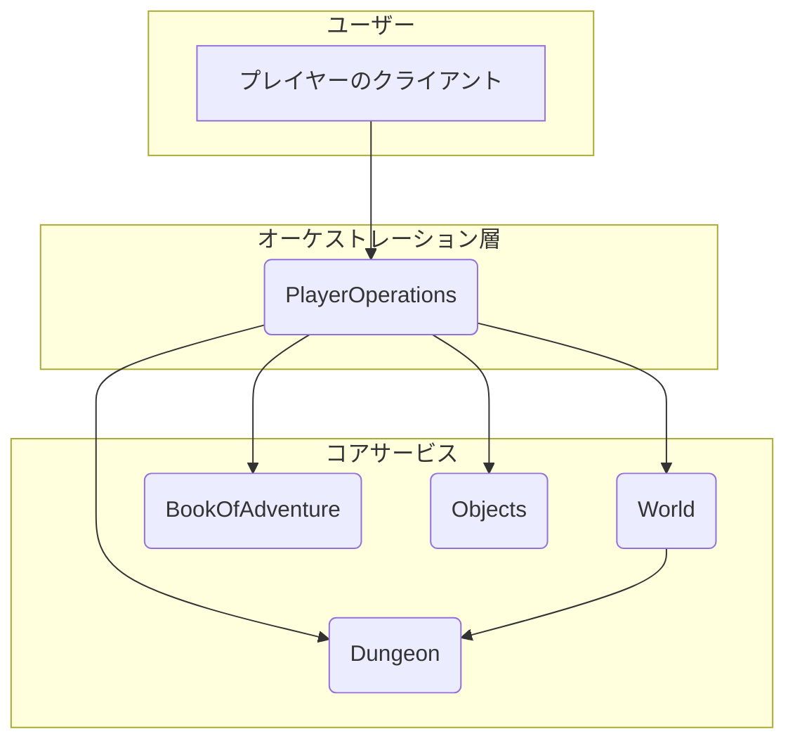

# コンポーネント関係の分析

このドキュメントは、ソースコードの分析に基づき、Rogue BackEnd Servicesアプリケーションの様々なコンポーネント間の関係性を概説します。

## ハイレベルアーキテクチャ

このアプリケーションはマイクロサービスアーキテクチャで構築されており、いくつかのサービスが連携してゲームの機能を提供しています。主要なサービスは以下の通りです：

*   **PlayerOperations**: プレイヤーのアクションを中央で調整するオーケストレーター。
*   **World**: ゲームワールドへのエントリーポイントであり、サービスレジストリ。
*   **Dungeon**: ダンジョンやフロアなど、ゲームワールドのレイアウトを管理。
*   **BookOfAdventure**: ステータスやインベントリなど、プレイヤーデータを保存。
*   **Objects**: ゲームアイテムを管理。

各サービス（`Dungeon`、`World`、`Objects`、`BookOfAdventure`）には、他のサービスとの通信に使用される対応するクライアントライブラリ（`DungeonClient`、`WorldClient`など）があります。

## コンポーネント相互作用図

以下の図は、サービス間の相互作用を示しています。`PlayerOperations`サービスは、他のすべてのサービスに接続してゲームロジックを実行する中央ハブです。

## サービスの責任範囲

### PlayerOperations
-   **役割**: プレイヤーのアクションを調整します。これはゲームロジック操作の主要なエントリーポイントです。
-   **相互作用**:
    -   クライアント（プレイヤー）からのリクエストを受け取ります。
    -   `World`を呼び出して、開始ダンジョン情報を取得します。
    -   `Dungeon`を呼び出して、プレイヤーの移動、周囲の確認、およびダンジョン環境との相互作用（例：アイテムの拾得、階段の上り下り）を処理します。
    -   `BookOfAdventure`を呼び出して、プレイヤーの状態（例：場所、ステータス、インベントリリスト）を作成、取得、更新します。
    -   `Objects`を呼び出して、アイテムの詳細情報を取得し、その履歴を管理します。

### World
-   **役割**: サービスレジストリとして機能し、ゲームワールドへのエントリーポイントを提供します。
-   **相互作用**:
    -   `PlayerOperations`によって呼び出され、開始ダンジョンを取得します。
    -   `Dungeon`を呼び出して、新しいダンジョンインスタンスを検索または作成します。

### Dungeon
-   **役割**: ダンジョン、フロア、部屋、およびアイテムや階段の場所を含む、ゲームワールドの構造とレイアウトを管理します。
-   **相互作用**:
    -   `World`によって呼び出され、ダンジョンを作成または検索します。
    -   `PlayerOperations`によって呼び出され、すべての空間操作（プレイヤーの移動、座標にあるものの確認、フロアの変更）を処理します。

### BookOfAdventure
-   **役割**: 永続的なプレイヤーデータを管理します。これはプレイヤーのキャラクターシートの「信頼できる情報源」です。
-   **相互作用**:
    -   `PlayerOperations`によって呼び出され、新しいプレイヤーを作成し、プレイヤーデータを取得し、アクションが実行された後に更新されたプレイヤーの状態を保存します。

### Objects
-   **役割**: すべてのゲームアイテム（例：鎧、指輪、金）のライフサイクルとデータを管理します。
-   **相互作用**:
    -   `PlayerOperations`によって呼び出され、プレイヤーが所持または発見した特定のアイテムに関する情報を取得します。
    -   アイテムの履歴を更新するために呼び出されます（例：誰がそれを拾ったか）。
