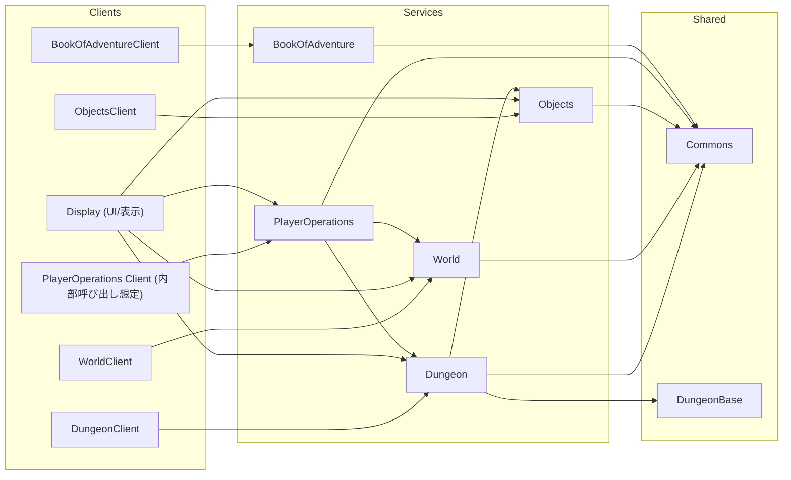
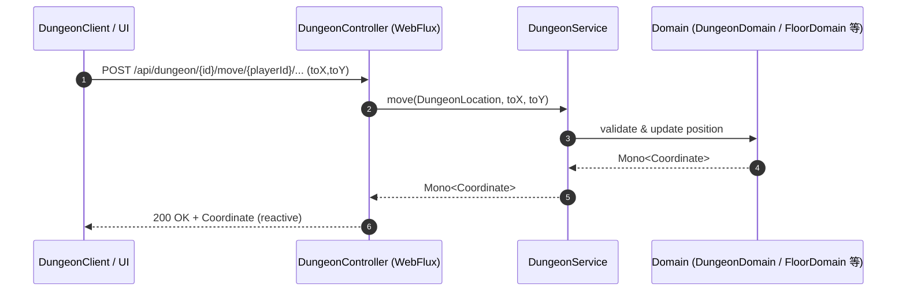
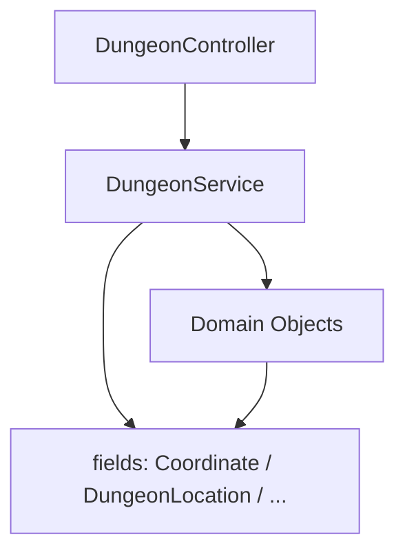

# rogueb コンポーネント概要

このドキュメントは、マルチモジュール構成の rogueb リポジトリにおける主要コンポーネントの役割と、コンポーネント間の関係を示します。図は mermaid.js を用いて表現しています。

- 技術スタックの例: Spring Boot / Spring WebFlux (Reactor Mono/Flux), Java, Maven マルチモジュール
- 通信形態: 主に REST（非同期・リアクティブ）、モジュール間の共有ライブラリ参照

## モジュール一覧と役割

以下はプロジェクト直下の主なモジュールです（リポジトリ構成より）。括弧内は代表的な責務の概要です。

- Commons: 共通ユーティリティ、共通ドメイン型などの再利用コード
- DungeonBase: ダンジョン領域に共通化された基底ドメイン／型（例: 共有の列挙や基底クラス）
- Dungeon: ダンジョンのアプリケーション本体（REST API、ドメインロジック）。Spring WebFlux によりリアクティブな API を公開
- DungeonClient: Dungeon サービスを呼び出すクライアント（他モジュールや外部からの呼び出し用）
- World: ワールド（マップや世界状態）に関するドメインと API
- WorldClient: World サービス呼び出し用クライアント
- Objects: アイテムやオブジェクトのドメインと API
- ObjectsClient: Objects サービス呼び出し用クライアント
- PlayerOperations: プレイヤー操作（移動、拾得、状態更新等）のアプリケーション／API
- Display: 表示・描画やクライアント表示用のサービス（サーバサイド描画やデータ提供）
- BookOfAdventure: 記録・図鑑・ログ等の補助的な機能（推定）
- BookOfAdventureClient: BookOfAdventure 呼び出し用クライアント

## コンポーネント間の関係（概略）

以下は、サービス群とクライアント群、共通ライブラリの関係を示す概念図です。

- クライアントモジュールは、対応するサービスモジュールの REST API を呼び出します。
- Display は UI/可視化レイヤーとして複数サービスからデータを取得・統合する想定です。
- PlayerOperations はプレイヤーの操作コマンドを受け、Dungeon/World/Objects 等に横断的に指示を行うハブ的役割を持つ想定です。
- Commons と DungeonBase は各サービスで共有される基本型・ユーティリティ群です。

## データフロー（例: ダンジョン内の移動）

Dungeon モジュール内の REST コントローラは Spring WebFlux を用いてリアクティブなエンドポイントを提供します。

### Dungeon API

- POST `/api/dungeon/{dungeonId}/go/{playerId}`
  - 目的: 指定したダンジョンへの入場
  - 戻り値: `Mono<DungeonLocation>`
- POST `/api/dungeon/{dungeonId}/move/{playerId}/{level}/{fromX}/{fromY}/{toX}/{toY}`
  - 目的: プレイヤーの移動
  - 戻り値: `Mono<Coordinate>`
- GET `/api/dungeon/{dungeonId}/what/{playerId}/{level}/{x}/{y}`
  - 目的: プレイヤー足元の状態確認
  - 戻り値: `Mono<ThingOverviewType>`
- POST `/api/dungeon/{dungeonId}/upstairs/{playerId}/{level}/{x}/{y}`
  - 目的: 階段を上る
  - 戻り値: `Mono<DungeonLocation>`
- POST `/api/dungeon/{dungeonId}/downstairs/{playerId}/{level}/{x}/{y}`
  - 目的: 階段を下りる
  - 戻り値: `Mono<DungeonLocation>`
- POST `/api/dungeon/{dungeonId}/pickup/gold/{playerId}/{level}/{x}/{y}`
  - 目的: 足元の金を拾う
  - 戻り値: `Mono<Gold>`
- POST `/api/dungeon/{dungeonId}/pickup/object/{playerId}/{level}/{x}/{y}`
  - 目的: 足元のアイテムを拾う
  - 戻り値: `Mono<String>` (アイテムのインスタンスID)
- GET `/api/dungeon/{dungeonId}/display/{playerId}/{level}/{x}/{y}`
  - 目的: 周辺の表示用データの取得
  - 戻り値: `Flux<DisplayData<String>>`
- GET `/api/dungeon/{dungeonId}/name`
  - 目的: ダンジョン名の取得
  - 戻り値: `Mono<String>`

### Objects API

- GET `/api/objects/instance/{id}`
  - 目的: 特定のアイテムインスタンス情報の取得
  - 戻り値: `Mono<ThingInstance>`
- POST `/api/objects/list`
  - 目的: 複数のアイテムインスタンス情報の一括取得
  - 戻り値: `Flux<ThingInstance>`
- POST `/api/objects/create/count/{count}`
  - 目的: 新しいアイテムインスタンスの生成
  - 戻り値: `Flux<ThingInstance>`
- POST `/api/objects/instance/{id}/`
  - 目的: アイテムインスタンスへの履歴（イベント）追加
  - 戻り値: `Mono<ThingInstance>`

このやり取りの概念的なシーケンスを以下に示します。

- すべての呼び出しはリアクティブストリーム（Mono/Flux）で非同期に処理されます。
- ドメイン層（Domain）はゲームロジックと整合性チェックを担います。

## Dungeon モジュールの簡易構成

参考として、Dungeon モジュールの一部（抜粋）:

- DungeonController: REST API 層（Spring WebFlux）。エンドポイント定義と引数組み立て
- DungeonService: アプリケーションサービス。ユースケースの実行、ドメイン呼び出し
- domain パッケージ（DungeonDomain, FloorDomain 等）: ドメインロジックと不変条件
- fields パッケージ（Coordinate, DungeonLocation, DisplayData, Gold 等）: 値オブジェクト、DTO

## 注意事項と拡張のヒント

- クライアント／サービス間の API 契約は、Commons に置く共通 DTO で整備すると依存が明確になります。
- PlayerOperations から Dungeon/World/Objects を跨ぐ操作は、サーガ/トランザクション的な整合戦略を検討してください。
- Display による集約表示は、バックエンド各サービスの GraphQL 化や BFF（Backend for Frontend）パターン導入で拡張性を高められます。
- リアクティブ処理では背圧（Backpressure）とタイムアウト、リトライ方針の設計が重要です。

以上。