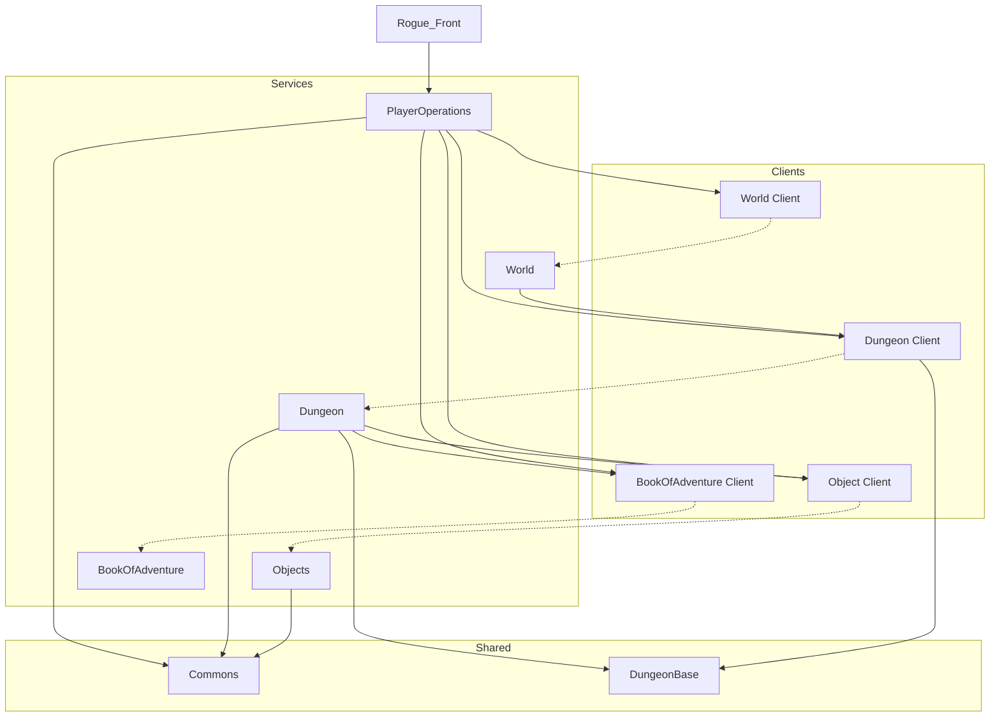
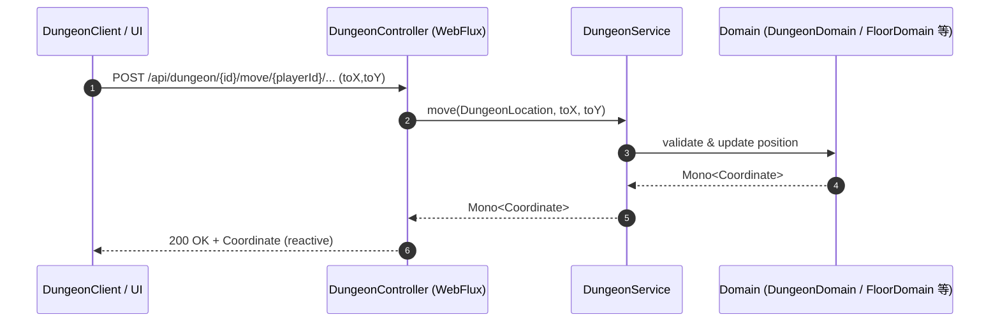
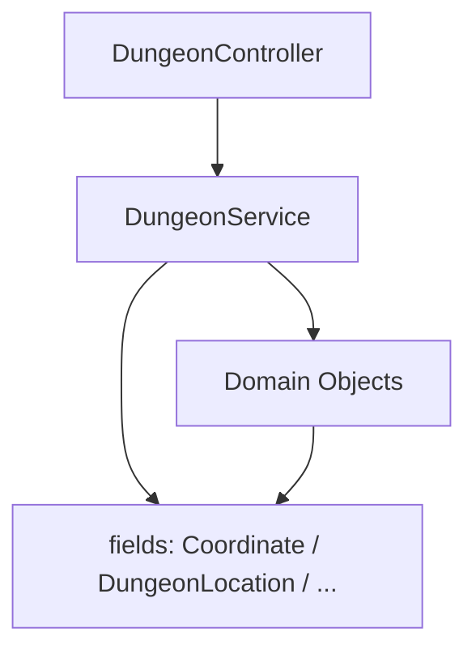

# rogueb コンポーネント概要

このドキュメントは、マルチモジュール構成の rogueb リポジトリにおける主要コンポーネントの役割と、コンポーネント間の関係を示します。図は mermaid.js を用いて表現しています。

- 技術スタック: Spring Boot 3.5.5 / Spring WebFlux (Reactor Mono/Flux), Java 21, Maven マルチモジュール
- 通信形態: 主に REST（非同期・リアクティブ）、モジュール間の共有ライブラリ参照

## モジュール一覧と役割

以下はプロジェクト直下の主なモジュールです。括弧内は代表的な責務の概要です。

| カテゴリ   | モジュール | 役割/概要                             |
|--------|---|-----------------------------------|
| サービス   | Dungeon | ダンジョン ドメイン                        |
| サービス   | World | ワールド（マップや世界状態）に関するドメイン            |
| サービス   | Objects | アイテムやオブジェクトのドメイン                  |
| BFF    | PlayerOperations | プレイヤー操作（移動、拾得、状態更新等）|
| サービス   | Display | 表示・描画やクライアント表示用のサービス |
| サービス   | BookOfAdventure | 記録・ログ等のドメイン |
| クライアント | DungeonClient | Dungeon サービスを呼び出すクライアント           |
| クライアント | WorldClient | World サービス呼び出し用クライアント             |
| クライアント | ObjectsClient | Objects サービス呼び出し用クライアント           |
| クライアント | BookOfAdventureClient | BookOfAdventure 呼び出し用クライアント       |
| 部品     | Commons | 共通ユーティリティ、共通ドメイン型などの再利用コード        |
| 部品     | DungeonBase | ダンジョン領域に共通化された基底ドメイン／型（例: 共有の列挙や基底クラス） |

## サービスの責任範囲

### PlayerOperations
-   **役割**: プレイヤーのアクションを調整します。これはゲームロジック操作の主要なエントリーポイントです。
-   **相互作用**:
    -   クライアント（プレイヤー）からのリクエストを受け取ります。
    -   `World`を呼び出して、開始ダンジョン情報を取得します。
    -   `Dungeon`を呼び出して、プレイヤーの移動、周囲の確認、およびダンジョン環境との相互作用（例：アイテムの拾得、階段の上り下り）を処理します。
    -   `BookOfAdventure`を呼び出して、プレイヤーの状態（例：場所、ステータス、インベントリリスト）を作成、取得、更新します。
    -   `Objects`を呼び出して、アイテムの詳細情報を取得し、その履歴を管理します。

### World
-   **役割**: サービスレジストリとして機能し、ゲームワールドへのエントリーポイントを提供します。
-   **相互作用**:
    -   `PlayerOperations`によって呼び出され、開始ダンジョンを取得します。
    -   `Dungeon`を呼び出して、新しいダンジョンインスタンスを検索または作成します。

### Dungeon
-   **役割**: ダンジョン、フロア、部屋、およびアイテムや階段の場所を含む、ゲームワールドの構造とレイアウトを管理します。
-   **相互作用**:
    -   `World`によって呼び出され、ダンジョンを作成または検索します。
    -   `PlayerOperations`によって呼び出され、すべての空間操作（プレイヤーの移動、座標にあるものの確認、フロアの変更）を処理します。

### BookOfAdventure
-   **役割**: 永続的なプレイヤーデータを管理します。これはプレイヤーのキャラクターシートの「信頼できる情報源」です。
-   **相互作用**:
    -   `PlayerOperations`によって呼び出され、新しいプレイヤーを作成し、プレイヤーデータを取得し、アクションが実行された後に更新されたプレイヤーの状態を保存します。

### Objects
-   **役割**: すべてのゲームアイテム（例：鎧、指輪、金）のライフサイクルとデータを管理します。
-   **相互作用**:
    -   `PlayerOperations`によって呼び出され、プレイヤーが所持または発見した特定のアイテムに関する情報を取得します。
    -   アイテムの履歴を更新するために呼び出されます（例：誰がそれを拾ったか）。

## コンポーネント間の関係（概略）

以下は、サービス群とクライアント群、共通ライブラリの関係を示す概念図です。

- クライアントモジュールは、対応するサービスモジュールの REST API を呼び出します。
- Display は UI/可視化レイヤーとして複数サービスからデータを取得・統合する想定です（現在はスケルトンのみ存在）。
- PlayerOperations はプレイヤーの操作コマンドを受け、Dungeon/World/Objects 等に横断的に指示を行うハブ的役割を持つ想定です。
- Commons と DungeonBase は各サービスで共有される基本型・ユーティリティ群です。

## データフロー（例: ダンジョン内の移動）

Dungeon モジュール内の REST コントローラは Spring WebFlux を用いてリアクティブなエンドポイントを提供します。

### World API

- GET `/api/world/dungeon/init`
  - 目的: 初期のダンジョン情報を取得
  - 戻り値: `Mono<DungeonInfo>`
- POST `/api/world/service`
  - 目的: サービスを登録
  - リクエストボディ: `ServiceInfo serviceInfo`
  - 戻り値: `void`

### BookOfAdventure API

- GET `/api/user/name/{userName}/exist`
  - 目的: ユーザーの存在確認
  - 戻り値: `Mono<Boolean>`
- PUT `/api/user/id/{userId}`
  - 目的: プレイヤー情報を保存
  - 戻り値: `Mono<String>` (userId)
- POST `/api/user/name/{userName}`
  - 目的: 新規プレイヤーを作成
  - リクエストボディ: `Map<String, Object> currentStatus`
  - 戻り値: `Mono<String>` (userId)
- POST `/api/user/id/{userId}/items`
  - 目的: プレイヤーの所持アイテムを更新
  - リクエストボディ: `List<String> objectIdList`
  - 戻り値: `Mono<String>` (userId)
- GET `/api/user/id/{userId}`
  - 目的: プレイヤー情報を取得
  - 戻り値: `Mono<PlayerDomain>`
- GET `/api/user/id/{userId}/items`
  - 目的: プレイヤーの所持アイテム一覧を取得
  - 戻り値: `Flux<String>`

### Dungeon API

- POST `/api/dungeon/{dungeonId}/go/{playerId}`
  - 目的: 指定したダンジョンへの入場
  - 戻り値: `Mono<DungeonLocation>`
- POST `/api/dungeon/{dungeonId}/move/{playerId}/{level}/{fromX}/{fromY}/{toX}/{toY}`
  - 目的: プレイヤーの移動
  - 戻り値: `Mono<Coordinate>`
- GET `/api/dungeon/{dungeonId}/what/{playerId}/{level}/{x}/{y}`
  - 目的: プレイヤー足元の状態確認
  - 戻り値: `Mono<ThingOverviewType>`
- POST `/api/dungeon/{dungeonId}/upstairs/{playerId}/{level}/{x}/{y}`
  - 目的: 階段を上る
  - 戻り値: `Mono<DungeonLocation>`
- POST `/api/dungeon/{dungeonId}/downstairs/{playerId}/{level}/{x}/{y}`
  - 目的: 階段を下りる
  - 戻り値: `Mono<DungeonLocation>`
- POST `/api/dungeon/{dungeonId}/pickup/gold/{playerId}/{level}/{x}/{y}`
  - 目的: 足元の金を拾う
  - 戻り値: `Mono<Gold>`
- POST `/api/dungeon/{dungeonId}/pickup/object/{playerId}/{level}/{x}/{y}`
  - 目的: 足元のアイテムを拾う
  - 戻り値: `Mono<String>` (アイテムのインスタンスID)
- GET `/api/dungeon/{dungeonId}/display/{playerId}/{level}/{x}/{y}`
  - 目的: 周辺の表示用データの取得
  - 戻り値: `Flux<DisplayData<String>>`
- GET `/api/dungeon/{dungeonId}/name`
  - 目的: ダンジョン名の取得
  - 戻り値: `Mono<String>`
- GET `/api/dungeon/name/{dungeonName}`
  - 目的: ダンジョンを名前で検索
  - 戻り値: `Mono<DungeonDomain>`
- PUT `/api/dungeon/name/{dungeonName}`
  - 目的: ダンジョンを保存（生成）
  - 戻り値: `Mono<String>`

### Objects API

- GET `/api/objects/instance/{id}`
  - 目的: 特定のアイテムインスタンス情報の取得
  - 戻り値: `Mono<ThingInstance>`
- POST `/api/objects/list`
  - 目的: 複数のアイテムインスタンス情報の一括取得
  - リクエストボディ: `Collection<String> idList`
  - 戻り値: `Flux<ThingInstance>`
- POST `/api/objects/create/count/{count}`
  - 目的: 新しいアイテムインスタンスの生成
  - リクエストボディ: `String description`
  - 戻り値: `Flux<ThingInstance>`
- POST `/api/objects/instance/{id}/`
  - 目的: アイテムインスタンスへの履歴（イベント）追加
  - リクエストボディ: `String description`
  - 戻り値: `Mono<ThingInstance>`

### PlayerOperations API

- GET `/api/user/name/{userName}/exist`
  - 目的: プレイヤーの存在確認
  - 戻り値: `Mono<Boolean>`
- POST `/api/user/name/{userName}`
  - 目的: プレイヤー作成
  - 戻り値: `Mono<String>` (userId)
- GET `/api/player/{userId}`
  - 目的: プレイヤー情報取得
  - 戻り値: `Mono<PlayerDto>`
- POST `/api/player/{userId}/command/dungeon/default`
  - 目的: デフォルトダンジョンへの入場
  - 戻り値: `Mono<Map<String, String>>`
- PUT `/api/player/{userId}/command/{top|down|right|left|top-right|top-left|down-right|down-left}`
  - 目的: プレイヤーの移動（8方向）
  - 戻り値: `Mono<Map<String, Boolean>>`
- PUT `/api/player/{userId}/command/pickup`
  - 目的: 足元のアイテム/金を拾う
  - 戻り値: `Mono<Map<String, Object>>`
- PUT `/api/player/{userId}/command/downStairs`
  - 目的: 階段を下りる
  - 戻り値: `Mono<Map<String, Boolean>>`
- PUT `/api/player/{userId}/command/upStairs`
  - 目的: 階段を上がる
  - 戻り値: `Mono<Map<String, Boolean>>`
- GET `/api/fields/{userId}`
  - 目的: フィールド表示データの取得
  - 戻り値: `Flux<DisplayData>`
- GET `/api/fields/{userId}/now`
  - 目的: フィールド表示データの即時取得
  - 戻り値: `Flux<DisplayData>`
- GET `/api/fields/{userId}/info`
  - 目的: ダンジョン情報の取得
  - 戻り値: `Mono<Map<String, String>>`

このやり取りの概念的なシーケンスを以下に示します。

- すべての呼び出しはリアクティブストリーム（Mono/Flux）で非同期に処理されます。
- ドメイン層（Domain）はゲームロジックと整合性チェックを担います。

## インフラ構成

### データベース
- **MongoDB**: ゲームの状態（ダンジョン、フロア、アイテムインスタンス、プレイヤーの冒険記録）を管理します。
  - `BookOfAdventure`, `Dungeon`, `Objects` モジュールで使用。
- **RDB (H2/MySQL)**: サービスディスカバリ情報を管理します。
  - `World` モジュールで使用。MyBatis と Flyway (マイグレーション) を利用。

### 開発環境
- `docker-compose.yml` により、MongoDB および Mongo Express (管理ツール) を起動可能です。
- 各マイクロサービスは独立して実行可能な Spring Boot アプリケーションです。

## Dungeon モジュールの簡易構成

参考として、Dungeon モジュールの一部（抜粋）:

- DungeonController: REST API 層（Spring WebFlux）。エンドポイント定義と引数組み立て
- DungeonService: アプリケーションサービス。ユースケースの実行、ドメイン呼び出し
- domain パッケージ（DungeonDomain, FloorDomain 等）: ドメインロジックと不変条件
- fields パッケージ（Coordinate, DungeonLocation, DisplayData, Gold 等）: 値オブジェクト、DTO

## 注意事項と拡張のヒント

- クライアント／サービス間の API 契約は、Commons に置く共通 DTO で整備すると依存が明確になります。
- PlayerOperations から Dungeon/World/Objects を跨ぐ操作は、サーガ/トランザクション的な整合戦略を検討してください。
- Display による集約表示は、バックエンド各サービスの GraphQL 化や BFF（Backend for Frontend）パターン導入で拡張性を高められます。
- リアクティブ処理では背圧（Backpressure）とタイムアウト、リトライ方針の設計が重要です。

以上。