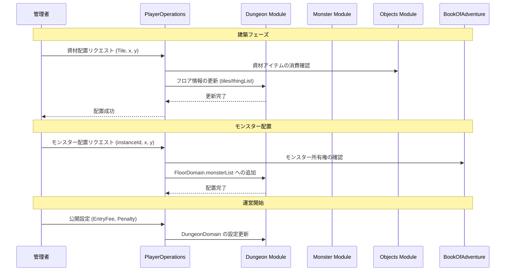

# ダンジョン構築・運営システム (Dungeon Construction & Management System)

## 1. 概要
本ドキュメントは、管理者が自身のダンジョン（マイ・ダンジョン）を構築・デザインし、他のプレイヤーに公開して運営するための仕様を定義します。本システムは、RogueB の「構築と運営」サイクルの中核を担います。

## 2. 建築資材 (Building Materials)
ダンジョンの構成要素を配置するには、特定の「建築資材」が必要です。これらは `Objects` モジュールで `TypeEnum.MATERIAL` として管理されます。

### 2.1 資材の獲得方法
- **探索による調達**: ランダムダンジョン（フロンティア）の宝箱や、特定の壁を掘削することで獲得できます。
- **ショップでの購入**: 他の管理者が運営するショップや、システム提供の資材屋で購入できます。
- **解体**: 既存の設置物を解体することで、一部の資材を回収できます。

### 2.2 資材のカテゴリと配置コスト
資材の配置には、アイテムとしての資材消費に加え、以下の配置コスト（ゴールド）の目安が必要です。

| カテゴリ | 例 | 配置コスト (Gold/枚) | 備考 |
| :--- | :--- | :---: | :--- |
| **地形タイル** | 石の床、水路、溶岩 | 10 〜 50 | 面積を埋める基本的なタイル。 |
| **構造物** | 扉、壊れる壁 | 100 〜 200 | 通行を制御する要素。 |
| **構造物 (強)** | 頑丈な壁 | 500 | 掘削困難な強固な壁。 |
| **トラップ** | 落とし穴、地雷 | 50 〜 200 | [トラップシステム](./Trap-System.md) 準拠。 |
| **施設** | ショップカウンター | 1,000 | 機能を持つ特殊なタイル。 |
| **施設 (高)** | 回復の泉 | 5,000 | 非常に高い回復効果を持つ。 |
| **デコレーション** | 燭台、石像、旗 | 50 〜 300 | 外観を整えるための装飾。 |

### 2.3 特殊タイルの詳細効果 (Detailed Effects of Special Tiles)
特定の地形タイルがエンティティ（プレイヤー・モンスター）に与える影響、および特性との相互作用を以下に定義します。

| タイル名 | 基本効果 | 特性による相互作用 |
| :--- | :--- | :--- |
| **水路 (Waterway)** | 通常移動不可。 | 特性「飛行 (`FLIGHT`)」を持つユニットは、ペナルティなしで通行可能。 |
| **溶岩 (Lava)** | 通行可能だが、進入時および滞在中に **10 HP ダメージ** を受ける。 | 特性「飛行」または「火属性無効 (`FIRE_IMMUNITY`)」を持つユニットは、ダメージを受けずに通行可能。 |
| **落とし穴 (Pitfall/Pit)** | 進入時に「[落とし穴の罠](./Trap-System.md)」として作動する。 | 特性「飛行」を持つユニットは、作動させずに通過可能。 |

## 3. 建築モード (Build Mode)
管理者は、自身の所有するダンジョンにおいて「建築モード」に切り替えることで、リアルタイムにレイアウトを変更できます。

### 3.1 配置ルール
- **グリッドベース**: ダンジョンは格子状のセルで構成され、資材は 1 セル単位で配置します。
- **配置コスト**: 資材の配置には、アイテムとしての「資材」の消費に加え、一定の「建築コスト（ゴールド）」が必要となる場合があります。
- **進入路の確保**: 原則として、入り口（上り階段）から最深部（下り階段/クリア地点）までの通行可能な経路が最低 1 つ存在する必要があります。

### 3.2 モンスターの配置
管理者は、[モンスター捕獲システム](./Monster-Capture-System.md) や [モンスター繁殖システム](./Monster-Breeding-System.md) で獲得したモンスターをダンジョン内に配置できます。
- **モンスター・ストック**: 配置に使用するモンスターは、あらかじめ「ストック（預かり所）」に登録されている必要があります（`MonsterInstanceDomain.state` が `STORAGE` または `PLACED` の個体）。
- **配置制限**: 配置できるモンスターの総数（`placementCost` の合計）には上限があります。この上限（最大配置コスト）は、**ダンジョンのランク**および**フロアの面積（幅 × 高さ）**に基づいて算出されます。
- **巡回設定**: モンスターの待機位置や、特定の範囲を巡回するなどの簡単な行動指針を設定できます。

## 4. ダンジョンの公開と運営
構築したダンジョンを他のプレイヤーに公開することで、収益を得ることができます。

### 4.1 運営設定
- **入場料 (`entryFee`)**: プレイヤーが入場する際に支払う金額を設定します。
- **デスペネルティ (`deathPenalty`)**: プレイヤーが死亡した際のアイテム・ゴールド没収ルールを設定します。詳細は [機能仕様書](./Functional-Specification.md) を参照。
- **クリア条件 (`clearCondition`)**: ダンジョンの「クリア」と判定される条件（階層到達、ボス撃破など）を設定します。
- **クリア報酬 (`clearReward`)**: プレイヤーがクリアした際に与える報酬（ゴールド、アイテム）を設定します。

### 4.2 収益サイクル
1. プレイヤーが入場料を支払い、管理者の所持金が増加する。
2. プレイヤーがダンジョン内で死亡した場合、没収されたアイテムやゴールドが管理者の倉庫/所持金に加算される。
3. プレイヤーがクリアした場合、管理者が設定した報酬がプレイヤーに支払われる（管理者の資産から差し引かれる）。

## 5. リアルタイム介入 (Admin Intervention)
管理者は、自身のダンジョンを攻略中のプレイヤーに対し、リアルタイムで干渉することができます。これらの介入アクションには、悪用防止のために「介入ポイント (Intervention Points: IP)」または「クールタイム」が設定されます。

- **介入ポイント (IP)**:
    - ダンジョンの時間経過や、プレイヤーへのダメージ、プレイヤーの撃破によって蓄積されます。
    - **蓄積ルール**:
        - **時間経過**: 10 秒ごとに 1 IP 蓄積。
        - **与ダメージ**: プレイヤーに 10 ダメージ与えるごとに 1 IP 蓄積。
        - **プレイヤー撃破**: 1 人撃破につき 100 IP 蓄積。
        - **ランクボーナス**: 蓄積される IP には、ダンジョンランクに応じた補正がかかります。
            - `獲得 IP = 基礎 IP * (1.0 + (ランク指数 - 1) * 0.2)`
    - **最大蓄積量**: `500 + (ダンジョンランク指数 * 100)` IP。
- **介入アクション**:
    - **増援の召喚**: ストックしているモンスターを、プレイヤーの視界外に即座に配置します。
        - **消費 IP**: モンスターのティアに応じて変動（Tier 1: 50 / Tier 2: 150 / Tier 3: 400 / Tier 4: 800）。
        - **クールタイム**: 配置したモンスターのティアに依存します（Tier 1: 30秒 / Tier 2: 60秒 / Tier 3: 120秒 / Tier 4: 300秒）。
    - **トラップの手動発動**: プレイヤーが踏んでいないトラップを、管理者の意思で強制的に作動させます。
        - **消費 IP**: 100 IP 固定。
        - **クールタイム**: 15 秒。
    - **メッセージ送信**: 攻略中のプレイヤーに対し、特定のメッセージ（天の声）を表示します。
        - **通信仕様**: [リアルタイム同期システム](../implementation/Real-time-Synchronization.md) の `ADMIN_MESSAGE` イベントを使用して配信されます。
        - **消費 IP**: 10 IP。
        - **クールタイム**: 5 秒。

## 6. プレイヤー活動のフィードバック (Player Activity Feedback)
管理者は、自身のダンジョンをより魅力的に、あるいは戦略的に改善するために、プレイヤーの活動記録を確認できます。

### 6.1 ログの収集と閲覧
- **活動ログ**: プレイヤーの入場、クリア、および死亡の記録が匿名化された状態で保存されます。
- **ヒートマップ**: プレイヤーがどの座標で最も多く立ち止まったか、あるいはどの場所で戦闘不能になったかの統計データを提供します。
- **クリア率の算出**: 階層ごとの到達率や、最終的なクリア率を可視化し、難易度の調整に役立てます。

## 7. モジュール間連携

## 8. 今後の拡張
- **[ダンジョンランク](./Dungeon-Rank-System.md)**: プレイヤーの評価や攻略難易度に基づき、ダンジョンのランクが上昇する仕組み。
- **設計図 (Blueprint)**: 他の管理者が作成した優れたレイアウトを、設計図として売買・利用できる機能。
- **自動生成の統合**: ベースとなるレイアウトを自動生成し、そこから管理者が微調整を行うハイブリッド建築。
