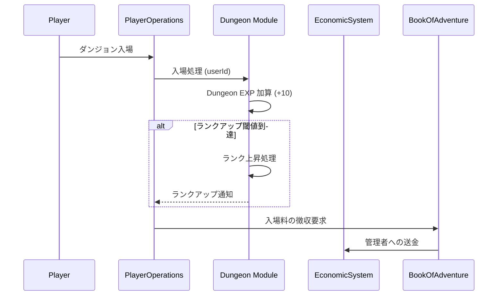

# ダンジョンランクシステム (Dungeon Rank System)

## 1. 概要
本ドキュメントは、管理者が運営するダンジョン（マイ・ダンジョン）の成長と評価を管理する「ダンジョンランク」システムの仕様を定義します。ダンジョンランクは、そのダンジョンの歴史、人気、および難易度を示す指標であり、ランクが上昇することで管理者はより高度な建築や運営が可能になります。

## 2. ダンジョン経験値 (Dungeon EXP)
ダンジョンのランクを上げるためには、特定の活動を通じて「ダンジョン経験値 (Dungeon EXP)」を蓄積する必要があります。

### 2.1 経験値の獲得源
| 獲得アクション | 獲得 EXP（目安） | 備考 |
| :--- | :---: | :--- |
| **プレイヤーの入場** | 10 EXP / 人 | 重複入場は一定時間無効。 |
| **プレイヤーの撃破** | 50 EXP / 人 | デスペナルティ発生時に獲得。 |
| **資材の配置** | 1 〜 5 EXP / 個 | 配置した資材のティアに応じる。 |
| **クリア報酬の支払い** | 100 EXP / 回 | プレイヤーがクリアし、報酬が正常に支払われた場合。 |
| **高評価の獲得** | 20 EXP / 回 | プレイヤーからの「いいね」等のフィードバック。 |

## 3. ランクアップと報酬
累計経験値が一定値に達すると、ダンジョンのランクが上昇します。ランクは E から始まり、最高 S まで存在します。

### 3.1 ランク別制限・特典
| ランク | 必要累計 EXP | 最大フロア数 | 最大配置コスト | 解放要素 |
| :--- | :---: | :---: | :---: | :--- |
| **E** | 0 | 3 | 500 | 基本的な石の床、壁、初期モンスター。 |
| **D** | 500 | 5 | 1,000 | 水路、基本的なトラップ、D ランクモンスター。 |
| **C** | 2,000 | 10 | 2,500 | 溶岩、属性トラップ、ショップの設置。 |
| **B** | 10,000 | 20 | 5,000 | 動く床、中級モンスター、入場料の上限引き上げ。 |
| **A** | 50,000 | 50 | 15,000 | 特殊な環境効果、上級モンスター。 |
| **S** | 200,000 | 無制限 | 50,000 | ボスモンスターの配置、独自ルールの策定。 |

## 4. ランクの影響

### 4.1 入場料の上限
ダンジョンランクが高いほど、管理者が設定できる入場料 (`entryFee`) の上限が引き上げられます。
- **ランク E**: 最大 100 Gold
- **ランク D**: 最大 500 Gold
- **ランク C**: 最大 1,000 Gold
- **ランク B**: 最大 5,000 Gold
- **ランク A**: 最大 10,000 Gold
- **ランク S**: 制限なし

### 4.2 検索・露出優先度
ワールド内でのダンジョン検索において、高ランクのダンジョンや「急上昇中（短期間で EXP を多く獲得）」のダンジョンが優先的に表示されるようになります。

### 4.3 報酬の質
高ランクのダンジョンに配置された宝箱からは、より高いティアのアイテムが出現しやすくなります（システムによる補正）。

## 5. ランクの降格 (Rank Decay)
長期間（例：30日間）プレイヤーの入場がない、あるいは管理者が全くメンテナンス（資材配置・更新）を行っていない場合、ダンジョンランクが降格する可能性があります。
- 降格前に管理者へ通知が行われます。
- 降格しても、配置済みの資材やモンスターが削除されることはありませんが、再配置や新規追加時にランク制限がかかります。

## 6. モジュール間連携

## 7. 今後の拡張
- **ダンジョン称号**: 特定の条件（例：1,000人撃破）を満たすことで付与される特別な肩書き。
- **ランキング報酬**: 期間ごとの獲得 EXP ランキングに応じた管理者向けのボーナス。
