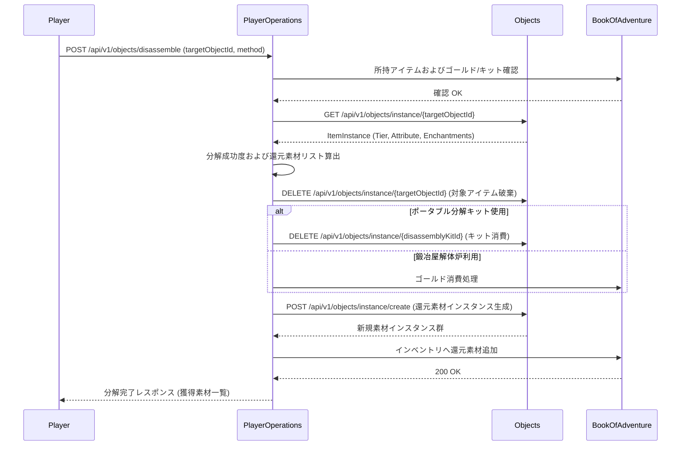

# アイテム分解・リサイクルシステム (Item Disassembly & Recycling System)

## 1. 概要
本ドキュメントは、不要になった装備品（武器、防具、指輪）、消費アイテム、および特殊資材を解体・分解し、クラフト資材、強化触媒、魔法の粉塵、属性の精華へと還元する「アイテム分解・リサイクルシステム」の仕様を定義します。

ダンジョン探索や錬金調合、ドロップで獲得した重複・低性能アイテムを資源循環のループへ組み込むことで、インベントリの圧迫を解消し、[アイテム調合システム](./Item-Synthesis-Alchemy-System.md)、[アイテムエンチャントシステム](./Item-Enchantment-System.md)、および[倉庫拡張](./Storage-System.md)に資材を供給するエコシステムを構築します。

---

## 2. 分解の基本ルールと環境
アイテムの分解は、以下の2種類の環境・手段で実行可能です。

### 2.1 分解手段と特徴
| 分解手段 | 必要ツール・コスト | 成功率補正 | 大成功率 | 特徴 |
| :--- | :--- | :---: | :---: | :--- |
| **ポータブル分解キット (`disassembly_kit`)** | 消費アイテム（1回使い捨て） | 基本 (+0%) | 5% | ダンジョン探索中にその場で実行可能。バック容量の緊急確保に有効。 |
| **町の鍛冶屋解体炉** | ゴールド消費（アイテムティア × 100 Gold） | 高 (+15%) | 15% | 街の拠点で実行。成功率が高く、追加素材（ボーナス還元）が発生しやすい。 |

---

## 3. 還元素材の算出メカニズム

### 3.1 アイテムカテゴリ別の基本還元素材
分解対象アイテムのカテゴリに応じて、必ず獲得できる基本還元素材が決定されます。

| アイテムカテゴリ | 主な基本還元素材 | 素材数（標準値） |
| :--- | :--- | :---: |
| **武器 (`WEAPON`)** | 鉄くず (`iron_scrap`) / 強化鉱石 | 1〜3 |
| **防具 (`ARMOR`)** | 頑丈な皮 (`sturdy_leather`) / 鉄くず | 1〜3 |
| **指輪 (`RING`)** | 魔導の粉塵 (`magic_powder`) | 1〜2 |
| **杖 (`STICK`)** | 魔導の粉塵 (`magic_powder`) / 木片 | 1〜3 |
| **巻物 (`SCROLL`)** | 魔法の紙片 (`magic_paper_fragment`) | 1〜2 |

### 3.2 ティア・エンチャント・属性補正
分解時の素材獲得量およびボーナス素材の選定は、以下の算出式に基づきます。

`基本素材獲得数 = BaseCount + floor(ItemTier * 0.5) + EnchantmentSlotCount`

- **ティア補正**: 高ティア（Tier 3〜5）のアイテムを分解した場合、**一定確率（ティア × 10%）**で増築用資材の破片（`expansion_material`）または高品質触媒が獲得できます。
- **属性補正**: 属性（火炎・氷結・電撃）が付与された装備やエンチャント付きアイテムを分解した場合、対応する属性の精華（`elemental_essence_fire`, `elemental_essence_frost`, `elemental_essence_lightning`）が追加で1個確定還元されます。
- **呪われたアイテム (`isCursed = true`)**: 呪われた装備品も分解可能ですが、分解時に50%の確率で「解呪の破片」に変換され、基本素材数が半減します。

---

## 4. 実行結果の判定

分解実行時には、プレイヤーレベル、分解手段、アイテムティアに基づいて成功判定が行われます。

1. **大成功 (Great Success)**: 基本素材量が 1.5 倍（切り上げ）になり、ボーナスレア素材（`expansion_material` 等）が確定獲得されます。
2. **成功 (Success)**: 算出式通りの素材が還元されます。
3. **失敗 (Failure)**: 素材の還元量が半減（最低1個）し、ボーナス素材は獲得できません。アイテム本体および分解キット/ゴールドは消失します。

---

## 5. モジュール間連携

アイテム分解処理における各モジュール間のシーケンスフローを以下に示します。



---

## 6. API仕様およびエラーハンドリング

### 6.1 APIエンドポイントとJSON構造

#### 6.1.1 アイテム分解実行 API
所持しているアイテムを分解し、還元素材を獲得します。

- **Endpoint**: `POST /api/v1/objects/disassemble`
- **Request Body (JSON - ポータブル分解キット使用時)**:
```json
{
  "userId": "player_uuid_12345",
  "targetObjectId": "item_sword_tier3_001",
  "method": "KIT",
  "disassemblyKitObjectId": "kit_instance_999"
}
```

- **Request Body (JSON - 鍛冶屋解体炉利用時)**:
```json
{
  "userId": "player_uuid_12345",
  "targetObjectId": "item_ring_fire_002",
  "method": "BLACKSMITH"
}
```

- **Response Body (JSON - 成功時)**:
```json
{
  "success": true,
  "result": "GREAT_SUCCESS",
  "message": "「炎の指輪」の分解に大成功しました！質の高い資材を獲得しました。",
  "disassembledItem": {
    "objectId": "item_ring_fire_002",
    "typeName": "炎の指輪",
    "tier": 3
  },
  "obtainedMaterials": [
    {
      "typeId": "magic_powder",
      "name": "魔導の粉塵",
      "count": 3
    },
    {
      "typeId": "elemental_essence_fire",
      "name": "火炎の精華",
      "count": 1
    },
    {
      "typeId": "expansion_material",
      "name": "増築用資材",
      "count": 1
    }
  ]
}
```

#### 6.1.2 分解還元予測 (プレビュー) API
対象アイテムを分解した際の還元予測素材および成功確率を取得します。

- **Endpoint**: `POST /api/v1/objects/disassemble/preview`
- **Request Body (JSON)**:
```json
{
  "userId": "player_uuid_12345",
  "targetObjectId": "item_sword_tier3_001",
  "method": "BLACKSMITH"
}
```

- **Response Body (JSON - 成功時)**:
```json
{
  "targetObjectId": "item_sword_tier3_001",
  "method": "BLACKSMITH",
  "requiredGold": 300,
  "successRate": 85,
  "greatSuccessRate": 15,
  "expectedMaterials": [
    {
      "typeId": "iron_scrap",
      "name": "鉄くず",
      "minCount": 2,
      "maxCount": 4
    },
    {
      "typeId": "expansion_material",
      "name": "増築用資材",
      "minCount": 0,
      "maxCount": 1,
      "chancePercent": 30
    }
  ]
}
```

### 6.2 エラーハンドリング (Error Handling)

| エラーコード | 発生条件 | レスポンス HTTP ステータス | 戻り値のメッセージ例 |
| :--- | :--- | :---: | :--- |
| `ITEM_NOT_FOUND` | 指定された `targetObjectId` のアイテムが存在しない。 | 404 Not Found | 指定されたアイテムが見つかりません。 |
| `USER_NOT_FOUND` | 指定された `userId` のプレイヤーが存在しない。 | 404 Not Found | 指定されたプレイヤーが見つかりません。 |
| `ITEM_NOT_DISASSEMBLABLE` | 対象アイテムが分解不可なカテゴリ（例：クエスト重要アイテム、特殊通貨等）である。 | 400 Bad Request | このアイテムは分解することができません。 |
| `INSUFFICIENT_DISASSEMBLY_TOOL` | `method="KIT"` 時に指定された分解キットが存在しない、または消費済みである。 | 400 Bad Request | 分解キットを所持していません。 |
| `INSUFFICIENT_GOLD` | `method="BLACKSMITH"` 時に鍛冶屋の分解費用が不足している。 | 400 Bad Request | 分解に必要なゴールドが不足しています。 |
| `INVENTORY_FULL` | 分解によって生じる還元素材を収納するバック空き枠が不足している。 | 400 Bad Request | インベントリの空き枠が不足しているため分解できません。 |
