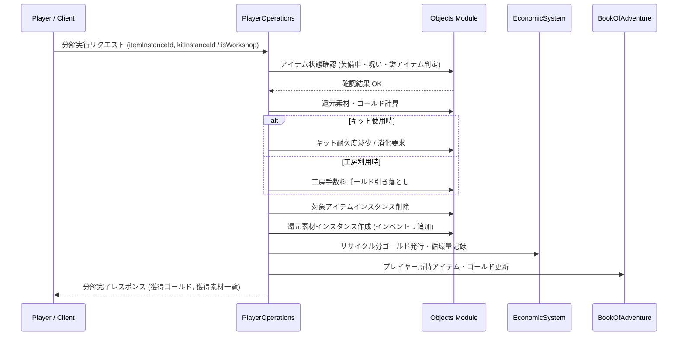

# アイテム分解・リサイクルシステム (Item Disassembly & Recycling System)

## 1. 概要
本ドキュメントは、ダンジョン探索やトレジャーハント、遠征で獲得した不要な装備品（武器・防具・指輪等）や罠の種、消費アイテムを分解・還元し、再利用可能な基本素材（ゴールド、魔力の粉末、属性の精霊石、ダンジョン増築資材等）として抽出・リサイクルする「アイテム分解・リサイクルシステム」の仕様を定義します。本システムは、不要アイテムの循環利用およびインベントリ圧迫の解消、クラフト・錬金・エンチャント・ダンジョン建築用リソース供給の核となるシステムです。

## 2. 分解メカニズムとツール
分解の実行方法は、「携帯型分解キット（`disassembly_kit`）による現場分解」と「拠点の鍛冶屋・作業台（`blacksmith_workshop`）による精密分解」の2通りが存在します。

### 2.1 携帯型分解キット（Field Disassembly）
- **使用方法**: ダンジョン探索中または街で、所持品内の「分解キット（`disassembly_kit`）」を選択し、対象アイテムに対して使用します。
- **特徴**:
  - ダンジョン内で即時にインベントリを整理可能。
  - 還元率は精密分解に比べてやや低め（基本還元率 70%）。
  - 分解キット自体に耐久度（使用可能回数: 10回）が存在し、使い切ると消滅します。

### 2.2 拠点の鍛冶屋・作業台（Workshop Disassembly）
- **使用方法**: 街の工房・鍛冶屋、あるいはダンジョン建築で設置した作業台タイルを訪れて実行します。
- **特徴**:
  - キットを消費せず、少額の手数料（ゴールド）で実行可能。
  - 高い還元率（基本還元率 100%）。
  - レア素材（属性の精霊石等）の抽出成功率が +15% 補正されます。

### 2.3 分解対象と制限
- **分解可能アイテム**:
  - 装備品（武器、防具、指輪・アクセサリ）
  - 罠の種（`trap_flame`, `trap_frost`, `trap_lightning`）
  - 一部の上位合成・建築素材
- **分解不可アイテム**:
  - 装備中のアイテム（あらかじめ装備解除が必要）
  - 呪われたアイテム（解呪スクロールまたは町での解呪が必要）
  - クエストアイテム・重要アイテム（`isKeyItem = true`）
  - 耐久度が 0 に破砕したジャンク品

## 3. 素材還元率・算出式
分解によって獲得できる素材の量およびゴールド還元値は、アイテムのカテゴリ、ティア（Rank）、エンチャント付与数、および分解方法の補正に基づいて算出されます。

### 3.1 還元ゴールド算出式
`獲得ゴールド = floor(標準価格 * 0.25 * ティア補正 * エンチャント補正 * 分解補正)`

- **標準価格**: 対象アイテムの `Thing.standardPrice`
- **ティア補正**: Tier 1 = 1.0, Tier 2 = 1.2, Tier 3 = 1.5, Tier 4 = 2.0
- **エンチャント補正**: `1.0 + (付与されているエンチャント数 * 0.2)`
- **分解補正**:
  - 携帯用分解キット: 0.70
  - 工房・作業台: 1.00

### 3.2 素材抽出判定・確率テーブル
分解実行時、アイテムの属性およびティアに応じて以下の素材が抽出されます。

| アイテムカテゴリ / 属性 | 主な還元素材 | 抽出確率 (キット / 工房) | 抽出数量 |
| :--- | :--- | :---: | :---: |
| **全一般装備 (Tier 1+)** | 魔力の粉末 (`magic_powder`) | 100% / 100% | 1 〜 3個 |
| **火属性装備 / 火炎トラップ** | 火の精霊石 (`elemental_essence_fire`) | 30% / 45% | 1個 |
| **氷属性装備 / 氷結トラップ** | 氷の精霊石 (`elemental_essence_frost`) | 30% / 45% | 1個 |
| **雷属性装備 / 電撃トラップ** | 雷の精霊石 (`elemental_essence_lightning`) | 30% / 45% | 1個 |
| **高ティア装備 (Tier 3+)** | 増築用資材 (`expansion_material`) | 15% / 30% | 1個 |

## 4. 還元アイテムおよびレア素材
本システムで抽出・使用される各種素材アイテムは `Objects` モジュールにて厳格に管理されます。

- **分解キット (`disassembly_kit`)**: Consumable カテゴリ。標準価格 500 Gold。最大使用回数 10 回。
- **魔力の粉末 (`magic_powder`)**: Material カテゴリ。標準価格 100 Gold。錬金・エンチャントの基本触媒。
- **火の精霊石 (`elemental_essence_fire`)**: Material カテゴリ。標準価格 800 Gold。火属性調合・トラップ作成用。
- **氷の精霊石 (`elemental_essence_frost`)**: Material カテゴリ。標準価格 800 Gold。氷属性調合・トラップ作成用。
- **雷の精霊石 (`elemental_essence_lightning`)**: Material カテゴリ。標準価格 800 Gold。雷属性調合・トラップ作成用。

## 5. モジュール間連携



## 6. データ構造と永続化
プレイヤーの分解実行履歴・統計データは、`Objects` モジュールの `playerDisassemblyLogDomain` コレクションにおいてログとして保持されます。

- **主要構造 (`playerDisassemblyLogDomain`)**:
  - `logId` (String): ログ一意 ID。
  - `userId` (String): プレイヤー ID。
  - `disassembledItemId` (String): 分解されたアイテムの種別 ID (`typeId`)。
  - `disassembledItemName` (String): アイテム表示名。
  - `tier` (Integer): アイテムティア。
  - `method` (String): 分解方法 (`FIELD_KIT` または `WORKSHOP`)。
  - `gainedGold` (Integer): 獲得ゴールド。
  - `gainedItems` (List<ObtainedItem>): 獲得した素材アイテムリスト（`typeId`, `quantity`）。
  - `createdAt` (Date): 分解日時。

## 7. 標準メタデータ・エフェクトID
`Standard-Metadata-Specification.md` の規定に従い、分解に関する特殊効果 ID を以下のように割り当てます。

- **`DISASSEMBLE_ITEM`**:
  - **カテゴリ**: `SPECIAL`
  - **説明**: 対象アイテムを分解し、構成素材およびゴールドを還元抽出するエフェクト。

## 8. APIリクエスト・フローとエラーハンドリング

### 8.1 APIリクエスト仕様

#### 1. 分解実行 (Execute Disassembly)
- **Endpoint**: `POST /api/v1/objects/disassemble`
- **Request Body (JSON)**:
```json
{
  "userId": "player_uuid_12345",
  "targetItemInstanceId": "item_uuid_sword_999",
  "disassemblyMethod": "FIELD_KIT",
  "kitInstanceId": "item_uuid_kit_111"
}
```

- **Response Body (JSON - 成功時)**:
```json
{
  "success": true,
  "result": "SUCCESS",
  "message": "ドラゴンキラーの分解に成功し、素材を獲得しました。",
  "gainedGold": 1250,
  "gainedItems": [
    {
      "typeId": "magic_powder",
      "name": "魔力の粉末",
      "quantity": 3
    },
    {
      "typeId": "elemental_essence_fire",
      "name": "火の精霊石",
      "quantity": 1
    }
  ],
  "remainingKitUses": 9
}
```

#### 2. 分解プレビュー (Preview Disassembly Yield)
- **Endpoint**: `POST /api/v1/objects/disassemble/preview`
- **Request Body (JSON)**:
```json
{
  "userId": "player_uuid_12345",
  "targetItemInstanceId": "item_uuid_sword_999",
  "disassemblyMethod": "WORKSHOP"
}
```

- **Response Body (JSON - 成功時)**:
```json
{
  "success": true,
  "expectedGold": 1800,
  "expectedItems": [
    {
      "typeId": "magic_powder",
      "name": "魔力の粉末",
      "minQuantity": 2,
      "maxQuantity": 3,
      "probability": 1.0
    },
    {
      "typeId": "elemental_essence_fire",
      "name": "火の精霊石",
      "minQuantity": 1,
      "maxQuantity": 1,
      "probability": 0.45
    }
  ],
  "workshopFee": 100
}
```

### 8.2 エラーハンドリング (Error Handling)
分解処理の実行時にビジネスルール違反が発生した場合、システムは以下のエラーコードと適切な HTTP ステータスを返却します。

| エラーコード | 発生条件 | レスポンス HTTP ステータス | 戻り値のメッセージ例 |
| :--- | :--- | :---: | :--- |
| `ITEM_NOT_FOUND` | 指定された `targetItemInstanceId` のアイテムが存在しない。 | 404 Not Found | 指定された分解対象アイテムが見つかりません。 |
| `ITEM_NOT_DISASSEMBLABLE` | 鍵アイテム、クエスト重要品、または破砕したジャンク品を指定した場合。 | 400 Bad Request | このアイテムは分解することができません。 |
| `EQUIPPED_ITEM_CANNOT_BE_DISASSEMBLED` | 対象アイテムがプレイヤーに装備中である場合。 | 400 Bad Request | 装備中のアイテムは分解できません。あらかじめ装備を解除してください。 |
| `CURSED_ITEM_CANNOT_BE_DISASSEMBLED` | 対象アイテムが呪われている場合。 | 400 Bad Request | 呪われたアイテムはそのまま分解できません。先に解呪を行ってください。 |
| `KIT_NOT_FOUND` | `FIELD_KIT` 選択時、指定された `kitInstanceId` が所持品に存在しない。 | 404 Not Found | 指定された分解キットが見つかりません。 |
| `KIT_EXHAUSTED` | 分解キットの使用可能回数が 0 に達している場合。 | 400 Bad Request | 分解キットの使用回数が上限に達しています。 |
| `INSUFFICIENT_GOLD` | 工房利用時（`WORKSHOP`）、手数料のゴールドが不足している場合。 | 400 Bad Request | 工房での分解手数料が不足しています。 |
| `INVENTORY_FULL` | 分解によって獲得する素材を受け入れるバッグの空き枠が不足している場合。 | 400 Bad Request | インベントリに空きがないため、分解を実行できません。 |
