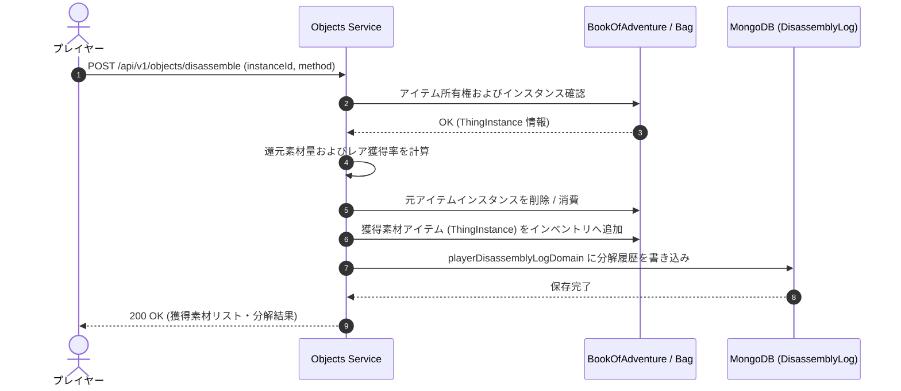

# アイテム分解・リサイクルシステム仕様 (Item Disassembly & Recycling System)

## 1. 概要
本ドキュメントは、ローグライクゲームにおける不必要な装備品（武器・防具・指輪等）や各種アイテムを分解し、再利用可能なクラフト資材・魔法の粉末・属性エッセンス・増築資材等へと還元する**「アイテム分解・リサイクルシステム」**の仕様を定義します。

探索やダンジョン踏破、遠征で獲得した不要なドロップ品を還元することで、[ダンジョン錬金・アイテム調合システム](./Item-Synthesis-Alchemy-System.md)、[アイテムエンチャントシステム](./Item-Enchantment-System.md)、[倉庫システム](./Storage-System.md) 等に必要なキーマテリアル（素材）を循環供給し、インベントリ圧迫の解消とゲーム経済の持続性を両立させます。

---

## 2. ビジネスルールと分解メカニズム

### 2.1 分解の基本手段
アイテムの分解は、以下の2つのいずれかの方法で行います。

1. **ポータブル分解キット（`disassembly_kit`）の使用**:
   - プレイヤーがインベントリまたはダンジョン内で消費アイテム「分解キット」を使用して実行します。
   - どこでも即座に分解可能ですが、素材還元率は標準値（100%）となります。
2. **拠点・町の鍛冶屋分解台（Blacksmith Workshop）の使用**:
   - 拠点や街の施設、またはダンジョン内に設置された特定タイルで実行します。
   - 費用としてゴールドを消費しますが、還元率が **+20%** 増加し、レア素材（属性エッセンスや増築資材）の抽出成功率が向上します。

---

### 2.2 対象アイテムカテゴリと基本還元アイテム

分解可能なアイテムは、そのカテゴリ（`TypeEnum`）と属性（`Attribute`）に応じて還元される標準素材が定まります。

| 対象カテゴリ (`TypeEnum`) | 主な還元素材 | 素材用途・連携先 |
| :--- | :--- | :--- |
| `WEAPON` / `ARMOR` | 建築資材（`stone_floor`, `strong_wall` 等）、**魔法の粉**（`magic_powder`） | [ダンジョン構築](./Dungeon-Construction-System.md), [アイテム調合](./Item-Synthesis-Alchemy-System.md) |
| `RING` / `STICK` | **魔法の粉**（`magic_powder`） | [アイテムエンチャント](./Item-Enchantment-System.md), [アイテム調合](./Item-Synthesis-Alchemy-System.md) |
| `SCROLL` / `POTION` | **魔法の粉**（`magic_powder`） | [アイテム調合](./Item-Synthesis-Alchemy-System.md) |
| 属性付き全アイテム | 対応する**属性エッセンス** (`elemental_essence_fire` 等) | [進化触媒](./Monster-Evolution-System.md), [環境異変宝珠](./Dungeon-Environmental-Anomaly-System.md) |
| ティア3以上の高階級装備 | 一定確率で**増築用資材** (`expansion_material`) | [倉庫システム](./Storage-System.md) |

---

### 2.3 素材獲得量の計算式

分解によって得られる基本素材の獲得量（`Yield`）は以下の計算式に基づきます。

$$\text{Yield} = \max\left(1, \lfloor (\text{Tier} \times 2 + \text{EnchantBonus} + \text{PriceBonus}) \times \text{FacilityBonus} \times \text{IdentifyMultiplier} \rfloor\right)$$

- **`Tier`**: 対象アイテムのティア数（1 〜 4）。
- **`EnchantBonus`**: 付与されているエンチャント数（1つにつき +1）。
- **`PriceBonus`**: アイテム標準価格（`standardPrice`）に基づく補正 ($\lfloor \text{standardPrice} / 1000 \rfloor$)。
- **`FacilityBonus`**: 分解キット使用時は `1.0`、鍛冶屋分解台使用時は `1.2`。
- **`IdentifyMultiplier`**: 識別済み品は `1.0`、未識別品は `0.5`（未識別品は識別鑑定精度が低いため獲得率が半減）。

---

### 2.4 特殊条件とレア素材抽出

1. **属性エッセンスの抽出**:
   - 火・水・風・土・聖・闇の各属性（`attribute`）を持つアイテムを分解した場合、100%の確率で対応する属性エッセンス（`elemental_essence_fire` 等）を1〜3個抽出できます。
2. **呪われたアイテム（`isCursed` = true）**:
   - 呪われたアイテムも分解可能です。ただし、抽出時に一定確率で「闇の石（`dark_stone`）」または「闇のエッセンス」へと変質します。
3. **増築用資材（`expansion_material`）の獲得確率**:
   - ティア3以上の装備品を分解した場合、以下の確率で `expansion_material` が1個還元されます。
     - ティア3装備: 分解キットで **15%** / 鍛冶屋分解台で **25%**
     - ティア4装備: 分解キットで **40%** / 鍛冶屋分解台で **60%**
4. **スタックアイテム（`isMany` = true）**:
   - 数量（`quantity`）を指定してまとめて分解可能です。獲得素材量は個数に比例して合算されます。

---

## 3. 新規登録アイテム

本システムを支えるため、[Objectsモジュール](./domain_models/Objects.md) に以下の5つの素材・道具アイテムを追加登録します。

| ID | 名称 | カテゴリ | 属性 | 価格 | ティア | 表示 | 効果・説明 |
| :--- | :--- | :--- | :---: | :---: | :---: | :---: | :--- |
| `disassembly_kit` | 分解キット | `OTHER` | None | 300 | 1 | `u` | アイテム1つ（または1スタック）を分解して素材に還元する消耗品。 |
| `magic_powder` | 魔法の粉 | `MATERIAL` | None | 100 | 1 | `*` | アイテム分解によって得られる不思議な粉末。[錬金調合](./Item-Synthesis-Alchemy-System.md)や[エンチャント](./Item-Enchantment-System.md)の触媒。 |
| `elemental_essence_fire` | 火のエッセンス | `MATERIAL` | Fire | 400 | 2 | `*` | 属性アイテム分解で得られる火の結晶素。[環境異変宝珠](./Dungeon-Environmental-Anomaly-System.md)等の調合素材。 |
| `elemental_essence_frost` | 水のエッセンス | `MATERIAL` | Water | 400 | 2 | `*` | 属性アイテム分解で得られる水の結晶素。調合や特殊効果の触媒。 |
| `elemental_essence_lightning` | 風のエッセンス | `MATERIAL` | Wind | 400 | 2 | `*` | 属性アイテム分解で得られる風の結晶素。調合や特殊効果の触媒。 |

---

## 4. ドメインモデルおよびデータ構造 (MongoDB)

分解履歴の記録および不正防止監査のため、MongoDBに `playerDisassemblyLogDomain` コレクションを保持します。

### 4.1 `playerDisassemblyLogDomain` コレクション
- **説明**: プレイヤーが行った分解処理の監査・ログ情報を永続化します。
- **フィールド構造**:
  - `_id` (String): 履歴の一意なID。
  - `userId` (String): 実行したプレイヤーID。
  - `sourceInstanceId` (String): 分解された元のアイテムインスタンスID。
  - `sourceTypeId` (String): 分解された元のアイテムタイプID（例: `dragon_killer`）。
  - `method` (String): 分解手段 (`DISASSEMBLY_KIT` または `BLACKSMITH_WORKSHOP`)。
  - `yieldedMaterials` (Array): 獲得した素材オブジェクトの配列。
    - `typeId` (String): 素材のアイテムタイプID（例: `magic_powder`）。
    - `quantity` (Integer): 獲得個数。
  - `createdAt` (Date): 分解日時。
  - `_class` (String): Spring Data MongoDB用クラス情報。

### 4.2 インデックス推奨事項
- `{"userId": 1, "createdAt": -1}`: プレイヤーごとの分解履歴検索用インデックス。
- `{"createdAt": 1}`: 90日経過ログの自動クリーニング用 TTL インデックス。

---

## 5. シーケンスフロー



---

## 6. API仕様 (API Specifications)

### 6.1 分解プレビュー (`POST /api/v1/objects/disassemble/preview`)
分解を実行する前に、獲得予定の素材種別・想定数量および獲得確率の事前確認を行います。

#### リクエスト JSON スキーマ
```json
{
  "userId": "user_772109",
  "instanceId": "obj_inst_881923",
  "quantity": 1,
  "method": "BLACKSMITH_WORKSHOP"
}
```

#### レスポンス JSON スキーマ (200 OK)
```json
{
  "sourceTypeId": "dragon_killer",
  "sourceName": "ドラゴンキラー",
  "method": "BLACKSMITH_WORKSHOP",
  "expectedYields": [
    {
      "typeId": "magic_powder",
      "name": "魔法の粉",
      "quantity": 6,
      "probability": 1.0
    },
    {
      "typeId": "expansion_material",
      "name": "増築用資材",
      "quantity": 1,
      "probability": 0.25
    }
  ]
}
```

---

### 6.2 分解実行 (`POST /api/v1/objects/disassemble`)
指定したアイテムインスタンスの分解を確定実行します。

#### リクエスト JSON スキーマ
```json
{
  "userId": "user_772109",
  "instanceId": "obj_inst_881923",
  "quantity": 1,
  "method": "DISASSEMBLY_KIT",
  "kitInstanceId": "obj_inst_112003"
}
```

#### レスポンス JSON スキーマ (200 OK)
```json
{
  "status": "SUCCESS",
  "sourceTypeId": "dragon_killer",
  "disassembledQuantity": 1,
  "obtainedMaterials": [
    {
      "typeId": "magic_powder",
      "name": "魔法の粉",
      "quantity": 5
    }
  ],
  "timestamp": "2026-03-31T12:00:00Z"
}
```

---

## 7. エラーハンドリング仕様 (Error Handling Specification)

分解処理の実行時に発生する異常系に対する統一エラーコードとHTTPステータスの一覧です。

| エラーコード | HTTPステータス | 発生条件・説明 |
| :--- | :---: | :--- |
| `ITEM_NOT_FOUND` | `404 Not Found` | 分解対象のアイテムインスタンスが存在しない場合。 |
| `ITEM_NOT_DISASSEMBLABLE` | `400 Bad Request` | イベント専用不壊アイテムや特殊キーアイテムなど、分解不能なアイテムを指定した場合。 |
| `DISASSEMBLY_KIT_NOT_FOUND` | `404 Not Found` | `method` が `DISASSEMBLY_KIT` であるにもかかわらず、指定された分解キットがインベントリに存在しない場合。 |
| `INSUFFICIENT_GOLD` | `400 Bad Request` | 鍛冶屋分解台の利用に必要な分解手数料（ゴールド）が不足している場合。 |
| `INVENTORY_FULL` | `409 Conflict` | 分解結果として生成される素材アイテムを受け取るインベントリ空き枠が存在しない場合。 |
| `UNAUTHORIZED_OPERATOR` | `403 Forbidden` | 他のプレイヤーが所持するアイテムの分解を試みた場合。 |
| `INVALID_QUANTITY` | `400 Bad Request` | 分解指定個数が所持数量（`quantity`）を超えている場合。 |

---

## 8. 他モジュールとの連携

1. **Objects モジュール**:
   - 分解キットおよび抽出された新素材（`magic_powder`, `elemental_essence_*`）のマスタ管理およびインスタンス発行。
2. **Item-Synthesis-Alchemy モジュール**:
   - 分解で得られた `magic_powder` や `elemental_essence` を錬金調合レシピの主要原材料として利用。
3. **Storage モジュール**:
   - ティア3/4装備の分解で獲得した `expansion_material` を倉庫拡張のコストとして消費。
4. **Standard Metadata 仕様**:
   - アイテム効果として `DISASSEMBLE_ITEM` エフェクトIDを拡張し、他システムでの一括連携を保証。
