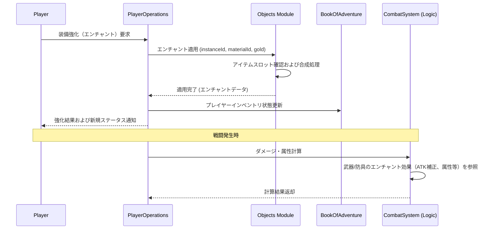

# アイテムエンチャントシステム (Item Enchantment System)

## 1. 概要
本ドキュメントは、武器、防具、指輪などの装備品に対して、追加の特殊効果やステータス補正を付与する「アイテムエンチャントシステム」の仕様を定義します。これにより、装備品のカスタマイズ性を向上させ、エンドコンテンツとしてのアイテム収集・育成要素を強化します。

## 2. 基本仕様
エンチャントは、アイテムのインスタンス（`ThingInstance`）が持つ `metadata` や `meta_effects` を通じて表現されます。

### 2.1 スロット制限
装備品が保持できるエンチャントの最大スロット数は、アイテムの**ティア（Tier）**に応じて制限されます。

| アイテムのティア | 最大エンチャントスロット数 | 備考 |
| :--- | :---: | :--- |
| **1** | 1 | 初期装備（木の剣、皮の鎧など）。 |
| **2** | 2 | 中堅装備（チェインメイル、シルバーソードなど）。 |
| **3** | 3 | 強力・レア装備（プレートアーマー、ドラゴンキラーなど）。 |
| **4** | 4 | ユニーク・極レア装備（伝説級の装備など）。 |

- **スロット状態**: スロットには「空きスロット」と「エンチャント付与済みスロット」が存在します。空きスロットがないアイテムに対しては、既存 of エンチャントを上書きするか、または専用のアイテムを用いてエンチャントを削除する必要があります。

### 2.2 エンチャントの識別
- 未識別のアイテムにエンチャントが付与されている場合、アイテム自体の識別（`isIdentified = true`）が行われるまで、付与されているエンチャントの具体的な効果や数値はプレイヤーに表示されません。詳細は [アイテム識別システム](./Item-Identification-System.md) を参照してください。
- 識別前は「???の施された [アイテム名]」のように、エンチャントが存在することのみが示唆されます。

## 3. エンチャントの付与方法
エンチャントの付与（付加）には、以下のいくつかの手段が存在します。

### 3.1 自然生成（ダンジョン内ドロップ）
- ダンジョン内で拾ったアイテムや、宝箱から出現したアイテムには、一定確率で初期状態でランダムなエンチャントが付与されています。
- ダンジョンレベルやランクが高いほど、付与されるエンチャントの品質（ランク）が高くなり、複数スロットが埋まっている確率が上昇します。

### 3.2 鍛冶屋での付与・強化
- 拠点（町）の鍛冶屋において、ゴールドおよび「魔力石」「属性石」などの特定素材を消費することで、空きスロットに任意のエンチャント（またはランダムエンチャント）を付与できます。
- **必要コスト**:
  `必要ゴールド = 対象アイテムのティア * 2000` Gold + 必要素材（例：`fire_stone`, `water_stone` などの [Objects ドメインモデル](./domain_models/Objects.md) で定義されている素材）

### 3.3 消費アイテムによる付与
- 専用の消費アイテム「エンチャントの巻物（`enchant_scroll`）」を使用することで、装備中の対象アイテムにランダムなエンチャントを即時に1つ付与できます。空きスロットがない場合は失敗します。

## 4. エンチャント効果一覧
エンチャントは、その効果の強さに応じて「I」「II」「III」などのランク（レベル）を持ちます。

### 4.1 ステータス補正系（プレフィックス）
装備品の基礎ステータスを直接強化するエンチャントです。

| 効果 ID / キー | 名称 | 付与可能カテゴリ | 補正効果 (I / II / III) | 備考 |
| :--- | :--- | :---: | :--- | :--- |
| `ENCHANT_ATK` | 鋭利な / 剛力の | 武器、指輪 | 物理攻撃力 `atk`: +1 / +3 / +5 | [戦闘システム](./Combat-System.md) における基礎値に加算。 |
| `ENCHANT_DEF` | 頑丈な / 守護の | 防具、指輪 | 物理防御力 `def`: +1 / +3 / +5 | 防御計算時の基礎値に加算。 |
| `ENCHANT_MATK` | 魔力の / 賢者の | 武器、指輪 | 魔法攻撃力 `magicAtk`: +1 / +3 / +5 | |
| `ENCHANT_MDEF` | 精神の / 魔防の | 防具、指輪 | 魔法防御力 `magicDef`: +1 / +3 / +5 | |
| `ENCHANT_DEX` | 俊敏な / 風切の | 武器、防具、指輪 | 器用さ `dex`: +2 / +4 / +8 | 命中率やクリティカル率に影響。 |
| `ENCHANT_HP` | 頑健な / 生命の | 防具、指輪 | 最大 HP `maxHp`: +5 / +15 / +30 | |

### 4.2 属性付与系
武器・防具に特定の属性を付加します。属性の判定は [Objects ドメインモデル](./domain_models/Objects.md) の属性規則に準拠します。

| 効果 ID / キー | 名称 | カテゴリ | 効果概要 |
| :--- | :--- | :---: | :--- |
| `ENCHANT_ATTR_FIRE` | 劫火の | 武器、防具 | 武器：攻撃を火属性に変更。防具：火属性ダメージを 15% 軽減。 |
| `ENCHANT_ATTR_WATER` | 氷結の | 武器、防具 | 武器：攻撃を水属性に変更。防具：水属性ダメージを 15% 軽減。 |
| `ENCHANT_ATTR_WIND` | 疾風の | 武器、防具 | 武器：攻撃を風属性に変更。防具：風属性ダメージを 15% 軽減。 |
| `ENCHANT_ATTR_EARTH` | 烈土の | 武器、防具 | 武器：攻撃を地属性に変更。防具：地属性ダメージを 15% 軽減。 |
| `ENCHANT_ATTR_HOLY` | 聖なる | 武器、防具 | 武器：攻撃を聖属性に変更。防具：聖属性ダメージを 20% 軽減。 |
| `ENCHANT_ATTR_DARK` | 邪悪な | 武器、防具 | 武器：攻撃を闇属性に変更。防具：闇属性ダメージを 20% 軽減。 |

### 4.3 特殊効果系（サフィックス）
戦闘時の特殊なパッシブ能力や、特定の種族に対する特効を付加します。

| 効果 ID / キー | 名称 | カテゴリ | 効果概要 | 備考 |
| :--- | :--- | :---: | :--- | :--- |
| `ENCHANT_REGEN` | 自己再生の | 防具、指輪 | `subStep % 15 == 0` のタイミングで HP を 1 回復する。 | 複数部位で重複不可（最大1つのみ有効）。 |
| `ENCHANT_SLAYER` | 〜キラー / 〜バスター | 武器 | 指定カテゴリのモンスターに対する物理・魔法ダメージが 1.4倍（特効）。 | [標準メタデータ仕様](./Standard-Metadata-Specification.md) の `slayer` キーに対応するカテゴリを付与。 |
| `ENCHANT_EXP` | 探求者の | 防具、指輪 | 敵撃破時に得られる獲得経験値が 10% 上昇する。 | 乗算で適用。 |
| `ENCHANT_GOLD` | 富豪の | 防具、指輪 | 敵撃破時に得られる獲得ゴールドが 10% 上昇する。 | 乗算で適用。 |
| `ENCHANT_STEALTH` | 忍びの | 防具、指輪 | モンスターからの索敵範囲（視界）を 1 マス減少させる。 | 最低 1 マスは残る。 |

## 5. データ構造と永続化
エンチャント情報は、`ThingInstance` の `metadata` フィールド、および `meta_effects` 配列を使用して格納されます。詳細は [標準メタデータ仕様](./Standard-Metadata-Specification.md) を参照してください。

### 5.1 メタデータ表現 (JSON 例)
以下は、2つのエンチャント（物理攻撃力+3、火属性付与）を持つ「銀の剣」（ティア 2）のインスタンスデータ表現例です。

```json
{
  "instanceId": "e30df9bc-2601-4475-bf7e-07df9e19d089",
  "typeId": "silver_sword",
  "name": "銀の剣",
  "display": ")",
  "attribute": "None",
  "tier": 2,
  "standardPrice": 1500,
  "metadata": {
    "isIdentified": true,
    "atk": 9,
    "enchantSlots": 2,
    "enchantments": [
      {
        "id": "ENCHANT_ATK",
        "level": 2,
        "name": "剛力の",
        "effects": {
          "atk": 3
        }
      },
      {
        "id": "ENCHANT_ATTR_FIRE",
        "level": 1,
        "name": "劫火の",
        "effects": {
          "attribute": "Fire"
        }
      }
    ]
  }
}
```

## 6. モジュール間連携
エンチャントシステムに関わる基本的なデータフローを以下に示します。



## 7. 制限事項とゲームバランス
- **重複不可**: 同一のステータス補正系エンチャント（例：`ENCHANT_ATK`）が1つのアイテムの異なるスロットに重複して付与されることはありません。
- **呪い状態の制約**: 鍛冶屋でのエンチャント付与および強化は、呪われているアイテム（`isCursed = true`）に対しては実行できません。先に「解呪の巻物」等で呪いを解く必要があります。
- **譲渡・移植制限**: エンチャントされたアイテムを他のアイテムへと直接エンチャント移行（移植）する機能は、ゲームバランス保護のため原則不可能です。

## 8. 今後の拡張
- **エンチャント抽出**: 不要になった装備から、1つのエンチャントのみを「魔力スクロール」として抽出する機能。
- **ソウルリンクエンチャント**: プレイヤーの現在 HP やスタミナに応じて、リアルタイムで効果が変動する特殊エンチャント。
