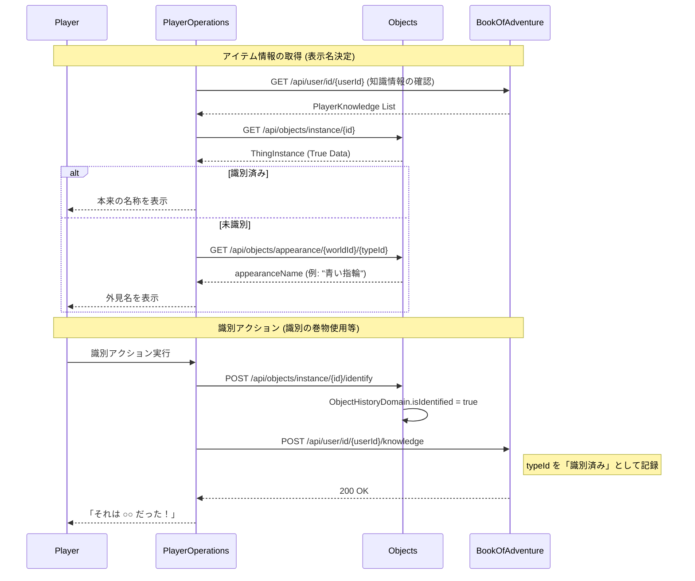

# アイテム識別システム

## 1. 概要
本ドキュメントは、ゲーム内におけるアイテムの「識別（Identification）」システムの仕様を定義します。
プレイヤーが拾った一部のアイテム（指輪、巻物、杖など）を、最初は正体不明の「未識別状態」とし、使用や特定のアイテムによって正体を明らかにする仕組みを導入することで、ゲームプレイに戦略性と緊張感を与えます。

## 2. 識別の対象
以下のアイテムタイプを識別の対象とします。
- **指輪 (`RING`)**: 装備するまで、あるいは識別するまで効果が不明。
- **巻物 (`SCROLL`)**: 読むまで効果が不明。
- **杖 (`STICK`)**: 振るまで効果が不明。

武器 (`WEAPON`) や防具 (`ARMOR`) は原則として最初から識別済みですが、将来的に「呪い」や「強化値」を隠蔽する仕組みへの拡張が可能です。

## 3. アイテムの状態
アイテムのインスタンスは以下のいずれかの状態を持ちます。

### 3.1 未識別 (Unidentified)
- アイテムの真の名称および具体的な効果がプレイヤーに伏せられている状態。
- **表示名**: カテゴリに応じた「外見名」が表示されます。
  - 例: 「青い指輪」「奇妙な文様の巻物」「ねじれた木の杖」
- **外見名の決定**:
  - ダンジョン生成時またはゲーム開始時に、各アイテムタイプ（例：`Ring of Strength`）に対して、ランダムな外見（例：`Blue Ring`）が割り当てられます。
  - 同じ外見のアイテムは、同じ効果を持ちます（一度識別されれば、同じ外見のアイテムはすべて識別済みとなります）。

### 3.2 識別済み (Identified)
- アイテムの真の名称および効果が判明している状態。
- **表示名**: 本来の名前が表示されます。
  - 例: 「力の指輪」「混乱の巻物」「火炎の杖」

## 4. 識別のプロセス
アイテムを識別するための主な方法は以下の通りです。

### 4.1 使用による識別
- **巻物/杖**: 使用してその効果が発動した際、自動的にそのアイテムタイプが識別されます。
- **指輪**: 装備した際にステータス変化などで正体が推測できる場合がありますが、完全な識別には専用の手段が必要な場合があります。

### 4.2 識別アイテムの使用
- 「識別の巻物」などの専用アイテムを使用し、対象のアイテムを選択することで識別状態にします。

### 4.3 鑑定サービスの利用
- 町の店主などに費用を支払うことで、所持品を鑑定してもらうことができます。

## 5. データ構造への影響案

### 5.1 Objects モジュール
- **`ObjectHistoryDomain` へのフィールド追加**:
  - `isIdentified` (boolean): 特定のアイテムインスタンスが識別されているかどうかを保持します。
- **`IdentificationMapDomain` (新規)**:
  - ワールドごとの外見マッピングを管理します。
  - フィールド: `id`, `worldId`, `typeId`, `appearanceName`
- **`PlayerKnowledgeDomain` (新規)**:
  - プレイヤー（ユーザー）ごとのアイテム知識を管理します。
  - フィールド: `id`, `userId`, `worldId`, `typeId`, `isIdentified`

### 5.2 PlayerOperations モジュール
- **名称解決ロジックの実装**:
  - アイテム情報を取得する際、以下の優先順位で名称を決定します。
    1. インスタンス自体が識別済み、または `PlayerKnowledgeDomain` で該当の `typeId` が識別済みの場合 → 本来の名称 (`Thing.getName()`) を使用。
    2. 未識別の場合 → `IdentificationMapDomain` から `appearanceName` を取得して使用。
    3. マッピングが存在しないカテゴリ（武器・防具等）の場合 → 本来の名称を使用。

## 6. 詳細な識別フロー

以下の図は、プレイヤーがアイテムを発見または識別した際のモジュール間連携を示します。

## 7. 今後の検討事項
- 一度識別したアイテムの外見知識を、次回のプレイ（別キャラクター）に引き継ぐか。
- 呪われたアイテムの識別制限（識別するまで呪われていることがわからない等）。
- 「店」での未識別アイテムの販売価格設定。
