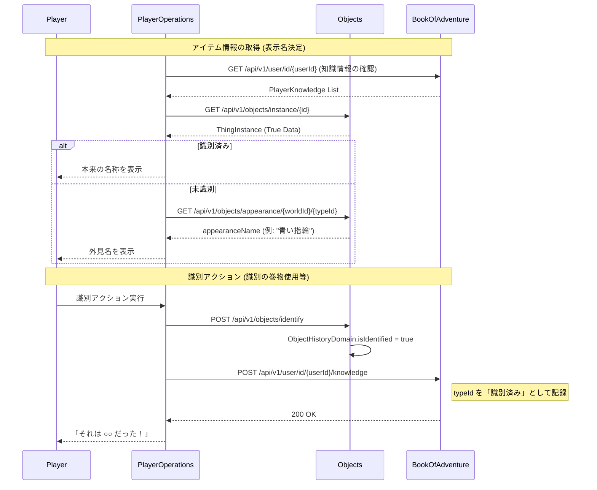

# アイテム識別システム

## 1. 概要
本ドキュメントは、ゲーム内におけるアイテムの「識別（Identification）」システムの仕様を定義します。
プレイヤーが拾った一部のアイテム（指輪、巻物、杖など）を、最初は正体不明の「未識別状態」とし、使用や特定のアイテムによって正体を明らかにする仕組みを導入することで、ゲームプレイに戦略性と緊張感を与えます。

## 2. 識別の対象
以下のアイテムタイプを識別の対象とします。
- **指輪 (`RING`)**: 装備するまで、あるいは識別するまで効果が不明。
- **巻物 (`SCROLL`)**: 読むまで効果が不明。
- **杖 (`STICK`)**: 振るまで効果が不明。

武器 (`WEAPON`) や防具 (`ARMOR`) は原則として最初から識別済みですが、将来的に「呪い」や「強化値」を隠蔽する仕組みへの拡張が可能です。

## 3. アイテムの状態
アイテムのインスタンスは以下のいずれかの状態を持ちます。

### 3.1 未識別 (Unidentified)
- アイテムの真の名称および具体的な効果がプレイヤーに伏せられている状態。
- **表示名**: カテゴリに応じた「外見名」が表示されます。
  - 例: 「青い指輪」「奇妙な文様の巻物」「ねじれた木の杖」
- **外見名の決定**:
  - ダンジョン生成時またはゲーム開始時に、各アイテムタイプ（例：`Ring of Strength`）に対して、ランダムな外見（例：`Blue Ring`）が割り当てられます。
  - 同じ外見のアイテムは、同じ効果を持ちます（一度識別されれば、同じ外見のアイテムはすべて識別済みとなります）。

### 3.2 識別済み (Identified)
- アイテムの真の名称および効果が判明している状態。
- **表示名**: 本来の名前が表示されます。
  - 例: 「力の指輪」「混乱の巻物」「火炎の杖」

## 4. 識別のプロセス
アイテムを識別するための主な方法は以下の通りです。

### 4.1 使用による識別
- **巻物/杖**: 使用してその効果が発動した際、自動的にそのアイテムタイプが識別されます。
- **指輪**: 装備した際にステータス変化などで正体が推測できる場合がありますが、完全な識別には専用の手段が必要な場合があります。

### 4.2 識別アイテムの使用
- 「識別の巻物」などの専用アイテムを使用し、対象のアイテムを選択することで識別状態にします。

### 4.3 鑑定サービスの利用
- 町の店主などに費用を支払うことで、所持品を鑑定してもらうことができます。

## 5. データ構造への影響案

### 5.1 Objects モジュール
- **`ObjectHistoryDomain` へのフィールド追加**:
  - `isIdentified` (boolean): 特定のアイテムインスタンスが識別されているかどうかを保持します。
- **`IdentificationMapDomain` (新規)**:
  - ワールドごとの外見マッピングを管理します。
  - フィールド: `id`, `worldId`, `typeId`, `appearanceName`
- **`PlayerKnowledgeDomain` (新規)**:
  - プレイヤー（ユーザー）ごとのアイテム知識を管理します。
  - フィールド: `id`, `userId`, `worldId`, `typeId`, `isIdentified`

### 5.2 PlayerOperations モジュール
- **名称解決ロジックの実装**:
  - アイテム情報を取得する際、以下の優先順位で名称を決定します。
    1. インスタンス自体が識別済み、または `PlayerKnowledgeDomain` で該当の `typeId` が識別済みの場合 → 本来の名称 (`Thing.getName()`) を使用。
    2. 未識別の場合 → `IdentificationMapDomain` から `appearanceName` を取得して使用。
    3. マッピングが存在しないカテゴリ（武器・防具等）の場合 → 本来の名称を使用。

## 6. 詳細な識別フロー

以下の図は、プレイヤーがアイテムを発見または識別した際のモジュール間連携を示します。


```mermaid
sequenceDiagram
    participant P as Player
    participant PO as PlayerOperations
    participant OBJ as Objects
    participant BA as BookOfAdventure

    Note over P, BA: アイテム情報の取得 (表示名決定)
    PO->>BA: GET /api/v1/user/id/{userId} (知識情報の確認)
    BA-->>PO: PlayerKnowledge List
    PO->>OBJ: GET /api/v1/objects/instance/{id}
    OBJ-->>PO: ThingInstance (True Data)
    alt 識別済み
        PO-->>P: 本来の名称を表示
    else 未識別
        PO->>OBJ: GET /api/v1/objects/appearance/{worldId}/{typeId}
        OBJ-->>PO: appearanceName (例: "青い指輪")
        PO-->>P: 外見名を表示
    end

    Note over P, BA: 識別アクション (識別の巻物使用等)
    P->>PO: 識別アクション実行
    PO->>OBJ: POST /api/v1/objects/identify
    OBJ->>OBJ: ObjectHistoryDomain.isIdentified = true
    PO->>BA: POST /api/v1/user/id/{userId}/knowledge
    Note right of BA: typeId を「識別済み」として記録
    BA-->>PO: 200 OK
    PO-->>P: 「それは ○○ だった！」
```

## 7. 知識の継承ルール
アイテムの識別知識（どの外見がどのアイテムタイプに対応するか）の継承については以下の通りとします。

- **継承の単位**: 知識は `userId` および `worldId` に紐づいて管理されます。
- **永続性**: プレイヤーキャラクターが死亡して新しく作り直した場合や、別のキャラクターで同じワールドを探索する場合も、識別済みの知識は保持されます。
- **リセット**: ワールド自体が再生成された場合、または管理者が知識のリセットを意図した設定を行った場合は、知識がクリアされます。

## 8. 呪いと識別の関係
未識別のアイテムには「呪い」がかかった状態（Cursed）が存在する可能性があります。

- **呪いの隠蔽**: アイテムが未識別状態である場合、そのアイテムが呪われているかどうかはプレイヤーには表示されません。
- **装備による判明**: 未識別の武器、防具、指輪を装備した際、そのアイテムが呪われていれば即座に「呪い」状態が判明し、メッセージが表示されます。この場合、装備を外すことができなくなります。
- **識別による判明**: 「識別の巻物」等でアイテムを識別した場合、呪いの有無も同時に判明します。
- **解除**: 呪いの解除には「解呪の巻物」等の専用の手段が必要です。識別しただけでは呪いは解除されません。

### 8.1 呪いの具体的効果 (Curse Effects)
呪われたアイテムには、外せないという制約に加え、以下のいずれかの負の効果が付随します。

| 名称 | 効果内容 | 対象カテゴリ |
| :--- | :--- | :--- |
| **能力低下** | 攻撃力 (`Atk`) または 防御力 (`Def`) が **10%** 減少する。 | 武器、防具、指輪 |
| **空腹の加速** | スタミナの消費速度が **1.2 倍** になる。 | 指輪、防具 |
| **行動失敗** | **5%** の確率でアクション（攻撃、移動等）に失敗する。 | 全カテゴリ |
| **成長抑制** | 装備中、一切の経験値を獲得できなくなる。 | 全カテゴリ |
| **技術封印** | 装備中、スキルや魔法の使用ができなくなる。 | 武器、指輪 |

## 9. ショップにおける取り扱い
管理者が運営するショップにおける、未識別アイテムの価格設定と取り扱いは以下の通りです。

- **販売価格（店から買う）**:
  - 店で売られている未識別アイテムは、その**正体（本来のアイテムタイプ）の `basePrice`** で販売されます。
  - プレイヤーは、販売価格からそのアイテムの正体を推測することが可能です（鑑定のヒントとしての役割）。
- **買取価格（店に売る）**:
  - プレイヤーが未識別アイテムを店に売る場合、正体が不明であることのリスクとして、本来の買取価格の **50%** に減額されます。
  - 確実に適正価格で売りたい場合は、事前に識別を済ませる必要があります。

## 10. 今後の検討事項
- **高度な隠蔽**: 識別済みであっても、特定の強力な呪いによって強化値が隠される「二重隠蔽」の導入。
- **偽の識別**: 呪いによって、誤った識別結果（偽の名称）を表示させるトラップ的な巻物の導入。

## 11. API仕様およびエラーハンドリング

### 11.1 APIエンドポイントとJSON構造

#### 11.1.1 アイテム識別実行 API
アイテムの識別（「識別の巻物」使用または町の鑑定サービス利用）を行います。

- **Endpoint**: `POST /api/v1/objects/identify`
- **Request Body (JSON - 識別の巻物使用時)**:
```json
{
  "userId": "player_uuid_12345",
  "targetObjectId": "item_instance_67890",
  "method": "SCROLL",
  "scrollObjectId": "scroll_identify_11111"
}
```

- **Request Body (JSON - 町の鑑定サービス利用時)**:
```json
{
  "userId": "player_uuid_12345",
  "targetObjectId": "item_instance_67890",
  "method": "APPRAISER"
}
```

- **Response Body (JSON - 成功時)**:
```json
{
  "success": true,
  "result": "SUCCESS",
  "message": "アイテムを識別しました！「奇妙な文様の巻物」の正体は「混乱の巻物」でした。",
  "item": {
    "objectId": "item_instance_67890",
    "typeId": "scroll_confusion",
    "trueName": "混乱の巻物",
    "category": "SCROLL",
    "isIdentified": true,
    "isCursed": false
  }
}
```

#### 11.1.2 外見マッピング取得 API
ワールドにおける特定の未識別アイテムタイプの外見情報を取得します。

- **Endpoint**: `GET /api/v1/objects/appearance/{worldId}/{typeId}`
- **Response Body (JSON - 成功時)**:
```json
{
  "worldId": "world_alpha_01",
  "typeId": "ring_strength",
  "category": "RING",
  "appearanceName": "青い指輪"
}
```

#### 11.1.3 プレイヤー識別知識 API
プレイヤーが獲得したアイテム識別知識の一覧取得および更新を行います。

- **Endpoint**: `GET /api/v1/user/{userId}/knowledge`
- **Response Body (JSON - 成功時)**:
```json
{
  "userId": "player_uuid_12345",
  "worldId": "world_alpha_01",
  "identifiedTypeIds": [
    "ring_strength",
    "scroll_confusion",
    "stick_fire"
  ]
}
```

- **Endpoint**: `POST /api/v1/user/{userId}/knowledge`
- **Request Body (JSON)**:
```json
{
  "worldId": "world_alpha_01",
  "typeId": "scroll_confusion"
}
```

### 11.2 エラーハンドリング (Error Handling)
アイテム識別処理および関連APIで問題が発生した場合のレスポンス定義です。

| エラーコード | 発生条件 | レスポンス HTTP ステータス | 戻り値のメッセージ例 |
| :--- | :--- | :---: | :--- |
| `ITEM_NOT_FOUND` | 指定された `targetObjectId` のアイテムが存在しない。 | 404 Not Found | 指定されたアイテムが見つかりません。 |
| `USER_NOT_FOUND` | 指定された `userId` のプレイヤーが存在しない。 | 404 Not Found | 指定されたプレイヤーが見つかりません。 |
| `ALREADY_IDENTIFIED` | 対象のアイテムはすでに識別済みである。 | 400 Bad Request | このアイテムはすでに識別されています。 |
| `ITEM_NOT_IDENTIFIABLE` | 対象アイテムが識別不可のカテゴリ（例：食料や素材等）である。 | 400 Bad Request | このアイテムは識別の必要がありません。 |
| `INVALID_IDENTIFY_METHOD` | 指定された `method`（`SCROLL` / `APPRAISER` 等）が無効。 | 400 Bad Request | 無効な識別手段が指定されています。 |
| `SCROLL_NOT_FOUND` | `method="SCROLL"` 時に指定された「識別の巻物」がインベントリに存在しない。 | 400 Bad Request | 識別の巻物を所持していません。 |
| `INSUFFICIENT_GOLD` | `method="APPRAISER"` 時に鑑定に必要なゴールドが不足している。 | 400 Bad Request | 鑑定費用が不足しています。 |
