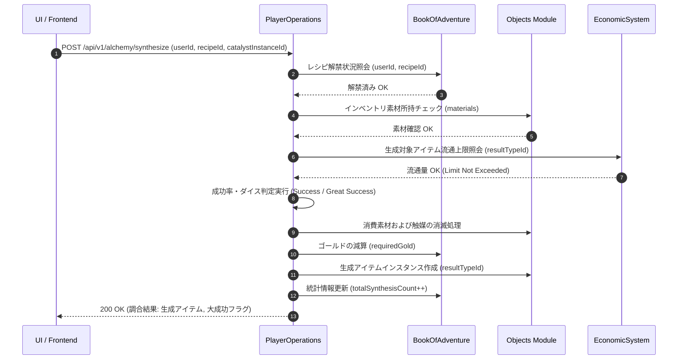

# ダンジョン錬金・アイテム調合システム (Item Synthesis & Alchemy System)

## 1. 概要
本ドキュメントは、プレイヤーが探索や遠征、ドロップによって入手した各種素材・アイテム・触媒を組み合わせ、新たな高ティアアイテムや強化素材、特殊効果を持つ消費アイテムを創出する「ダンジョン錬金・アイテム調合システム（Item Synthesis & Alchemy System）」の仕様を定義します。

本システムは RogueB の「収集・育成・経済」エコシステムを横断し、余剰素材の活用、未利用ドロップの循環、高難易度コンテンツに向けたリソース精製の中核を担います。

---

## 2. 調合・錬金メカニズム (Synthesis Mechanics & Rules)

### 2.1 調合手段と実行環境
調合・錬金は以下の 2 つの方法で実行可能です。

1. **ポータブル調合（調合の鍋 `alchemy_pot`）**:
   - プレイヤーがインベントリ内に消費型/使用型アイテム「調合の鍋（`alchemy_pot`）」を所持している場合、ダンジョン内または拠点（町）で手軽に調合を実行可能。
   - レシピ基準成功率に `-10%` の補正がかかります。
2. **ダンジョン錬金炉（`alchemy_kettle_tile`）**:
   - ダンジョン内やマイ・ダンジョン施設として設置された「錬金炉」タイルに隣接して実行。
   - レシピ基準成功率に `+10%` のボーナスがかかり、大成功（品質アップ・個数増加）の確率が上昇します。

### 2.2 調合ルールと計算式

#### 1) 成功率と品質判定
調合の成功率は、レシピごとの「基礎成功率（`baseSuccessRate`）」、使用する触媒（`catalyst`）、および実行環境（鍋 or 錬金炉）によって決定されます。

$$\text{最終成功率 (\%)} = \min(100, \text{baseSuccessRate} + \text{catalystBonus} + \text{facilityBonus})$$

- **成功時 (Success)**: 目的の生成アイテムを 1 個獲得（またはレシピで規定された個数）。
- **大成功時 (Great Success)**: 最終成功率が 100% を超える余剰確率（またはダイス目が上位 10%）の場合発動。生成数量が `+1` 増加するか、エンチャント/ステータス補正値が +1 向上した品質向上アイテム（`qualityBonus`）を獲得。
- **失敗時 (Failure)**: 投入素材が消滅し、低価値な残渣アイテム（`ash_waste` または `ruined_potion`）に変化。

#### 2) 賢者の石（`philosophers_stone`）による絶対成功
触媒として最高級触媒「賢者の石（`philosophers_stone`）」を投入した場合、成功率は無条件で **100%** となり、確実に出力数量が **2倍**（大成功確定）となります。

#### 3) 世界内流通上限 (`maxLimit`) チェック
生成対象アイテムが世界内存在上限（`maxLimit`）を持つ貴重品の場合、調合実行時に `EconomicSystem` モジュールを介して現在の世界内流通量をリアルタイム照会します。
上限に達している場合、調合処理はエラー (`CIRCULATION_LIMIT_REACHED`) となり、素材およびゴールドは消費されません。

---

## 3. レシピ定義と初期レシピ (Recipe Definitions & Initial Recipes)

レシピは「固定レシピ（確定調合）」と「解禁条件（レシピ本所持・熟練度）」によって管理されます。

### 3.1 レシピカテゴリ
1. **消費・回復系 (Consumables)**: 薬草や各種ポーション、食料の精製。
2. **触媒・素材系 (Catalysts & Materials)**: 進化・退化・特性強化用触媒や高階級資材の練成。
3. **装備・エンチャント系 (Equipment & Enchants)**: 鍛冶・魔法属性を付与した特殊装備や巻物の調合。
4. **特殊ユーティリティ系 (Special Utilities)**: 環境異変宝珠や捕獲カプセル、遠征笛などの精製。

### 3.2 初期実装レシピ一覧

| レシピ ID | 名称 | カテゴリ | 必用素材アイテム | 必要ゴールド | 基礎成功率 | 生成アイテム (`typeId`) | 生成数 |
| :--- | :--- | :--- | :--- | :---: | :---: | :--- | :---: |
| `recipe_healing_potion_high` | 上級癒しの薬 | Consumables | `healing_potion` x2, `medicinal_herb` x1 | 100 | 90% | `high_healing_potion` | 1 |
| `recipe_elixir_stamina` | 活力の秘薬 | Consumables | `bread` x2, `bitter_medicine` x1 | 150 | 85% | `stamina_elixir` | 1 |
| `recipe_elemental_stone_fire` | 炎の結晶 | Catalysts | `fire_stone` x3, `candlestick` x1 | 300 | 80% | `fire_crystal` | 1 |
| `recipe_trait_crystal` | 特性の結晶 | Catalysts | `trait_stone` x3, `monster_soul_gem` x1 | 1,000 | 75% | `trait_crystal` | 1 |
| `recipe_ultra_capsule` | 最高性能カプセル | Special | `great_capsule` x2, `iron_sword` x1 | 500 | 80% | `ultra_capsule` | 1 |
| `recipe_weather_orb_blaze` | 灼熱の宝珠 | Special | `fire_stone` x2, `tp_scroll` x1 | 800 | 70% | `weather_orb_blaze` | 1 |
| `recipe_expedition_whistle` | 遠征の笛 | Special | `wood_material` x3, `speed_potion` x1 | 400 | 85% | `expedition_whistle` | 1 |

---

## 4. ドメインモデルおよびMongoDB永続化仕様 (Domain Models & MongoDB Persistence)

### 4.1 ドメインモデル構造

#### `AlchemyRecipeDomain`
```java
public record AlchemyRecipeDomain(
    String recipeId,
    String name,
    String category,
    List<MaterialRequirement> materials,
    int requiredGold,
    double baseSuccessRate,
    String resultTypeId,
    int resultQuantity,
    boolean isDefaultUnlocked,
    String requiredRecipeBookId
) {}

public record MaterialRequirement(
    String typeId,
    int quantity
) {}
```

#### `PlayerAlchemyRecipeDomain` (プレイヤー解放状態)
```java
public record PlayerAlchemyRecipeDomain(
    String userId,
    Set<String> unlockedRecipeIds,
    int totalSynthesisCount,
    int totalSuccessCount,
    LocalDateTime updatedAt
) {}
```

### 4.2 MongoDB 永続化仕様 (`playerAlchemyRecipeDomain`)

- **コレクション名**: `playerAlchemyRecipeDomain`
- **モジュール**: `BookOfAdventure`

#### コレクション構造 (JSON 表現)
```json
{
  "_id": "user_uuid_12345",
  "userId": "user_uuid_12345",
  "unlockedRecipeIds": [
    "recipe_healing_potion_high",
    "recipe_elemental_stone_fire",
    "recipe_trait_crystal"
  ],
  "totalSynthesisCount": 42,
  "totalSuccessCount": 38,
  "updatedAt": "2026-03-31T12:00:00Z"
}
```

#### インデックス設計
| コレクション | インデックスキー | ユニーク | 目的・用途 |
| :--- | :--- | :---: | :--- |
| `playerAlchemyRecipeDomain` | `{"userId": 1}` | **Yes** | ユーザー別レシピ解禁状況の高速取得 |

---

## 5. モジュール間連携とシーケンスフロー (Inter-Module Data Flow & Sequence Diagram)



---

## 6. API仕様 (API Specifications)

### 6.1 解禁済みレシピ一覧照会 (`GET /api/v1/alchemy/recipes/{userId}`)
指定したユーザーが現在解禁している調合レシピの一覧および解放可能条件を取得します。

#### レスポンス JSON スキーマ (200 OK)
```json
{
  "userId": "user_uuid_12345",
  "unlockedRecipes": [
    {
      "recipeId": "recipe_healing_potion_high",
      "name": "上級癒しの薬",
      "category": "Consumables",
      "materials": [
        { "typeId": "healing_potion", "quantity": 2 },
        { "typeId": "medicinal_herb", "quantity": 1 }
      ],
      "requiredGold": 100,
      "baseSuccessRate": 0.90,
      "resultTypeId": "high_healing_potion",
      "resultQuantity": 1
    }
  ],
  "totalSynthesisCount": 42
}
```

---

### 6.2 レシピ解禁 (`POST /api/v1/alchemy/recipes/unlock`)
レシピ本（`recipe_book_basic` 等）を消費して、新たな調合レシピを解禁します。

#### リクエスト JSON スキーマ
```json
{
  "userId": "user_uuid_12345",
  "recipeBookInstanceId": "obj_inst_recipe_book_001"
}
```

#### レスポンス JSON スキーマ (200 OK)
```json
{
  "status": "SUCCESS",
  "unlockedRecipeIds": [
    "recipe_ultra_capsule",
    "recipe_weather_orb_blaze"
  ],
  "message": "「初級錬金調合書」を使用し、新たなレシピを解禁しました。"
}
```

---

### 6.3 調合実行 (`POST /api/v1/alchemy/synthesize`)
指定したレシピに従ってアイテムの調合・錬金を実行します。

#### リクエスト JSON スキーマ
```json
{
  "userId": "user_uuid_12345",
  "recipeId": "recipe_trait_crystal",
  "catalystInstanceId": "obj_inst_philosophers_stone_01",
  "useFacility": true
}
```

#### レスポンス JSON スキーマ (200 OK - 大成功時)
```json
{
  "status": "GREAT_SUCCESS",
  "recipeId": "recipe_trait_crystal",
  "recipeName": "特性の結晶",
  "calculatedSuccessRate": 1.00,
  "createdItems": [
    {
      "instanceId": "obj_inst_trait_crystal_99",
      "typeId": "trait_crystal",
      "name": "特性の結晶",
      "quantity": 2
    }
  ],
  "consumedGold": 1000,
  "message": "大成功！賢者の石の導きにより「特性の結晶」が 2 個創出されました。"
}
```

---

## 7. エラーハンドリング仕様 (Error Handling Specification)

### 7.1 エラーレスポンス共通 JSON スキーマ
```json
{
  "errorCode": "INSUFFICIENT_MATERIALS",
  "message": "調合に必要な素材アイテムが不足しています。",
  "timestamp": "2026-03-31T12:00:00Z"
}
```

### 7.2 エラーコード一覧およびマッピング

| エラーコード | HTTPステータス | 発生条件・説明 |
| :--- | :---: | :--- |
| `RECIPE_NOT_FOUND` | `404 Not Found` | 指定された `recipeId` がマスターデータに存在しない場合。 |
| `RECIPE_LOCKED` | `400 Bad Request` | プレイヤーがまだ対象レシピを解禁していない場合。 |
| `INSUFFICIENT_MATERIALS` | `400 Bad Request` | インベントリに必要な素材アイテムの種類・数量が不足している場合。 |
| `INSUFFICIENT_GOLD` | `400 Bad Request` | 調合費用に必要なゴールドが不足している場合。 |
| `CIRCULATION_LIMIT_REACHED` | `409 Conflict` | 生成対象アイテムが世界内存在上限 (`maxLimit`) に達している場合。 |
| `ALCHEMY_FAILED` | `200 OK` | 確率判定により調合が失敗した場合（ステータス `FAILED` と共に残渣アイテムを返却）。 |
| `BAG_FULL` | `400 Bad Request` | 生成アイテムを受け取るインベントリ空き枠がない場合。 |
| `INVALID_CATALYST` | `400 Bad Request` | 調合に使用できない無効な触媒アイテムが指定された場合。 |
