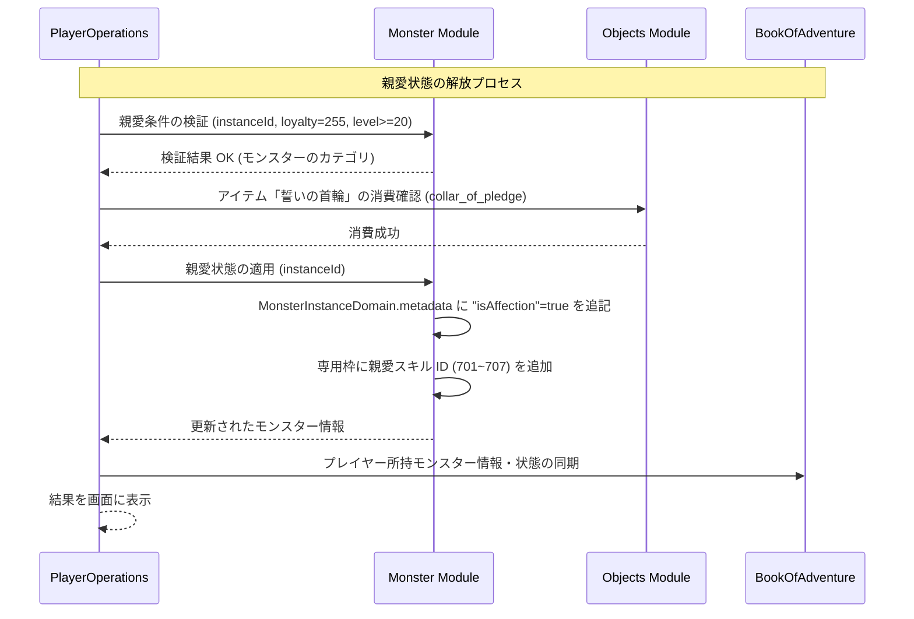

# モンスター親愛システム (Monster Affection System)

## 1. 概要
本ドキュメントは、プレイヤーと「仲間のモンスター」との間の絆が極限（限界値）に達した際に解放される「モンスター親愛システム」の仕様を定義します。これは、[モンスター忠誠度システム](./Monster-Loyalty-System.md) の上位（エンドコンテンツ）に位置づけられ、特別な親愛スキルや特殊な戦闘・非戦闘時の相互作用をもたらすことで、モンスターとの一体感と育成の楽しさを最大化するシステムです。

## 2. 親愛状態 (Affection State) の解放条件と維持
モンスター個体がプレイヤーを無二のパートナーとして完全に受け入れたとき、その個体は「親愛状態（Affection）」へと昇華します。

### 2.1 解放条件
- **忠誠度の最大化**: プレイヤーに対する忠誠度（`loyalty`）が限界値である **255** に達していること。
- **レベル制限**: モンスター個体（`MonsterInstance`）が **レベル 20** 以上であること。
- **専用の儀式・アイテム（任意）**: 絆を確固たるものにするための特別なアイテム「誓いの首輪（`collar_of_pledge`）」を拠点（ロビー）で使用するか、特別な会話イベントを完了させること。

### 2.2 親愛状態の維持と喪失
- **状態の永続性**: 一度「親愛状態」に達したモンスターは、通常の忠誠度減少アクション（長期間の放置等）による忠誠度低下のペナルティを大幅に無視（または無効化）します。
- **例外的な忠誠度減少**:
  - 戦闘不能（HP 0）が連続して発生した場合に限り、例外的に忠誠度が減少します（戦闘不能1回につき 忠誠度 -5、親愛状態では通常の -20 より減衰）。
  - 忠誠度が 250 未満に低下した場合、親愛状態は「一時休止（Suspended）」となり、後述の親愛効果やスキルは再び忠誠度を 255 に戻すまで封印されます。

## 3. 親愛効果と特殊演出 (Affection Effects & Performance)
親愛状態にあるモンスターは、戦闘および非戦闘時において以下の強力な相互作用（バディ効果）を発揮します。

### 3.1 身代わり（かばう - Covering）
- **発動条件**: プレイヤーの HP が 25% 以下であり、隣接（8マス）する位置に親愛モンスターがアクティブパーティに編入されている場合。
- **効果**: プレイヤーが致死ダメージまたは通常攻撃を受ける際、**30%** の確率で親愛モンスターがその攻撃を「かばい」、ダメージを代わりに引き受けます。
- **演出**: 戦闘ログに「[モンスターのニックネーム]が身を挺して[プレイヤー名]をかばった！」と表示され、モンスターがプレイヤーの座標に割り込むカットイン演出が発生します。

### 3.2 自力治癒 (Self-Remedy)
- **発動条件**: モンスターが行動不能を伴う状態異常（「睡眠」「麻痺」「混乱」）にかかっている際、自身の行動ターンの開始時に判定。
- **効果**: **20%** の確率で、状態異常を自力で解除して即座に行動を可能にします（プレイヤーを助けたいという強い意志の具現化）。
- **演出**: 「[モンスターのニックネーム]は[プレイヤー名]の呼びかけに応え、状態異常を振り払った！」とログに表示されます。

### 3.3 不屈の闘志 (Last Stand)
- **発動条件**: 親愛モンスターが戦闘不能（HP 0）になるダメージを受けた場合。
- **効果**: [戦闘システム](./Combat-System.md)で定義されている確率的な「食いしばり」とは別に、**100% の確率で確実に HP 1 で踏みとどまります（1戦闘につき1回のみ発動）**。
- **演出**: 「[モンスターのニックネーム]は深い絆の力で踏みとどまった！」と表示されます。

## 4. 親愛スキル (Affection Skills)
親愛状態のモンスターは、そのカテゴリ（Type）に応じた、通常のレベルアップや融合では獲得できない「親愛スキル（アクティブ / パッシブ）」を 1 つ自動で解放・習得します。

※ **親愛スキルは通常のスキル枠（最大4つ）とは別枠（親愛スキル専用枠）として管理**され、スキル枠超過時の手動選択の対象外となります。

| 種族カテゴリ (`MonsterDomain.type`) | 解放される親愛スキル名 | スキル ID | 効果概要 |
| :--- | :--- | :---: | :--- |
| **`SLIME`** | ライフシェア (Life Share) | 701 | 自身の HP を半分消費し、プレイヤーの HP/MP をその消費量分即座に回復する。 |
| **`BEAST`** | 神速の絆 (Bonds of Gale) | 702 | パッシブ：プレイヤーが「ヘイスト」状態の時、自身の攻撃力・回避率が 1.2 倍になる。 |
| **`UNDEAD`** | ソウル・バリア (Soul Barrier) | 703 | プレイヤーに 15 ターンの間、魔法ダメージを 30% 軽減するシールドを張る。 |
| **`DRAGON`** | 共鳴ブレス (Resonating Breath) | 704 | 前方3マスの扇状範囲に火属性のブレス（威力 2.0）を放ち、さらにプレイヤーに「攻撃力 1.1倍（5ターン）」を付与。 |
| **`DEMON`** | 闇の代償 (Dark Contract) | 705 | プレイヤーの MP を 20 回復する代わりに、10% の確率で自身が 3 ターン「封印」状態になる。 |
| **`SPIRIT`** | 精霊の加護 (Aegis of Spirits) | 706 | パッシブ：プレイヤーの全属性耐性を 10% 上昇させる。 |
| **`HUMANOID`** | 阿吽の呼吸 (Perfect Synergy) | 707 | パッシブ：自身とプレイヤーが同一の敵を攻撃した際、与えるダメージが双方 1.25 倍になる。 |

## 5. モジュール間連携とシーケンス
親愛状態の解放およびスキルの連動プロセスは、`PlayerOperations` を中心に以下のように連携します。



## 6. APIリクエスト・フローとエラーハンドリング

### 6.1 APIリクエスト仕様
親愛状態を解放（誓い）するための API エンドポイントです。

- **Endpoint**: `POST /api/v1/monsters/affection/pledge`
- **Request Body (JSON)**:
```json
{
  "userId": "player_uuid_12345",
  "monsterInstanceId": "monster_uuid_99999",
  "ritualItemId": "collar_of_pledge"
}
```

- **Response Body (JSON - 成功時)**:
```json
{
  "success": true,
  "result": "SUCCESS",
  "message": "モンスターとの深い絆が結ばれ、親愛状態になりました！「精霊の加護」が発動します。",
  "monster": {
    "instanceId": "monster_uuid_99999",
    "monsterId": "water_spirit",
    "level": 22,
    "loyalty": 255,
    "metadata": {
      "isAffection": true,
      "affectionSkillId": 706
    }
  }
}
```

### 6.2 エラーハンドリング (Error Handling)
処理中に問題が検出された場合、システムは適切なエラーレスポンスを返却します。

| エラーコード | 発生条件 | レスポンス HTTP ステータス | 戻り値のメッセージ例 |
| :--- | :--- | :---: | :--- |
| `MONSTER_NOT_FOUND` | 指定された `monsterInstanceId` のモンスターが存在しない。 | 404 Not Found | 指定されたモンスターが見つかりません。 |
| `INSUFFICIENT_LOYALTY` | モンスターの忠誠度（loyalty）が 255 未満。 | 400 Bad Request | 親愛状態に達するには、忠誠度が最大値(255)に達している必要があります。 |
| `INSUFFICIENT_LEVEL` | モンスターのレベルが 20 未満。 | 400 Bad Request | モンスターのレベルが20以上に達していないため、親愛の誓いを行えません。 |
| `ALREADY_AFFECTION` | 既に対象のモンスターが親愛状態である。 | 400 Bad Request | このモンスターとは既に親愛状態を結んでいます。 |
| `INVALID_RITUAL_ITEM` | 使用した儀式用アイテムが「誓いの首輪 (`collar_of_pledge`)」以外。 | 400 Bad Request | 無効な儀式アイテムが指定されています。 |
| `INSUFFICIENT_RITUAL_ITEM` | インベントリ内に指定されたアイテムが存在しない。 | 400 Bad Request | 親愛の儀式に必要なアイテムが不足しています。 |
