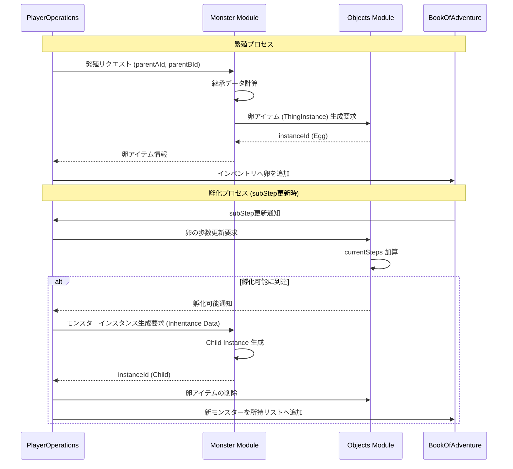

# モンスター繁殖システム (Monster Breeding System)

## 1. 概要
本ドキュメントは、モンスターの「繁殖」および「孵化」に関する仕様を定義します。繁殖システムは、プレイヤーが所持するモンスターを掛け合わせ、より強力な、あるいは特定の能力を持つ新たな個体（卵）を獲得するためのゲームサイクルの中核をなす要素です。

## 2. 卵 (Egg) の仕様
「卵」は `Objects` モジュールで管理される `Thing` の一種として扱われますが、孵化に必要な固有のメタデータを保持します。

### 2.1 卵のプロパティ
これらの情報は、`ThingInstance.metadata` に格納されます。

- **孵化対象種族 (`typeId`)**: 孵化した際に生まれるモンスターの種族 ID (`MonsterDomain.id`)。
- **親個体情報 (`parentAId`, `parentBId`)**: 繁殖に使用した両親のインスタンス ID。継承ロジックで使用します。
- **必要歩数 (`incubationSteps`)**: 孵化までに必要な `subStep`（内部歩数カウンタ）の総量。
- **現在の蓄積歩数 (`currentSteps`)**: 現在までにプレイヤーが移動・行動して蓄積された歩数。

### 2.2 卵の状態
- **未孵化**: インベントリまたは拠点に保管されている状態。
- **孵化可能**: `currentSteps >= incubationSteps` に達した状態。

## 3. 繁殖 (Breeding) のルール
プレイヤーは特定の施設（拠点・管理者エリア）において、所持している 2 体のモンスターを組み合わせて繁殖を行うことができます。

### 3.1 実行条件
- **レベル制限**: 両親となるモンスターが一定以上のレベル（例: レベル 10 以上）に達していること。
- **コスト**: 繁殖の実行には、一定のゴールドまたは特定の触媒アイテムが必要となります。
- **個体への影響**: 繁殖を行った親モンスターは、設定に応じて「消失」するか、あるいは一定期間「再繁殖不可」の状態となります。

### 3.2 子の種族決定ルール
生まれてくる子の種族 (`typeId`) は、以下の優先順位で決定されます。
1. **特殊配合**: 両親の特定の組み合わせによって決定される固定の種族（例: スライム × ドラゴン = ドラゴンスライム）。
2. **ランダム継承**: 特殊配合に該当しない場合、親 A または 親 B の種族を 50% ずつ（各 45%）の確率で継承します。
3. **突然変異**: 低確率（10%）で、全く別の種族（通常は同一系統の下位種など）が生まれる場合があります。

## 4. 継承 (Inheritance) ロジック
生まれてくる個体のステータスおよび能力は、両親の性能をベースに決定されます。

### 4.1 ステータスの継承
子モンスターの `inheritedStatus` は、以下の式で算出されます。
`inheritedStatus[stat] = ((ParentA.Base + ParentA.Inherited) + (ParentB.Base + ParentB.Inherited)) / 10 * 乱数係数(0.9 ~ 1.1)`
- 親の最終ステータス（レベル1換算）の 10% 程度をボーナスとして継承します。
- `stat` は `hp, mp, atk, def, magicAtk, magicDef, dex, mnd` の各項目を対象とします。

### 4.2 スキル・特性の継承
- 両親が持つ固有スキルや特性を、一定の確率で子が引き継ぎます。
- 低確率で、両親が持っていない突然変異スキルが発現する場合があります。

## 5. 孵化 (Hatching) プロセス
卵はプレイヤーが所持（インベントリ内に保持）した状態で歩くことで、孵化が進みます。

### 5.1 歩数カウントの連動
- `PlayerDomain.currentStatus.subStep` が加算されるたびに、インベントリ内の卵の `currentSteps` も同等量加算されます。
- 拠点の特定の施設（孵化器など）に預けている場合も、時間の経過またはプレイヤーの行動に連動してカウントが進みます。

### 5.2 孵化の実行
1. `currentSteps` が `incubationSteps` に達すると、通知が発生します。
2. プレイヤーが「孵化」コマンドを実行すると、卵アイテムが消費されます。
3. `Monster` モジュールにおいて、継承データに基づいた新しい `MonsterInstanceDomain` が生成されます。
4. 生成された個体はプレイヤーの所持モンスターリストに追加されます。

## 6. モジュール間連携

