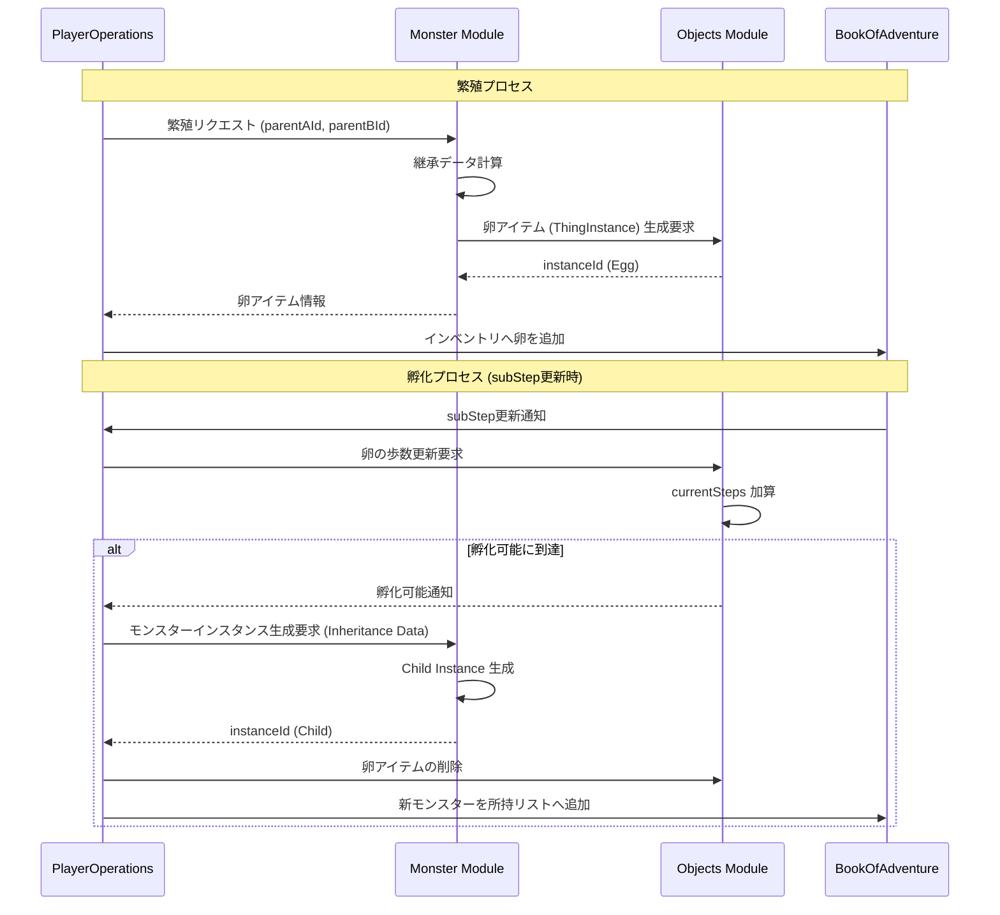

# モンスター繁殖システム (Monster Breeding System)

## 1. 概要
本ドキュメントは、モンスターの「繁殖」および「孵化」に関する仕様を定義します。繁殖システムは、プレイヤーが所持するモンスターを掛け合わせ、より強力な、あるいは特定の能力を持つ新たな個体（卵）を獲得するためのゲームサイクルの中核をなす要素です。

## 2. 卵 (Egg) の仕様
「卵」は `Objects` モジュールで管理される `Thing` の一種として扱われますが、孵化に必要な固有のメタデータを保持します。

### 2.1 卵のプロパティ
これらの情報は、`ThingInstance.metadata` に格納されます。

- **孵化対象種族 (`typeId`)**: 孵化した際に生まれるモンスターの種族 ID (`MonsterDomain.id`)。
- **親個体情報 (`parentAId`, `parentBId`)**: 繁殖に使用した両親のインスタンス ID。継承ロジックで使用します。
- **必要歩数 (`incubationSteps`)**: 孵化までに必要な `subStep`（内部歩数カウンタ）の総量。以下の式で算出されます。
  `incubationSteps = ChildSpecies.baseIncubationSteps * 乱数係数(0.9 ~ 1.1)`
  - 種族ごとの基本歩数にランダムな微変動を加えることで、個体ごとの孵化タイミングに多様性を持たせます。
- **現在の蓄積歩数 (`currentSteps`)**: 現在までにプレイヤーが移動・行動して蓄積された歩数。

### 2.2 卵の状態
- **未孵化**: インベントリまたは拠点に保管されている状態。
- **孵化可能**: `currentSteps >= incubationSteps` に達した状態。

## 3. 繁殖 (Breeding) のルール
プレイヤーは特定の施設（拠点・管理者エリア）において、所持している 2 体のモンスターを組み合わせて繁殖を行うことができます。

### 3.1 実行条件
- **レベル制限**: 両親となるモンスターが一定以上のレベル（例: レベル 10 以上）に達していること。
- **コスト**: 繁殖の実行には、以下のコストが必要となります。
    - **ゴールド**: `(親 A のティア + 親 B のティア) * 500` Gold。
    - **触媒アイテム**: 繁殖の儀式に必要な「繁殖のお香 (`breeding_incense`)」を 1 つ消費します。
- **個体への影響**: 繁殖を行った親モンスターは消失しませんが、一定期間「再繁殖不可」の状態となります。再繁殖が可能になるまでのクールタイムは、現実時間で **24 時間** です。

### 3.2 子の種族決定ルール
生まれてくる子の種族 (`typeId`) は、以下の優先順位で決定されます。
1. **特殊配合**: 両親の特定の組み合わせによって決定される固定の種族。後述の「特殊配合テーブル」を参照。
2. **ランダム継承**: 特殊配合に該当しない場合、親 A または 親 B の種族を 45% ずつ（合計 90%）の確率で継承します。
3. **突然変異 (Mutation)**: 低確率（10%）で、以下のルールに基づき親とは異なる種族が生まれる場合があります。
    - 親 A または 親 B と同じカテゴリ (`MonsterDomain.type`) に属する種族の中からランダムに選択されます。
    - 選択される種族のティアは、親の平均ティアから ±1 の範囲内となります。
    - カテゴリ内に該当する種族がいない場合は、ランダム継承が適用されます。

### 3.3 特殊配合テーブル (Special Combination Table)
特定の組み合わせによって生まれる特殊なモンスターの例です。

| 親 A (種族 ID) | 親 B (種族 ID) | 子 (種族 ID) | 備考 |
| :--- | :--- | :--- | :--- |
| `slime` | `dragon` | `dragon_slime` | ドラゴン属性を持つスライム。 |
| `wolf` | `eagle` | `griffin` | 翼を持つ狼。 |
| `zombie` | `skeleton` | `lich` | 強力な不死の魔導師。 |
| `fire_spirit` | `water_spirit` | `mist_spirit` | 相反する属性の融合。 |

## 4. 継承 (Inheritance) ロジック
生まれてくる個体のステータスおよび能力は、両親の性能をベースに決定されます。

### 4.1 ステータスの継承
子モンスターの `inheritedStatus` は、以下の式で算出されます。
`inheritedStatus[stat] = ((ParentA.Base + ParentA.Inherited) + (ParentB.Base + ParentB.Inherited)) / 10 * 乱数係数(0.9 ~ 1.1)`
- 親の最終ステータス（レベル1換算）の 10% 程度をボーナスとして継承します。
- `stat` は `hp, mp, atk, def, magicAtk, magicDef, dex, mnd` の各項目を対象とします。

#### 計算例:
- **親 A (Atk)**: Base 20 + Inherited 5 = 25
- **親 B (Atk)**: Base 30 + Inherited 10 = 40
- **計算**: `(25 + 40) / 10 = 6.5`
- **継承値**: 乱数補正後、約 **6** または **7** が子の `inheritedStatus["atk"]` に設定されます。

### 4.2 スキル・特性の継承
生まれてくる個体が引き継ぐスキルおよび特性の詳細な確率設定です。

#### 4.2.1 スキルの継承 (Skill Inheritance)
- **継承枠**: 最大 **2 つ**。
- **継承プロセス**:
    1. **候補リストの作成**: 両親が現在習得しているすべてのスキル（`skillIds`）をリストアップします。
    2. **個別の継承判定**: リスト内の各スキルについて、それぞれ独立して **30%** の確率で継承の成否を判定します。
    3. **枠への割り当て**: 判定に成功したスキルの中から、ランダムに最大 2 つが選ばれ、子のスキルリストに追加されます。
    4. **突然変異の判定**: 上記のプロセス完了後、継承枠（2 スロット）に空きがある場合、**5%** の確率で突然変異が発生します。変身後の種族カテゴリ（Type）に属する未習得スキルの中から、ランダムに 1 つが選ばれ、空き枠に追加されます。
- **枠数制限の適用**: 継承されたスキルと、種族の初期スキルを合わせて **4 つ** を超える場合、プレイヤーが最終的に保持する 4 つのスキルを選択します。
- **意図**: 有用なスキルを多く持つ親ほど継承のチャンスが増えますが、最終的に引き継げる数は制限することで、バランスを維持します。

#### 4.2.2 特性の継承 (Trait Inheritance)
- **種族特性**: 進化後の種族 (`typeId`) が持つ標準特性は、自動的に 100% 継承されます。
- **個体特性の引き継ぎ**:
    - 両親が持っている「種族特性以外の特性（突然変異等で得たもの）」を、各 **20%** の確率で引き継ぎます。
- **特性の突然変異 (Mutation)**:
    - 継承とは別に、**5%** の確率で新たな特性が発現します。
    - 発現する特性は、[モンスター特性システム](./Monster-Trait-System.md) に定義された汎用的なものから抽選されます。

## 5. 孵化 (Hatching) プロセス
卵はプレイヤーが所持（インベントリ内に保持）した状態で歩くことで、孵化が進みます。

### 5.1 歩数カウントの連動
- `PlayerDomain.currentStatus.subStep` が加算されるたびに、インベントリ内の卵の `currentSteps` も同等量加算されます。
- 拠点の特定の施設（孵化器など）に預けている場合も、時間の経過またはプレイヤーの行動に連動してカウントが進みます。

### 5.2 孵化の実行
1. `currentSteps` が `incubationSteps` に達すると、通知が発生します。
2. プレイヤーが「孵化」コマンドを実行すると、卵アイテムが消費されます。
3. `Monster` モジュールにおいて、継承データに基づいた新しい `MonsterInstanceDomain` が生成されます。
   - **初期スキル**: 生まれた個体は、その種族のレベル 1 で習得可能なスキルを自動的に習得します。
   - **スキル枠の調整**: 継承スキルと初期スキルの合計が 4 つを超える場合、このタイミングでスキルの選択画面が表示されます。
4. 生成された個体はプレイヤーの所持モンスターリストに追加されます。
   - **ランク制限の適用**: ダンジョン探索中に孵化した場合、生まれるモンスターのティアがそのダンジョンの[ランク上限](./Dungeon-Rank-System.md)を超えているときは、その個体は自動的に「預かり所（STORAGE）」へ送られます。

## 6. モジュール間連携


```mermaid
sequenceDiagram
    participant PO as PlayerOperations
    participant M as Monster Module
    participant OBJ as Objects Module
    participant BA as BookOfAdventure

    Note over PO, BA: 繁殖プロセス
    PO->>M: 繁殖リクエスト (parentAId, parentBId)
    M->>M: 継承データ計算
    M->>OBJ: 卵アイテム (ThingInstance) 生成要求
    OBJ-->>M: instanceId (Egg)
    M-->>PO: 卵アイテム情報
    PO->>BA: インベントリへ卵を追加

    Note over PO, BA: 孵化プロセス (subStep更新時)
    BA->>PO: subStep更新通知
    PO->>OBJ: 卵の歩数更新要求
    OBJ->>OBJ: currentSteps 加算
    alt 孵化可能に到達
        OBJ-->>PO: 孵化可能通知
        PO->>M: モンスターインスタンス生成要求 (Inheritance Data)
        M->>M: Child Instance 生成
        M-->>PO: instanceId (Child)
        PO->>OBJ: 卵アイテムの削除
        PO->>BA: 新モンスターを所持リストへ追加
    end
```

## 7. APIリクエスト・フローとエラーハンドリング (API Request Flow and Error Handling)

### 7.1 APIリクエスト・レスポンス仕様

#### 7.1.1 モンスター繁殖 API (`POST /api/v1/monsters/breed`)
2体の親モンスターから卵アイテムを生成するためのエンドポイントです。

- **Endpoint**: `POST /api/v1/monsters/breed`
- **Request Body (JSON)**:
```json
{
  "userId": "player_uuid_12345",
  "parentAMonsterInstanceId": "monster_instance_001",
  "parentBMonsterInstanceId": "monster_instance_002",
  "catalystItemId": "breeding_incense"
}
```

- **Response Body (JSON - 成功時)**:
```json
{
  "success": true,
  "result": "SUCCESS",
  "message": "繁殖が行われ、新しい卵を獲得しました！",
  "egg": {
    "instanceId": "egg_instance_999",
    "typeId": "egg",
    "name": "スライムの卵",
    "metadata": {
      "childTypeId": "slime",
      "parentAId": "monster_instance_001",
      "parentBId": "monster_instance_002",
      "incubationSteps": 500,
      "currentSteps": 0
    }
  },
  "goldSpent": 1000,
  "cooldownExpiration": "2026-03-31T12:00:00Z"
}
```

#### 7.1.2 卵の孵化 API (`POST /api/v1/monsters/hatch`)
歩数条件を満たした卵アイテムを孵化させ、新しいモンスター個体を生成するエンドポイントです。

- **Endpoint**: `POST /api/v1/monsters/hatch`
- **Request Body (JSON)**:
```json
{
  "userId": "player_uuid_12345",
  "eggInstanceId": "egg_instance_999",
  "selectedSkillIds": [101, 105, 201, 301]
}
```
※ `selectedSkillIds`: 継承スキルと初期スキルの合計が4つを超える場合に手動選択したスキルのID配列（4つ以下の場合は省略可）。

- **Response Body (JSON - 成功時)**:
```json
{
  "success": true,
  "result": "SUCCESS",
  "message": "卵が孵化し、新しいモンスター「スライム」が誕生しました！",
  "monster": {
    "instanceId": "child_monster_instance_100",
    "monsterId": "slime",
    "level": 1,
    "loyalty": 100,
    "skillIds": [101, 105, 201, 301],
    "traits": ["REGENERATION"],
    "inheritedStatus": {
      "hp": 5,
      "mp": 2,
      "atk": 3,
      "def": 3,
      "magicAtk": 1,
      "magicDef": 1,
      "dex": 2,
      "mnd": 2
    }
  },
  "destination": "PARTY"
}
```

### 7.2 エラーハンドリング (Error Handling)
処理の過程で異常が検出された場合、システムは適切なエラーレスポンスを返却します。

#### 繁殖 API (`/breed`) のエラーハンドリング
| エラーコード | 発生条件 | レスポンス HTTP ステータス | 戻り値のメッセージ例 |
| :--- | :--- | :---: | :--- |
| `MONSTER_NOT_FOUND` | 指定された `parentAMonsterInstanceId` または `parentBMonsterInstanceId` のモンスターが存在しない。 | 404 Not Found | 指定された親モンスターが見つかりません。 |
| `SAME_MONSTER_SELECTED` | 親 A と親 B に同一のモンスターインスタンス ID が指定された。 | 400 Bad Request | 繁殖には2体の異なるモンスターを指定する必要があります。 |
| `INSUFFICIENT_LEVEL` | いずれかの親モンスターのレベルが 10 未満。 | 400 Bad Request | 繁殖を行うには両親のレベルが10以上である必要があります。 |
| `BREEDING_COOLDOWN` | 指定された親モンスターが 24 時間の再繁殖クールタイム中である。 | 400 Bad Request | 指定された親モンスターは現在クールタイム中です。 |
| `INVALID_CATALYST` | 指定された触媒アイテム ID が `breeding_incense` 以外。 | 400 Bad Request | 無効な触媒アイテムが指定されています。 |
| `INSUFFICIENT_CATALYST` | プレイヤーのインベントリに「繁殖のお香 (`breeding_incense`)」が存在しない。 | 400 Bad Request | 繁殖に必要な触媒アイテム（繁殖のお香）が不足しています。 |
| `INSUFFICIENT_GOLD` | 繁殖に必要なゴールドが不足している。 | 400 Bad Request | 所持ゴールドが不足しています。 |
| `INVENTORY_FULL` | プレイヤーのインベントリが上限に達しており、卵アイテムを受け取れない。 | 400 Bad Request | インベントリが満杯のため卵を受け取れません。 |

#### 孵化 API (`/hatch`) のエラーハンドリング
| エラーコード | 発生条件 | レスポンス HTTP ステータス | 戻り値のメッセージ例 |
| :--- | :--- | :---: | :--- |
| `EGG_NOT_FOUND` | 指定された `eggInstanceId` の卵アイテムが存在しない。 | 404 Not Found | 指定された卵アイテムが見つかりません。 |
| `EGG_NOT_READY` | 卵の蓄積歩数が足りない (`currentSteps < incubationSteps`)。 | 400 Bad Request | この卵はまだ孵化に必要な歩数に達していません。 |
| `SKILL_OVERFLOW` | 所持スキルと継承スキルの合計が 4 つを超えているが、`selectedSkillIds` が正しく指定されていない。 | 400 Bad Request | 習得スキルが上限（4つ）を超過しています。保持するスキルを4つ選択してください。 |
| `STORAGE_FULL` | ティア超過により預かり所へ送られる際、預かり所（STORAGE）の空き枠が存在しない。 | 400 Bad Request | 預かり所が満杯のため、孵化を実行できません。 |
