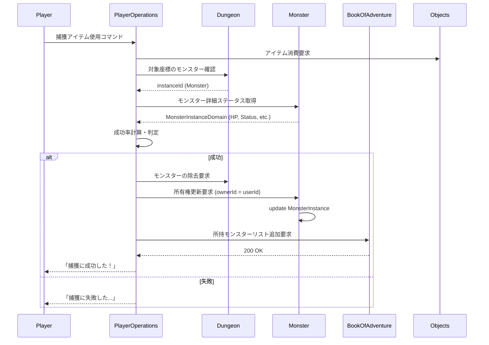

# モンスター捕獲システム (Monster Capture System)

## 1. 概要
本ドキュメントは、野生のモンスターを捕獲し、プレイヤーの「仲間のモンスター」として管理するシステムの仕様を定義します。捕獲したモンスターは、拠点での育成や繁殖、あるいは自身のダンジョンへの配置に利用されます。

## 2. 捕獲用アイテム (Capture Items)
モンスターを捕獲するには、専用のアイテム（例：「捕獲用カプセル」）を使用する必要があります。これらは `Objects` モジュールで管理される `Thing` の一種です。

| 名称 | 基本捕獲倍率 | 特徴 |
| :--- | :---: | :--- |
| **捕獲カプセル (Normal)** | 1.0x | 最も一般的な捕獲用アイテム。 |
| **高性能カプセル (Great)** | 1.5x | 捕獲成功率が少し高い。 |
| **最高性能カプセル (Ultra)** | 2.0x | 捕獲成功率が非常に高い。 |
| **属性カプセル (Elemental)** | 1.0x / 2.5x | 対象の属性と一致する場合、非常に高い効果を発揮する。 |

## 3. 捕獲成功率の計算式 (Success Rate Formula)
捕獲の成否は、使用したアイテムの倍率と、対象モンスターの状態に基づいて判定されます。

`捕獲成功率(%) = 基本成功率 * アイテム倍率 * HP補正 * 状態異常補正 * レベル差補正`

### 3.1 各補正係数
- **基本成功率**: 20% (システム基本値)
- **HP補正**: `1.0 + (1.0 - (現在HP / 最大HP))`
  - HP が低いほど捕獲しやすくなり、瀕死状態では最大 2.0 倍となります。
- **状態異常補正**:
  - **睡眠・麻痺**: 1.5x
  - **毒・混乱・封印**: 1.2x
  - **通常**: 1.0x
- **レベル差補正**: `1.0 + (プレイヤーの器用さ - モンスターの精神力) * 0.01`
  - プレイヤーの能力がモンスターの抵抗力を上回るほど有利になります。

## 4. 捕獲プロセス
1. **アイテム使用**: プレイヤーはインベントリから捕獲用アイテムを選択し、隣接する（または射程内の）モンスターに対して使用します。
2. **成否判定**: 上記の計算式に基づき、サーバー側で乱数判定を行います。
3. **成功時**:
   - モンスターがマップから消失します。
   - `MonsterInstanceDomain` の `ownerId` がプレイヤーの ID に更新され、`isWild` が `false` になります。
   - プレイヤーの所持モンスターリスト（`BookOfAdventure`）に追加されます。
4. **失敗時**:
   - 捕獲用アイテムは消費されます。
   - モンスターが「怒り」状態（一時的なステータス上昇）になる場合があります。

## 5. 捕獲の制限 (Restrictions)
すべてのモンスターが捕獲可能とは限りません。

- **ボスモンスター**: 原則として捕獲不可です。
- **他プレイヤーのモンスター**: すでに `ownerId` が設定されている個体は捕獲できません。
- **レベル制限**: プレイヤーのレベルを大幅に上回るモンスターは、捕獲成功率が極端に低くなる（あるいは 0 になる）制限がかかります。

## 6. モジュール間連携

## 7. 今後の拡張
- **捕獲スキルの導入**: アイテムを使わずに捕獲を試みる特殊なスキル。
- **捕獲後の忠誠度**: 捕獲直後のモンスターは忠誠度が低く、命令を聞かないことがある。
- **自動捕獲トラップ**: ダンジョン内に設置し、踏んだモンスターを自動的に捕獲する罠。
