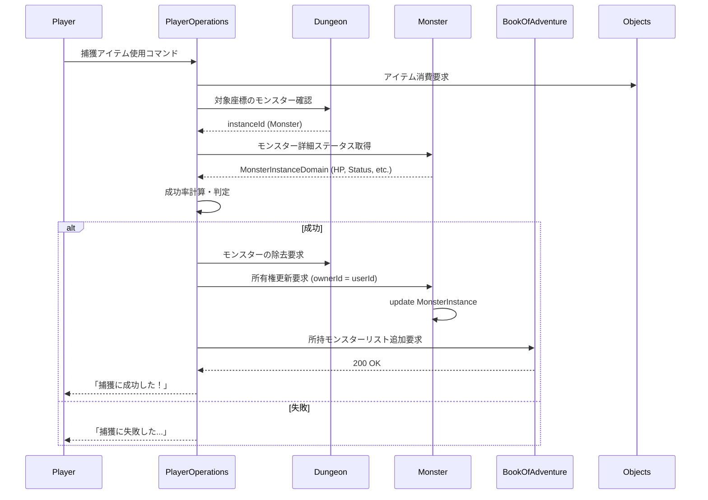

# モンスター捕獲システム (Monster Capture System)

## 1. 概要
本ドキュメントは、野生のモンスターを捕獲し、プレイヤーの「仲間のモンスター」として管理するシステムの仕様を定義します。捕獲したモンスターは、拠点での育成や繁殖、あるいは自身のダンジョンへの配置に利用されます。

## 2. 捕獲用アイテム (Capture Items)
モンスターを捕獲するには、専用のアイテム（例：「捕獲用カプセル」）を使用する必要があります。これらは `Objects` モジュールで管理される `Thing` の一種です。

| 名称 | 基本捕獲倍率 | 特徴 |
| :--- | :---: | :--- |
| **捕獲カプセル (Normal)** | 1.0x | 最も一般的な捕獲用アイテム。 |
| **高性能カプセル (Great)** | 1.5x | 捕獲成功率が少し高い。 |
| **最高性能カプセル (Ultra)** | 2.0x | 捕獲成功率が非常に高い。 |
| **属性カプセル (Elemental)** | 1.0x / 2.5x | 対象の属性と一致する場合、非常に高い効果を発揮する。詳細な判定は以下「2.1 属性カプセルの判定ロジック」を参照。 |

### 2.1 属性カプセルの判定ロジック
- **アイテムの属性**:
  `Objects` モジュールの `Thing` データベース（テンプレート）上の `elemental_capsule` は `None` 属性として登録されていますが、生成または入手された具体的なアイテムインスタンス（`ThingInstance`）は、6 つの個別属性（`Fire`, `Water`, `Wind`, `Earth`, `Holy`, `Dark`）のいずれかを保持することが可能です（例: 「炎の属性カプセル」等）。
- **属性一致判定**:
  プレイヤーが属性カプセルを投げた際、使用したカプセルインスタンスの属性（`ThingInstance.attribute`）と対象モンスターの属性（`MonsterDomain.attribute`）が比較されます。
  - **一致する場合（例: `Fire` 属性のカプセルを `Fire` 属性のドラゴンへ投げた場合）**: 基本捕獲倍率として **2.5x** が適用されます。
  - **不一致または一方が `None` の場合**: 基本捕獲倍率として **1.0x** が適用されます。

## 3. 捕獲成功率の計算式 (Success Rate Formula)
捕獲の成否は、使用したアイテムの倍率と、対象モンスターの状態に基づいて判定されます。

`捕獲成功率(%) = 基本成功率 * アイテム倍率 * HP補正 * 状態異常補正 * レベル差補正`

### 3.1 各補正係数
- **基本成功率**: 20% (システム基本値)
- **HP補正**: `1.0 + (1.0 - (現在HP / 最大HP))`
  - HP が低いほど捕獲しやすくなり、瀕死状態では最大 2.0 倍となります。
- **状態異常補正**:
  [戦闘システム](./Combat-System.md#6-状態異常-status-effects) で定義されている各状態異常に応じた捕獲補正が適用されます。
  - **睡眠・麻痺・捕縛**: **1.5x** （行動が完全に、または部分的に制限されているため捕獲が最も容易になります）
  - **恐怖**: **1.3x** （戦闘意志や警戒心が著しく低下しているため捕獲しやすくなります）
  - **毒・混乱・封印**: **1.2x**
  - **通常**: **1.0x**
  - **怒り・ヘイスト**: **0.8x** （暴走または加速状態のため、捕獲用の軌道から逃れやすく狙いを定めづらくなります）
  - **不可視**: **捕獲不可**（原則としてカプセルの投擲対象に指定できません。ただし、プレイヤーが特性「不可視看破 (`SEE_INVISIBILITY`)」を所持している場合に限り、通常通り対象指定可能となり、状態異常補正は **1.0x** として扱われます）
  - ※複数の状態異常が付与されている場合、最も高い倍率のみが適用されます。
- **レベル差補正**: `1.0 + (プレイヤーの器用さ - モンスターの精神力) * 0.01`
  - プレイヤーの能力がモンスターの抵抗力を上回るほど有利になります。
  - ※レベル差補正値が 0 以下になる場合は、最低値として 0.1 を適用します（ただし下記のレベル差による強制失敗ルールを除く）。
  - **レベル差による強制失敗**:
    - モンスターのレベルがプレイヤーのレベルより 10 以上高い場合、補正後の成功率は強制的に 0% となります。

## 4. 捕獲プロセス
1. **アイテム使用**: プレイヤーはインベントリから捕獲用アイテムを選択し、隣接する（または射程内の）モンスターに対して使用します。
2. **成否判定**: 上記の計算式に基づき、サーバー側で乱数判定を行います。
3. **成功時**:
   - モンスターがマップから消失します。
   - `MonsterInstanceDomain` の `ownerId` がプレイヤーの ID に更新され、`isWild` が `false` になります。
   - プレイヤーの所持モンスターリスト（`BookOfAdventure`）に追加されます。
4. **失敗時**:
   - 捕獲用アイテムは消費されます。
   - **20%** の確率で、モンスターが「[怒り](./Combat-System.md#6-状態異常-status-effects)」状態（一時的なステータス上昇）になります。

## 5. 捕獲の制限 (Restrictions)
すべてのモンスターが捕獲可能とは限りません。

- **ボスモンスター**: 原則として捕獲不可です。
- **他プレイヤーのモンスター**: すでに `ownerId` が設定されている個体は捕獲できません。
- **レベル制限**: プレイヤーのレベルを大幅に上回るモンスターは、捕獲成功率が極端に低くなる（あるいは 0 になる）制限がかかります。

## 6. モジュール間連携

```mermaid
sequenceDiagram
    participant P as Player
    participant PO as PlayerOperations
    participant D as Dungeon
    participant M as Monster
    participant BA as BookOfAdventure
    participant OBJ as Objects

    P->>PO: 捕獲アイテム使用コマンド
    PO->>OBJ: アイテム消費要求
    PO->>D: 対象座標のモンスター確認
    D-->>PO: instanceId (Monster)
    PO->>M: モンスター詳細ステータス取得
    M-->>PO: MonsterInstanceDomain (HP, Status, etc.)
    PO->>PO: 成功率計算・判定
    alt 成功
        PO->>D: モンスターの除去要求
        PO->>M: 所有権更新要求 (ownerId = userId)
        M->>M: update MonsterInstance
        PO->>BA: 所持モンスターリスト追加要求
        BA-->>PO: 200 OK
        PO-->>P: 「捕獲に成功した！」
    else 失敗
        PO-->>P: 「捕獲に失敗した...」
    end
```

## 7. 今後の拡張
- **捕獲スキルの導入**: アイテムを使わずに捕獲を試みる特殊なスキル。
- **自動捕獲トラップ**: ダンジョン内に設置し、踏んだモンスターを自動的に捕獲する罠。
