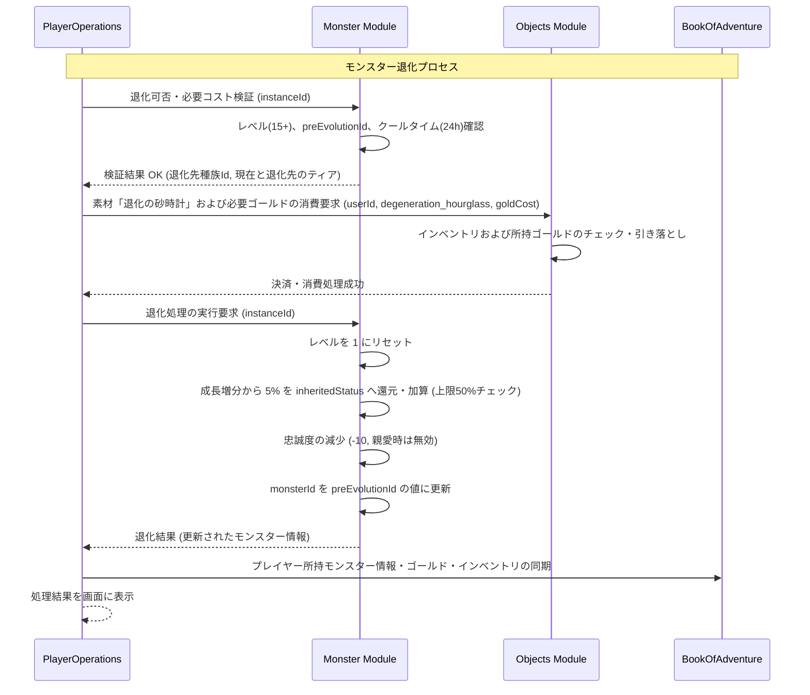

# モンスター退化システム (Monster Degeneration System)

## 1. 概要
本ドキュメントは、一度進化を遂げた、または特定の成長段階に達した仲間モンスターを、その進化前の形態（種族）に意図的に差し戻す「モンスター退化システム」の仕様を定義します。本システムは、育成の方向性を変更する「リビルド（育成再設計）」手段を提供するとともに、退化と再進化を繰り返すことでステータス上限を突破（限界突破）するやり込み要素として機能します。

## 2. 退化の実行条件
モンスターの退化を実行するには、対象個体および必要な触媒アイテムが以下の条件を満たしている必要があります。

### 2.1 対象モンスターの制限
- **レベル制限**: 退化を実行するモンスター個体（`MonsterInstance`）は、**レベル 15** 以上であること。
- **進化履歴の保持**: 退化は「過去に進化した、または繁殖によって上位形態として生まれた」個体にのみ実行可能です。
  - 具体的には、`MonsterInstanceDomain.metadata` 内に退化先の種族 ID を示す `preEvolutionId` フィールドが保存されている必要があります。
  - 一度も進化しておらず、初期形態かつ `preEvolutionId` が設定されていない個体は退化できません。
- **累計融合回数への配慮**:
  - 退化を実行しても、個体の累計融合回数（`fusionCount`）はリセットされません。これにより、融合回数の上限（5回）をすり抜けて無限に融合を繰り返す不正行為を防ぎます。

### 2.2 必要コストと消費素材
退化にはゴールドと、専用の希少な触媒アイテム「退化の砂時計（`degeneration_hourglass`）」を消費します。

- **必要アイテム**: 「退化の砂時計 (`degeneration_hourglass`)」を 1 つ消費。
- **必要ゴールド**: `(退化前の現在のティア + 退化先のティア) * 1500` Gold

- **例**:
  - ティア3（`ancient_dragon`）からティア2（`dragon`）へ退化する場合：
    `(3 + 2) * 1500 = 7500` Gold

### 2.3 実行可能頻度（クールタイム）
- 魂や肉体の再構成に伴う負荷を再現するため、同一モンスター個体に対する退化の実行は、現実時間で **24時間** に1回に制限されます。
- クールタイム情報は `MonsterInstanceDomain.metadata` 内の `lastDegenerationTime`（最終退化実行タイムスタンプ）を基準に判定されます。

## 3. 退化時のステータス・レベル・能力の挙動

### 3.1 レベルのリセット (Level Reset)
- 退化完了時、モンスターのレベル（`level`）は **1** にリセットされます。これにより、進化前の形態でレベルアップ時のステータス成長補正を再獲得（再レベリング）することが可能になります。

### 3.2 ステータス継承と限界突破 (Status Inheritance & Limit Break)
退化の最大の特徴は、退化する前の形態で得た成長（ステータス）の一部を、永続的なボーナス（継承ステータス）として引き継げる点にあります。

- **成長値の還元補正**:
  退化前（進化形態）のレベルアップによって上昇したステータス（基本値からの増分）の **5%** が、永続的なボーナスとして `inheritedStatus` に加算されます。

- **算出式**:
  `新InheritedStatus[stat] = 旧InheritedStatus[stat] + (退化前最終ステータス[stat] - 退化前基本ステータス[stat]) * 0.05`
  - 対象ステータス: `hp, mp, atk, def, magicAtk, magicDef, dex, mnd`
  - 小数点以下は四捨五入。

- **継承ステータスの上限 (Inherited Stats Cap) の遵守**:
  - [モンスター融合システム](./Monster-Fusion-System.md) で定義されている上限ルールと同様に、退化による加算結果も含め、`inheritedStatus` は**退化先種族の Lv 1 基本ステータス（種族基本値）の 50%** を上限（キャップ）とします。これを超える値は切り捨てられます。

### 3.3 スキルの保持と超過時の選択
- **旧スキルの保持**: 進化後の形態で習得した上位スキル（例: ドラゴンの「自己破滅」等）は、退化して低ティアの形態に戻った後も **そのまま保持** されます。
- **スキル枠の制限（最大 4 つ）**:
  - [スキル・魔法システム](./Skill-And-Magic-System.md) に基づき、保持できるアクティブスキルは最大 4 つに制限されます。
  - 退化先種族のレベル1で自動習得するスキルと、保持していたスキルの合計が 5 つ以上になる場合は、プレイヤーが手動で「残す 4 つのスキル」を選択します。

### 3.4 個体特性の保持
- **個体特性 (Individual Traits)**: 融合や突然変異等で得た最大 2 つの個体特性（`MonsterInstanceDomain.traits`）は、退化時にも **100% 維持** されます。
- **種族特性 (Species Traits)**: 動的参照ルールに従い、退化先種族固有の特性へと自動的に切り替わります（詳細は [モンスター特性システム](./Monster-Trait-System.md) を参照）。

### 3.5 忠誠度への影響 (Loyalty Impact)
- **記憶の混乱に伴う低下**: 肉体と魂が前の世代に戻る影響で、一時的に記憶の混濁が発生し、プレイヤーに対する忠誠度（`loyalty`）が **10** 減少します（下限は 0）。
- ただし、親愛状態（[モンスター親愛システム](./Monster-Affection-System.md)）に達している個体の場合、固い魂の結びつきによって、この忠誠度低下は **完全に無効化** されます。

## 4. 特殊進化・分岐進化における退化経路の解決
特殊進化や分岐進化を経たモンスターが退化する際、退化先種族（`preEvolutionId`）は以下のルールに基づいて解決されます。

| 進化元の形態 (`monsterId`) | 退化先の形態 (`preEvolutionId`) | 解決のルール・備考 |
| :--- | :--- | :--- |
| `gale_wolf` (ティア3) | `wolf` (ティア2) | 特殊進化合体で誕生した個体の場合、合体前のベース形態であった `wolf` へと退化。素材側の `wind_spirit` には戻りません。 |
| `ancient_dragon` (ティア4) | `dragon` (ティア3) | 進化テーブルに基づいて直前の進化元種族へと退化。 |
| 分岐進化種 A | 進化前ベース種 | 分岐進化を経ている場合でも、その個体が進化する直前に保持していた `monsterId` を `preEvolutionId` から特定して正確に戻ります。 |

## 5. モジュール間連携とシーケンス

退化処理は、`PlayerOperations` がフロントエンドと連携して各モジュール（`Objects`, `Monster`, `BookOfAdventure`）を制御します。



## 6. APIリクエスト・フローとエラーハンドリング

### 6.1 APIリクエスト仕様
退化を実行するためのエンドポイントおよびリクエスト・レスポンスボディの構造です。

- **Endpoint**: `POST /api/v1/monsters/degeneration`
- **Request Body (JSON)**:
```json
{
  "userId": "player_uuid_12345",
  "monsterInstanceId": "monster_uuid_55555",
  "catalystItemId": "degeneration_hourglass"
}
```

- **Response Body (JSON - 成功時)**:
```json
{
  "success": true,
  "result": "SUCCESS",
  "message": "退化の儀式に成功しました。モンスターは「ウルフ」の姿に戻り、新たな可能性を秘めて目覚めました！",
  "monster": {
    "instanceId": "monster_uuid_55555",
    "monsterId": "wolf",
    "level": 1,
    "loyalty": 200,
    "inheritedStatus": {
      "hp": 5,
      "atk": 4,
      "def": 3
    },
    "traits": ["REGENERATION"],
    "skillIds": ["bite", "power_attack"]
  }
}
```

### 6.2 エラーハンドリング (Error Handling)
処理の過程で整合性や制約を満たさない場合、以下のエラーコードおよび適切な HTTP ステータスを返却します。

| エラーコード | 発生条件 | レスポンス HTTP ステータス | 戻り値のメッセージ例 |
| :--- | :--- | :---: | :--- |
| `MONSTER_NOT_FOUND` | 指定された `monsterInstanceId` のモンスターが存在しない。 | 404 Not Found | 指定されたモンスターが見つかりません。 |
| `INSUFFICIENT_LEVEL` | モンスターのレベルが 15 未満。 | 400 Bad Request | 退化を実行するには、モンスターのレベルが15以上である必要があります。 |
| `NOT_EVOLVED_YET` | `preEvolutionId` フィールドが存在しない（退化する過去の形態がない）。 | 400 Bad Request | この個体は初期形態のため、退化を実行できません。 |
| `DEGENERATION_COOLDOWN` | 前回の退化実行から 24 時間が経過していない。 | 400 Bad Request | 退化のクールタイム中です。次の実行までお待ちください。 |
| `INVALID_CATALYST` | 指定された触媒アイテム ID が `degeneration_hourglass` 以外。 | 400 Bad Request | 無効な触媒アイテムが指定されています。 |
| `INSUFFICIENT_CATALYST` | プレイヤーのインベントリに「退化の砂時計」が存在しない。 | 400 Bad Request | 退化に必要な触媒アイテム「退化の砂時計」が不足しています。 |
| `INSUFFICIENT_GOLD` | 退化に必要なゴールドが不足している。 | 400 Bad Request | 退化に必要な所持ゴールドが不足しています。 |

## 7. 相互参照
- [モンスター進化システム](./Monster-Evolution-System.md)：進化の基本プロセスと条件。
- [モンスター融合システム](./Monster-Fusion-System.md)：累計融合回数（`fusionCount`）およびステータス上限（Lv 1 種族値の 50%）の共通ルール。
- [モンスター特性システム](./Monster-Trait-System.md)：種族特性と個体特性の区別、および動的参照仕様。
- [Objectsモジュール ドメインモデル](./domain_models/Objects.md)：「退化の砂時計 (`degeneration_hourglass`)」の価格、ティア等の定義。
