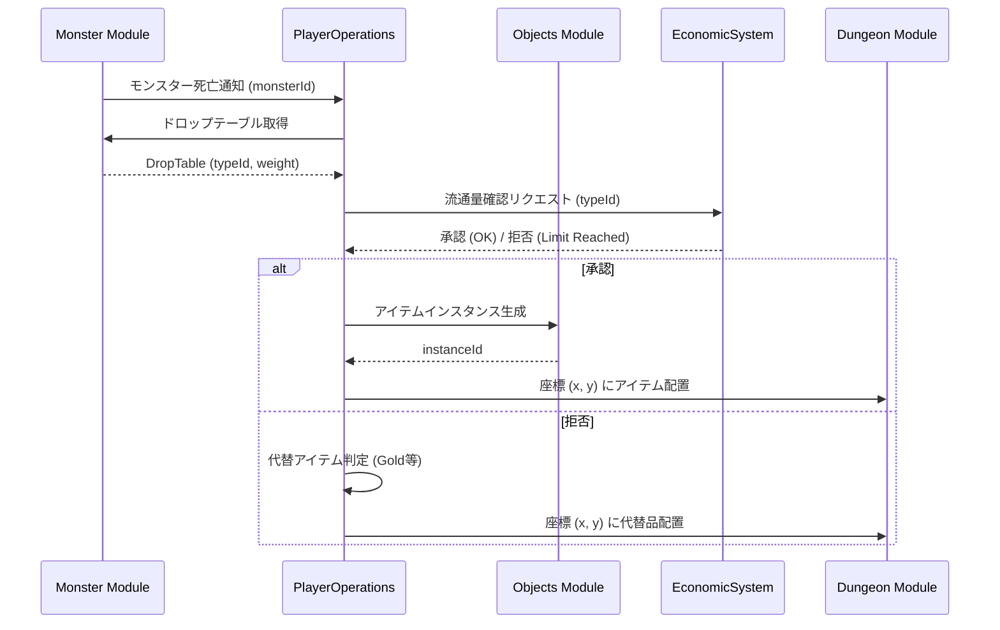

# モンスタードロップシステム (Monster Drop System)

## 1. 概要
本ドキュメントは、モンスター撃破時に発生するアイテムドロップの仕様を定義します。本システムは、[経済システム](./domain_models/Economic-System.md)と連携し、世界内のアイテム流通量を考慮した動的なドロップ制御を行います。

## 2. ドロップテーブルの構造
各モンスター種族（`MonsterDomain`）は、一つ以上のドロップテーブルを持つことができます。

### 2.1 ドロップスロット
ドロップテーブルは複数のスロットで構成され、各スロットは以下のプロパティを持ちます。
- **アイテムタイプID (`typeId`)**: ドロップするアイテムの ID。
- **ドロップ率 (`weight`)**: そのアイテムが選ばれる相対的な重み。
- **個数範囲 (`minCount`, `maxCount`)**: ドロップする個数の範囲。

### 2.2 ドロップ判定フロー
1. モンスター死亡時に、設定された「ドロップ発生率」に基づき、ドロップの有無を判定します。
2. ドロップが発生する場合、スロットの重みに基づいて特定のアイテムタイプを選択します。
3. 選択されたアイテムが「流通制限対象」である場合、後述の「流通量確認」プロセスへ移行します。

## 3. サーキュレーション考慮型ドロップ (Circulation-Aware Drop)
特定の貴重なアイテムには、世界全体の存在上限（`maxLimit`）が設定されています。流通カウントの対象範囲および上限到達時の基本的な振る舞いについては、[経済システム ドメインモデル](./domain_models/Economic-System.md#5-サーキュレーション制限存在上限の挙動) を参照してください。

### 3.1 流通量確認プロセス
1. **Objects モジュール**を通じて、対象アイテムの現在の流通量（`currentCount`）を**EconomicSystem モジュール**に問い合わせます。
2. `currentCount < maxLimit` の場合：
   - 通常通りアイテムを生成し、ドロップします。
   - `ItemCirculationDomain.currentCount` がインクリメントされます。
3. `currentCount >= maxLimit` の場合：
   - 対象アイテムのドロップをキャンセルし、独自の**代替ドロップロジック（Fallback）**を実行します。

## 4. 代替ドロップロジック (Fallback Logic)
流通制限によって特定のアイテムがドロップできない場合、プレイヤーの努力を無駄にしないため、経済システムの「共通代替ルール」を拡張した以下の優先順位で代替品を生成します。

1. **下位アイテムへの置換**:
   - 同カテゴリ (`TypeEnum`) の、制限に達していない（`currentCount < maxLimit`）アイテムの中から、元のアイテムのティア (`Thing.getTier()`) に最も近く、かつそれより低いティアのアイテムを検索してドロップします。
2. **ゴールドへの置換 (共通代替ルール)**:
   - 下位アイテムも制限されている、あるいは適切な置換先がない場合、アイテムの「標準価格 (`standardPrice`)」の **30%** をゴールドとしてドロップします。詳細は[こちら](./domain_models/Economic-System.md#52-上限到達時の共通振る舞い-global-fallback-standard)。
3. **ドロップなし**:
   - 特殊な設定（ボスの固定ドロップ等）を除き、最終的な手段としてドロップなしとなります。

## 5. モジュール間連携

## 6. 今後の拡張
- **ドロップ補正**: プレイヤーの運（Luck）ステータスによるドロップ率向上。
- **特定条件ドロップ**: 特定の属性武器で倒した時のみドロップする素材など。
- **期間限定ドロップ**: イベント期間中のみ特定のモンスターからドロップする特殊アイテム。
