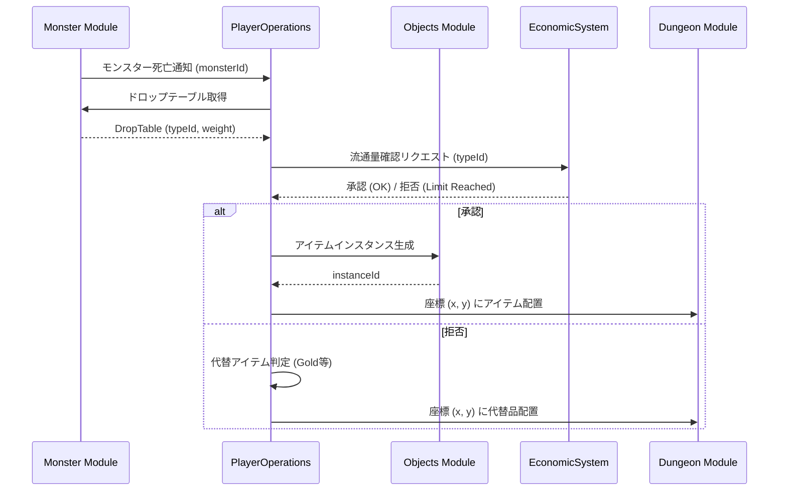

# モンスタードロップシステム (Monster Drop System)

## 1. 概要
本ドキュメントは、モンスター撃破時に発生するアイテムドロップの仕様を定義します。本システムは、[経済システム](./domain_models/Economic-System.md)と連携し、世界内のアイテム流通量を考慮した動的なドロップ制御を行います。

## 2. ドロップテーブルの構造
各モンスター種族（`MonsterDomain`）は、一つ以上のドロップテーブルを持つことができます。

### 2.1 ドロップスロット
ドロップテーブルは複数のスロットで構成され、各スロットは以下のプロパティを持ちます。
- **アイテムタイプID (`typeId`)**: ドロップするアイテムの ID。
- **ドロップ率 (`weight`)**: そのアイテムが選ばれる相対的な重み。
- **個数範囲 (`minCount`, `maxCount`)**: ドロップする個数の範囲。

### 2.2 ドロップ判定フロー
1. モンスター死亡時に、設定された「ドロップ発生率」に基づき、ドロップの有無を判定します。
2. ドロップが発生する場合、スロットの重みに基づいて特定のアイテムタイプを選択します。
3. 選択されたアイテムが「流通制限対象」である場合、後述の「流通量確認」プロセスへ移行します。

## 3. サーキュレーション考慮型ドロップ (Circulation-Aware Drop)
特定の貴重なアイテムには、世界全体の存在上限（`maxLimit`）が設定されています。流通カウントの対象範囲および上限到達時の基本的な振る舞いについては、[経済システム ドメインモデル](./domain_models/Economic-System.md#5-サーキュレーション制限存在上限の挙動) を参照してください。

### 3.1 流通量確認プロセス
1. **Objects モジュール**を通じて、対象アイテムの現在の流通量（`currentCount`）を**EconomicSystem モジュール**に問い合わせます。
2. `currentCount < maxLimit` の場合：
   - 通常通りアイテムを生成し、ドロップします。
   - `ItemCirculationDomain.currentCount` がインクリメントされます。
3. `currentCount >= maxLimit` の場合：
   - 対象アイテムのドロップをキャンセルし、独自の**代替ドロップロジック（Fallback）**を実行します。

## 4. 代替ドロップロジック (Fallback Logic)
流通制限によって特定のアイテムがドロップできない場合、プレイヤーの努力を無駄にしないため、経済システムの「共通代替ルール」を拡張した以下の優先順位で代替品を生成します。

1. **下位アイテムへの置換**:
   - 同カテゴリ (`TypeEnum`) の、制限に達していない（`currentCount < maxLimit`）アイテムの中から、元のアイテムのティア (`Thing.getTier()`) に最も近く、かつそれより低いティアのアイテムを検索してドロップします。
2. **ゴールドへの置換 (共通代替ルール)**:
   - 下位アイテムも制限されている、あるいは適切な置換先がない場合、アイテムの「標準価格 (`standardPrice`)」の **30%** をゴールドとしてドロップします。詳細は[こちら](./domain_models/Economic-System.md#52-上限到達時の共通振る舞い-global-fallback-standard)。
3. **ドロップなし**:
   - 特殊な設定（ボスの固定ドロップ等）を除き、最終的な手段としてドロップなしとなります。

## 5. モジュール間連携


```mermaid
sequenceDiagram
    participant M as Monster Module
    participant PO as PlayerOperations
    participant OBJ as Objects Module
    participant ECO as EconomicSystem
    participant D as Dungeon Module

    M->>PO: モンスター死亡通知 (monsterId)
    PO->>M: ドロップテーブル取得
    M-->>PO: DropTable (typeId, weight)
    PO->>ECO: 流通量確認リクエスト (typeId)
    ECO-->>PO: 承認 (OK) / 拒否 (Limit Reached)

    alt 承認
        PO->>OBJ: アイテムインスタンス生成
        OBJ-->>PO: instanceId
        PO->>D: 座標 (x, y) にアイテム配置
    else 拒否
        PO->>PO: 代替アイテム判定 (Gold等)
        PO->>D: 座標 (x, y) に代替品配置
    end
```

## 6. 今後の拡張
- **ドロップ補正**: プレイヤーの運（Luck）ステータスによるドロップ率向上。
- **特定条件ドロップ**: 特定の属性武器で倒した時のみドロップする素材など。
- **期間限定ドロップ**: イベント期間中のみ特定のモンスターからドロップする特殊アイテム。

## 7. APIリクエスト・フローとエラーハンドリング

### 7.1 APIリクエスト仕様
モンスター撃破時のドロップ処理およびドロップテーブルの参照を行うためのエンドポイントおよびリクエスト/レスポンスボディのJSON構造を定義します。

#### 1. モンスター撃破時ドロップ処理
- **Endpoint**: `POST /api/v1/monsters/drop`
- **Request Body (JSON)**:
```json
{
  "userId": "player_uuid_12345",
  "dungeonId": "dungeon_uuid_99887",
  "floorNumber": 3,
  "monsterInstanceId": "monster_uuid_67890",
  "position": {
    "x": 12,
    "y": 8
  }
}
```

- **Response Body (JSON - 通常アイテムドロップ時)**:
```json
{
  "success": true,
  "result": "ITEM_DROPPED",
  "message": "スライムから「やくそう」がドロップしました。",
  "droppedItem": {
    "instanceId": "item_uuid_112233",
    "typeId": "herb",
    "name": "やくそう",
    "position": {
      "x": 12,
      "y": 8
    },
    "isFallback": false
  }
}
```

- **Response Body (JSON - 流通制限による代替ゴールドドロップ時)**:
```json
{
  "success": true,
  "result": "GOLD_DROPPED",
  "message": "流通制限によりアイテムの代わりに150ゴールドがドロップしました。",
  "droppedGold": {
    "amount": 150,
    "position": {
      "x": 12,
      "y": 8
    },
    "isFallback": true
  }
}
```

- **Response Body (JSON - ドロップなし時)**:
```json
{
  "success": true,
  "result": "NO_DROP",
  "message": "ドロップアイテムはありませんでした。",
  "droppedItem": null
}
```

#### 2. ドロップテーブル情報取得
- **Endpoint**: `GET /api/v1/monsters/drop-tables/{typeId}`
- **Response Body (JSON)**:
```json
{
  "typeId": "slime",
  "dropRate": 0.5,
  "slots": [
    {
      "typeId": "herb",
      "weight": 70,
      "minCount": 1,
      "maxCount": 1
    },
    {
      "typeId": "potion",
      "weight": 30,
      "minCount": 1,
      "maxCount": 1
    }
  ]
}
```

### 7.2 エラーハンドリング (Error Handling)
ドロップ処理およびドロップテーブル参照の過程でビジネスルール違反やパラメータ異常が検出された場合、システムは以下のエラーコードと適切なHTTPステータスを持つエラーレスポンスを返却します。

| エラーコード | 発生条件 | レスポンス HTTP ステータス | 戻り値のメッセージ例 |
| :--- | :--- | :---: | :--- |
| `MONSTER_NOT_FOUND` | 指定された `monsterInstanceId` または `typeId` のモンスターが存在しない。 | 404 Not Found | 指定されたモンスターが見つかりません。 |
| `DUNGEON_NOT_FOUND` | 指定された `dungeonId` のダンジョンが存在しない。 | 404 Not Found | 指定されたダンジョンが見つかりません。 |
| `FLOOR_NOT_FOUND` | 指定された階層 `floorNumber` が存在しない。 | 404 Not Found | 指定されたダンジョンの階層が見つかりません。 |
| `INVALID_COORDINATE` | ドロップ位置の座標 `position` がダンジョンマップの範囲外または通行不能領域。 | 400 Bad Request | ドロップ位置の座標が無効です。 |
| `DROP_TABLE_NOT_FOUND` | 対象モンスター種族にドロップテーブルが定義されていない。 | 404 Not Found | 対象モンスターのドロップテーブルが存在しません。 |
| `MONSTER_ALREADY_DEFEATED` | すでにドロップ処理が完了済みのモンスターインスタンスに対して重複リクエストが送信された。 | 400 Bad Request | 該当モンスターのドロップ処理は既に完了しています。 |
