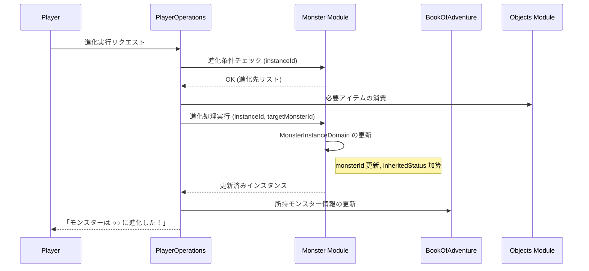

# モンスター進化システム (Monster Evolution System)

## 1. 概要
本ドキュメントは、モンスターが特定の条件を満たすことで別の種族へと変化する「進化」システムの仕様を定義します。進化は、モンスターの外見、ステータス、および使用可能なスキルを大幅に強化する重要な成長要素です。

## 2. 進化の条件
進化は、モンスター個体が以下の条件を満たした際に実行可能となります。

### 2.1 基本条件
- **レベル到達**: 各モンスター種族ごとに設定された「進化可能レベル」に達している必要があります。
- **進化アイテム（任意）**: 特定の種族への進化には、触媒となるアイテム（例：「炎の石」）が必要な場合があります。

### 2.2 特殊条件
- **特定のステータス**: 特定のステータス（例：攻撃力が 100 以上）が条件となる場合があります。
- **場所**: 特定のダンジョンや施設内でのみ進化可能な場合があります。
- **忠誠度**: プレイヤーに対する忠誠度が一定以上である必要がある場合があります。

## 3. 進化のプロセス
1. **進化可能通知**: 条件を満たした際、インベントリやモンスター詳細画面で「進化可能」な状態であることが表示されます。
2. **実行の選択**: プレイヤーが進化コマンドを選択します。複数の進化先（分岐進化）がある場合は、ここで選択します。
3. **リソースの消費**: 必要なアイテムやゴールドが消費されます。
4. **種族の変更**: `MonsterInstanceDomain` の `monsterId` が新しい種族の ID に更新されます。
5. **レベルのリセット（任意）**: 進化後のバランス調整のため、レベルが 1 に戻る（ただしステータスボーナスは保持）か、現在のレベルを維持するかが種族ごとに定義されます。

## 4. ステータスとスキルの継承

### 4.1 進化後のステータス計算
進化後のステータスは、進化先の種族の `baseStatus` に、進化前の個体が持っていた `inheritedStatus` を引き継いだ上で算出されます。

`進化後のステータス = (進化後種族のBase + 継承補正) * (1 + (新レベル - 1) * 0.1)`

- **進化ボーナス**: 進化の際、`inheritedStatus` に対して一定の固定ボーナス、または進化前ステータスの数％が加算される場合があります。

### 4.2 スキルの引き継ぎ
- **固有スキルの習得**: 進化後の種族がレベル 1 で習得しているスキルは自動的に習得します。
- **旧スキルの保持**: 進化前に習得していたスキルは、そのまま `skillIds` リストに保持されます。これにより、進化前の種族のみが習得できるスキルを、進化した後も使用することが可能です。

## 5. モジュール間連携

## 6. 進化テーブルの定義
各種族の進化データは、`MonsterDomain` 内の `evolutionTable` プロパティで定義されます。

### `MonsterEvolutionSlot` (値オブジェクト)
- `targetMonsterId`: 進化先の種族 ID。
- `requiredLevel`: 必要なレベル。
- `requiredItemId`: 必要なアイテムのタイプ ID（任意）。
- `requiredStats`: 必要なステータス条件（Map<String, Integer>、任意）。
    - 有効なキー: `hp`, `mp`, `atk`, `def`, `magicAtk`, `magicDef`, `dex`, `mnd`
- `resetLevel`: 進化後にレベルを 1 に戻すかどうか (boolean)。

## 7. 今後の拡張
- **分岐進化**: 同じモンスターから複数の異なる進化先を選べる仕組み。
- **退化**: 特定の条件下で前の形態に戻る、あるいは戻すことができる仕組み。
- **合体進化**: 2 体のモンスターを合わせて 1 体のより強力なモンスターに進化させる仕組み。
