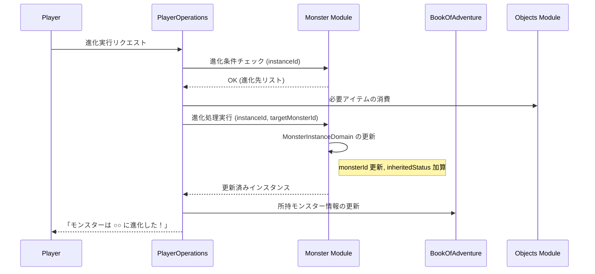

# モンスター進化システム (Monster Evolution System)

## 1. 概要
本ドキュメントは、モンスターが特定の条件を満たすことで別の種族へと変化する「進化」システムの仕様を定義します。進化は、モンスターの外見、ステータス、および使用可能なスキルを大幅に強化する重要な成長要素です。

## 2. 進化の条件
進化は、モンスター個体が以下の条件を満たした際に実行可能となります。

### 2.1 基本条件
- **レベル到達**: 各モンスター種族ごとに設定された「進化可能レベル」に達している必要があります。
- **進化アイテム（任意）**: 特定の種族への進化には、触媒となるアイテム（例：「炎の石」）が必要な場合があります。

### 2.2 特殊条件
- **特定のステータス**: 特定のステータス（例：攻撃力が 100 以上）が条件となる場合があります。
- **場所・ランク制限**: 特定のダンジョンや施設内でのみ進化可能な場合があります。また、管理されたダンジョン内では、そのダンジョンの[ランク上限](./Dungeon-Rank-System.md)を超えるティアの種族へ進化させることはできません（[詳細](./Dungeon-Rank-System.md#モンスターティアの制限-monster-tier-restrictions)）。
- **忠誠度**: プレイヤーに対する忠誠度が一定以上である必要がある場合があります。

## 3. 進化のプロセス
1. **進化可能通知**: 条件を満たした際、インベントリやモンスター詳細画面で「進化可能」な状態であることが表示されます。
2. **実行の選択**: プレイヤーが進化コマンドを選択します。複数の進化先（分岐進化）がある場合は、ここで選択します。
3. **リソースの消費**: 必要なアイテムやゴールドが消費されます。
4. **種族の変更**: `MonsterInstanceDomain` の `monsterId` が新しい種族の ID に更新されます。
5. **レベルのリセット（任意）**: 進化後のバランス調整のため、レベルが 1 に戻る（ただしステータスボーナスは保持）か、現在のレベルを維持するかが種族ごとに定義されます。

## 4. ステータスとスキルの継承

### 4.1 進化後のステータス計算
進化後のステータスは、進化先の種族の `baseStatus` に、進化前の個体が持っていた `inheritedStatus` を引き継いだ上で算出されます。

`進化後のステータス = (進化後種族のBase + 継承補正) * (1 + (新レベル - 1) * 0.1)`

- **進化ボーナス (Evolution Bonus)**:
    進化の瞬間、それまでの成長の証として `inheritedStatus` が強化されます。強化量は以下の式で算出されます。
    `新InheritedStatus[stat] = 旧InheritedStatus[stat] + (進化前最終ステータス[stat] - 進化前基本ステータス[stat]) * 0.1`
    - 進化前のレベルアップによって上昇したステータス（基本値からの増分）の **10%** が、永続的なボーナスとして継承補正に加算されます。
    - これにより、低レベルで進化させるよりも、十分に育ててから進化させた方が、最終的なステータスが高くなります。

### 4.2 スキルの引き継ぎ
- **固有スキルの習得**: 進化後の種族がレベル 1 で習得しているスキルは自動的に習得します。
- **旧スキルの保持**: 進化前に習得していたスキルは、原則としてそのまま `skillIds` リストに保持されます。これにより、進化前の種族のみが習得できるスキルを、進化した後も使用することが可能です。
- **枠数制限（最大 4 つ）の適用**: 進化によって新たにスキルを習得し、合計が 4 つを超える場合は、既存のスキルまたは新スキルのいずれかを破棄して 4 つに収める必要があります。

## 5. モジュール間連携


```mermaid
sequenceDiagram
    participant P as Player
    participant PO as PlayerOperations
    participant M as Monster Module
    participant BA as BookOfAdventure
    participant OBJ as Objects Module

    P->>PO: 進化実行リクエスト
    PO->>M: 進化条件チェック (instanceId)
    M-->>PO: OK (進化先リスト)
    PO->>OBJ: 必要アイテムの消費
    PO->>M: 進化処理実行 (instanceId, targetMonsterId)
    M->>M: MonsterInstanceDomain の更新
    Note right of M: monsterId 更新, inheritedStatus 加算
    M-->>PO: 更新済みインスタンス
    PO->>BA: 所持モンスター情報の更新
    PO-->>P: 「モンスターは ○○ に進化した！」
```

## 6. 進化テーブルの定義
各種族の進化データは、`MonsterDomain` 内の `evolutionTable` プロパティで定義されます。

### `MonsterEvolutionSlot` (値オブジェクト)
- `targetMonsterId`: 進化先の種族 ID。
- `requiredLevel`: 必要なレベル。
- `requiredItemId`: 必要なアイテムのタイプ ID（任意）。例：高ティア進化における「賞金稼ぎの証 (`bounty_hunter_proof`)」。
- `requiredStats`: 必要なステータス条件（Map<String, Integer>、任意）。
    - 有効なキー: `hp`, `mp`, `atk`, `def`, `magicAtk`, `magicDef`, `dex`, `mnd`, `loyalty`
- `resetLevel`: 進化後にレベルを 1 に戻すかどうか (boolean)。

## 7. 今後の拡張
- **分岐進化**: 同じモンスターから複数の異なる進化先を選べる仕組み。
- **退化**: 特定の条件下で前の形態に戻る、あるいは戻すことができる仕組み。詳細なルール、コスト、ステータス継承ロジックは **[モンスター退化システム](./Monster-Degeneration-System.md)** を参照してください。
- **合体進化**: 2 体のモンスターを合わせて 1 体のより強力なモンスターに進化させる仕組み（詳細は [モンスター融合システム](./Monster-Fusion-System.md) を参照）。

## 8. APIリクエスト・フローとエラーハンドリング

### 8.1 APIリクエスト仕様
モンスターの進化を実行するためのエンドポイントおよびリクエスト/レスポンスボディのJSON構造を定義します。

- **Endpoint**: `POST /api/v1/monsters/evolve`
- **Request Body (JSON)**:
```json
{
  "userId": "player_uuid_12345",
  "monsterInstanceId": "monster_uuid_67890",
  "targetMonsterId": "orc"
}
```

- **Response Body (JSON - 成功時)**:
```json
{
  "success": true,
  "result": "SUCCESS",
  "message": "モンスターは オーク に進化した！",
  "monster": {
    "instanceId": "monster_uuid_67890",
    "monsterId": "orc",
    "level": 1,
    "traits": [],
    "loyalty": 150,
    "inheritedStatus": {
      "hp": 2,
      "mp": 0,
      "atk": 1,
      "def": 1,
      "magicAtk": 0,
      "magicDef": 0,
      "dex": 1,
      "mnd": 0
    },
    "skillIds": [101]
  }
}
```

### 8.2 エラーハンドリング (Error Handling)
進化処理の過程で何らかのビジネスルールに抵触した場合、システムは以下のエラーコードと適切なHTTPステータスを持つエラーレスポンスを返却します。

| エラーコード | 発生条件 | レスポンス HTTP ステータス | 戻り値のメッセージ例 |
| :--- | :--- | :---: | :--- |
| `MONSTER_NOT_FOUND` | 指定された `monsterInstanceId` のモンスターが存在しない。 | 404 Not Found | 指定されたモンスターが見つかりません。 |
| `INSUFFICIENT_LEVEL` | モンスターが進化可能レベル（`requiredLevel`）に達していない。 | 400 Bad Request | 進化に必要なレベルに達していません。 |
| `MISSING_EVOLUTION_ITEM` | 進化に必要な触媒アイテム（`requiredItemId`）がインベントリに不足している。 | 400 Bad Request | 進化に必要な触媒アイテムが不足しています。 |
| `STATS_NOT_SATISFIED` | 進化に必要なステータス条件（`requiredStats`）を満たしていない。 | 400 Bad Request | 進化に必要なステータス条件を満たしていません。 |
| `RANK_LIMIT_EXCEEDED` | 進化先のモンスターのティアが現在のダンジョンランク上限（`DungeonRank`）を超えている。 | 400 Bad Request | このダンジョン内では、現在のランク制限によりこれ以上高位のティアへ進化させることはできません。 |
| `INVALID_EVOLUTION_PATH` | 指定された `targetMonsterId` への進化ルートが種族の `evolutionTable` に定義されていない。 | 400 Bad Request | 指定された進化先へのルートが存在しません。 |
| `SKILL_OVERFLOW` | 進化にともない新規習得するスキルと既存の保持スキルの合計が4つを超えるが、手動選択が完了していない。 | 400 Bad Request | 保持スキルが上限（4つ）を超えるため、忘れるスキルを選択してください。 |
