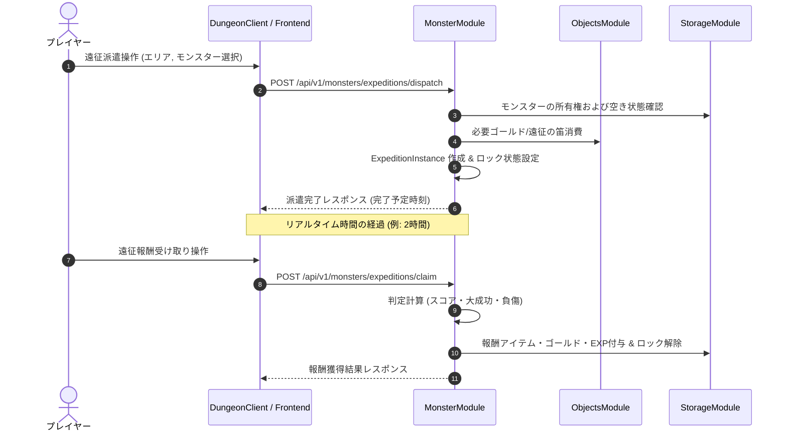

# モンスター遠征システム仕様

このドキュメントは、プレイヤーが所持するアクティブパーティ外の控えモンスター（ストレージ・牧場保管個体）をフロンティア・未開拓地へ派遣し、リアルタイム時間経過によって自動的に資材・ゴールド・経験値を獲得する**モンスター遠征システム（Monster Expedition System）**の仕様を定義します。

---

## 1. 概要

モンスター遠征システムは、アクティブ編成に含まれていないモンスターを一定時間遠征に派遣することで、放置プレイやエンドゲームにおいて素材収集や控えモンスターの育成を並行して行えるコンテンツです。

### 1.1 主な特徴
- **控えモンスターの活用**: アクティブパーティ外（ストレージ内）のモンスターを最大3頭まで1チームとして編成し派遣。
- **リアルタイム時間進行**: 1時間〜8時間のリアルタイム進行により遠征が完了。
- **エリア特性と属性相性**: 派遣エリアの推奨ステータスや推奨属性に適合したモンスターを選択することで、遠征成功率や「大成功」の発生率が大幅に上昇。
- **リスクとリターン**: 難易度の高いエリアでは「負傷」リスクが存在し、帰還後に一定の治療時間または回復アイテムが必要となる場合がある。

---

## 2. 遠征エリア定義

遠征先となるエリアは、難易度・解放条件・推奨属性・主要獲得リソースが異なります。

| エリアID | エリア名称 | 推奨レベル | 推奨属性 | 基本所要時間 | 必要ゴールド | 主要獲得リソース | ハザード率 |
| :--- | :--- | :---: | :---: | :---: | :---: | :--- | :---: |
| `ancient_mine` | 古代の鉱山 | Lv.5+ | Earth / Fire | 2時間 | 100 Gold | 建築資材（`stone_floor`, `strong_wall`）、ゴールド、鉱石類 | 5% |
| `miasma_forest` | 瘴気の森 | Lv.15+ | Wind / Holy | 4時間 | 300 Gold | トラップの種（`trap_poison_arrow`, `trap_sleep_gas`）、薬草・食料 | 12% |
| `sunken_ruins` | 沈没した遺跡 | Lv.25+ | Water / Dark | 6時間 | 600 Gold | 魔法の触媒（`water_stone`, `dark_stone`）、未識別巻物・杖 | 18% |
| `dragons_ridge` | 竜の脊梁 | Lv.40+ | Dragon / Fire | 8時間 | 1200 Gold | 高レア素材（`holy_stone`, `trait_stone`）、進化触媒、大金 | 25% |

---

## 3. 遠征成功度および計算式

遠征の結果は「大成功」「成功」「一般帰還（小失敗）」「負傷帰還」の4段階に判定されます。

### 3.1 判定スコア計算式

派遣パーティの総合スコア $S_{exp}$ は以下の式で算出されます。

$$S_{exp} = \sum_{m \in Party} \left( \text{Level}_m \times 2 + \text{ATK}_m + \text{DEF}_m \right) \times E_{bonus} \times M_{item}$$

- **$E_{bonus}$ (属性一致補正)**: エリア推奨属性と一致するモンスター1頭につき $+20\%$（最大 $+60\%$）。
- **$M_{item}$ (サポートアイテム補正)**: 「遠征の笛（`expedition_whistle`）」使用時は $1.5$ 倍。

### 3.2 成功度判定基準

エリアごとに設定された必要スコア $S_{req}$ に対する割合 $R = S_{exp} / S_{req}$ に基づき決定されます。

- **大成功 ($R \ge 1.5$)**: 規定報酬の 150%〜200% を獲得。全員の獲得EXP 1.5倍。負傷率 0%。
- **成功 ($1.0 \le R < 1.5$)**: 規定報酬および通常EXPを獲得。
- **一般帰還 ($0.6 \le R < 1.0$)**: 規定報酬の 40%〜60% を獲得。EXP半減。
- **負傷帰還 ($R < 0.6$)**: 報酬なし。派遣モンスターのいずれかが「負傷」状態となり、ステータス低下デバフが付与される。

---

## 4. ドメインモデルおよび永続化スキーマ

### 4.1 `ExpeditionInstance` (ドメインモデル)
- **ファイル:** `Monster/src/main/java/net/hero/rogueb/monster/domain/ExpeditionInstance.java`
- **主要フィールド:**
  - `expeditionId`: 一意な遠征セッションID。
  - `userId`: 派遣プレイヤーID。
  - `areaId`: 遠征エリアID（例: `ancient_mine`）。
  - `monsterInstanceIds`: 派遣されたモンスターのインスタンスIDリスト（最大3頭）。
  - `dispatchTime`: 派遣開始日時 (UTC)。
  - `estimatedCompletionTime`: 完了予定日時 (UTC)。
  - `status`: 遠征状態 (`IN_PROGRESS`, `COMPLETED`, `CLAIMED`, `CANCELLED`)。
  - `isWhistleUsed`: サポートアイテム「遠征の笛」使用フラグ。

### 4.2 `expeditionInstanceDomain` (MongoDB コレクション)
MongoDB に保存される遠征インスタンスのスキーマ構造です。

```json
{
  "_id": ObjectId("660a1234abcd5678ef901234"),
  "expeditionId": "exp_8830192",
  "userId": "user_1002",
  "areaId": "ancient_mine",
  "monsterInstanceIds": [
    "mon_inst_101",
    "mon_inst_102"
  ],
  "dispatchTime": ISODate("2026-03-31T10:00:00Z"),
  "estimatedCompletionTime": ISODate("2026-03-31T12:00:00Z"),
  "status": "COMPLETED",
  "isWhistleUsed": true,
  "result": {
    "outcome": "GREAT_SUCCESS",
    "rewardGold": 450,
    "rewardExp": 320,
    "rewardItems": [
      { "typeId": "stone_floor", "quantity": 5 },
      { "typeId": "fire_stone", "quantity": 1 }
    ],
    "injuredMonsterIds": []
  },
  "createdAt": ISODate("2026-03-31T10:00:00Z"),
  "updatedAt": ISODate("2026-03-31T12:00:00Z")
}
```

---

## 5. モジュール間連携フロー

遠征の派遣から報酬受領までのシーケンスは以下の通りです。



---

## 6. API仕様

### 6.1 遠征可能エリア一覧取得 (`GET /api/v1/monsters/expeditions/areas`)
現在開放されている遠征エリアの情報および要求パラメータを取得します。

#### レスポンス JSON スキーマ (200 OK)
```json
{
  "areas": [
    {
      "areaId": "ancient_mine",
      "name": "古代の鉱山",
      "recommendedLevel": 5,
      "recommendedElements": ["EARTH", "FIRE"],
      "durationMinutes": 120,
      "requiredGold": 100,
      "hazardRate": 0.05,
      "primaryRewards": ["石の床", "頑丈な壁", "炎の石"]
    },
    {
      "areaId": "miasma_forest",
      "name": "瘴気の森",
      "recommendedLevel": 15,
      "recommendedElements": ["WIND", "HOLY"],
      "durationMinutes": 240,
      "requiredGold": 300,
      "hazardRate": 0.12,
      "primaryRewards": ["毒矢の罠の種", "薬草"]
    }
  ]
}
```

---

### 6.2 実行中遠征状況取得 (`GET /api/v1/monsters/expeditions/active/{userId}`)
ユーザーが現在進行中または報酬受け取り待ちの遠征一覧を取得します。

#### レスポンス JSON スキーマ (200 OK)
```json
{
  "activeExpeditions": [
    {
      "expeditionId": "exp_8830192",
      "areaId": "ancient_mine",
      "monsterInstanceIds": ["mon_inst_101", "mon_inst_102"],
      "dispatchTime": "2026-03-31T10:00:00Z",
      "estimatedCompletionTime": "2026-03-31T12:00:00Z",
      "status": "COMPLETED",
      "isWhistleUsed": true,
      "isReadyToClaim": true
    }
  ]
}
```

---

### 6.3 遠征派遣リクエスト (`POST /api/v1/monsters/expeditions/dispatch`)
控えモンスターを選択して遠征へ派遣します。

#### リクエスト JSON スキーマ
```json
{
  "userId": "user_1002",
  "areaId": "ancient_mine",
  "monsterInstanceIds": ["mon_inst_101", "mon_inst_102"],
  "useWhistle": true
}
```

#### レスポンス JSON スキーマ (201 Created)
```json
{
  "expeditionId": "exp_8830192",
  "status": "IN_PROGRESS",
  "dispatchTime": "2026-03-31T10:00:00Z",
  "estimatedCompletionTime": "2026-03-31T12:00:00Z",
  "message": "古代の鉱山へモンスターを派遣しました。"
}
```

---

### 6.4 遠征報酬受け取り (`POST /api/v1/monsters/expeditions/claim`)
完了した遠征の報酬および経験値を受け取り、モンスターのロックを解除します。

#### リクエスト JSON スキーマ
```json
{
  "userId": "user_1002",
  "expeditionId": "exp_8830192"
}
```

#### レスポンス JSON スキーマ (200 OK)
```json
{
  "expeditionId": "exp_8830192",
  "outcome": "GREAT_SUCCESS",
  "rewardGold": 450,
  "gainedExpPerMonster": 320,
  "rewardItems": [
    {
      "typeId": "stone_floor",
      "name": "石の床",
      "quantity": 5
    },
    {
      "typeId": "fire_stone",
      "name": "炎の石",
      "quantity": 1
    }
  ],
  "injuredMonsterIds": [],
  "claimedAt": "2026-03-31T12:05:00Z"
}
```

---

## 7. エラーハンドリング仕様

遠征APIの処理において発生する例外とエラーコードのマッピング一覧です。

| エラーコード | HTTPステータス | 発生条件・説明 |
| :--- | :---: | :--- |
| `EXPEDITION_AREA_NOT_FOUND` | `404 Not Found` | 指定された `areaId` が存在しない場合。 |
| `MONSTER_NOT_AVAILABLE` | `400 Bad Request` | 派遣しようとしたモンスターがアクティブパーティに編入中、または他の遠征に派遣中の場合。 |
| `PARTY_SIZE_INVALID` | `400 Bad Request` | 派遣モンスター数が 1〜3 頭の範囲外である場合。 |
| `LEVEL_REQUIREMENT_NOT_MET` | `400 Bad Request` | エリアの推奨レベルに対しパーティ平均レベルが著しく不足している場合。 |
| `INSUFFICIENT_GOLD` | `400 Bad Request` | 遠征出発に必要な参加費（ゴールド）が不足している場合。 |
| `EXPEDITION_IN_PROGRESS` | `409 Conflict` | 対象の遠征がまだ完了予定時刻に達していない状態で受取を試みた場合。 |
| `EXPEDITION_NOT_FOUND` | `404 Not Found` | 指定された `expeditionId` が存在しない場合。 |
| `EXPEDITION_ALREADY_CLAIMED` | `409 Conflict` | すでに報酬受領済みの遠征に対して再度受取を行った場合。 |
