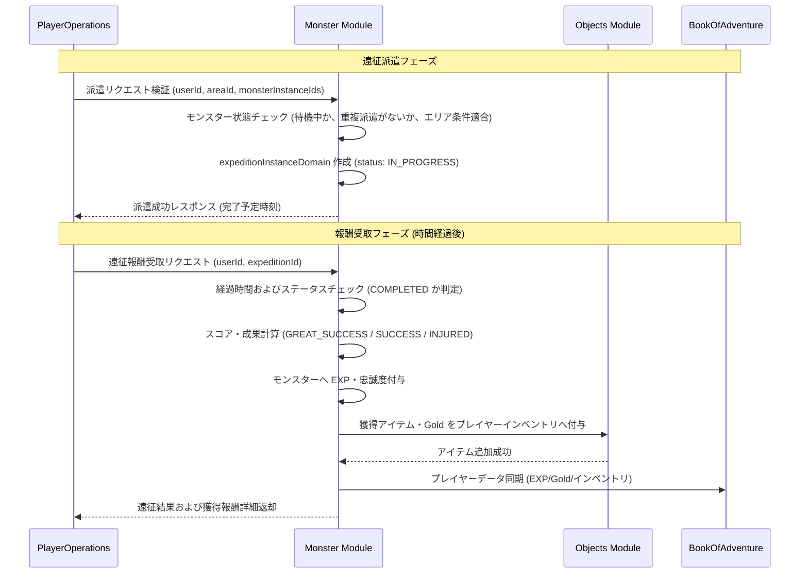

# モンスター遠征システム (Monster Expedition System)

## 1. 概要
本ドキュメントは、アクティブパーティ（ダンジョン探索用パーティ）に編入されていない手持ち・倉庫内の待機中モンスターを、未開地や辺境エリア（遠征地域）へ派遣して探索を行わせる「モンスター遠征システム（Monster Expedition System）」の仕様を定義します。

遠征に派遣されたモンスターは一定時間の経過後に帰還し、成果に応じてゴールド、各種クラフト素材（拡張資材・触媒アイテム等）、種・トラップ配置用アイテム、経験値（EXP）、および忠 loyalty（忠誠度）を獲得します。本システムにより、待機中のモンスターの有効活用および継続的な資源獲得の機会をプレイヤーに提供します。

## 2. 遠征エリアと開放条件
プレイヤーは解放済みの「遠征エリア」を選択し、条件を満たすモンスターグループ（最大3体）を選択して派遣します。

### 2.1 遠征エリア定義
各遠征エリアには推奨レベル、必須/推奨要素（属性・タイプ）、所要時間、および獲得可能な主要報酬が定義されています。

| エリアID | エリア名称 | 推奨レベル | 所要時間 | 派遣条件 | 獲得可能な主要資源・アイテム |
| :--- | :--- | :---: | :---: | :--- | :--- |
| `ANCIENT_MINE` | 古代の鉱山 | Lv 5+ | 1時間 | なし | Gold, `expansion_material`, 各種鉱石系アイテム |
| `MIASMA_FOREST` | 瘴気の森 | Lv 12+ | 4時間 | 草木・昆虫系または毒耐性 | Gold, `trap_flame`, `trap_frost`, `trap_lightning`, 種子アイテム |
| `SUNKEN_RUINS` | 沈没船の入江 | Lv 20+ | 8時間 | 水棲・飛行系または氷結属性 | Gold, `enchant_scroll`, `trait_stone`, 高級宝箱ドロップ |
| `DRAGON_RIDGE` | 竜の脊梁 | Lv 30+ | 12時間 | ドラゴン系または火炎属性 (1体以上必須) | Gold, `trait_crystal`, `degeneration_hourglass`, `collar_of_pledge` |

### 2.2 派遣グループの制限事項
- 1つの遠征エリアに派遣できるモンスターは **1〜3体** です。
- **アクティブパーティに編入中のモンスター**、および**すでに他の遠征に派遣中のモンスター**は派遣できません。
- 同時に進行できる遠征は、プレイヤー1人あたり最大 **2エリア** までとなります。

## 3. 遠征実行メカニズムと結果判定

### 3.1 成果の判定基準
遠征終了時、派遣したモンスターのステータス合計値（HP/攻撃力/防御力）、エリア推奨レベルとの差、および属性/タイプ相性補正に基づき、「大成功」「成功」「負傷帰還」の3段階で判定が行われます。

1. **スコア計算式**:
   $$Score = \sum (Monster.Level \times 2 + Monster.Attack + Monster.Defense) \times ElementBonus \times TypeBonus$$
   - `ElementBonus`: 推奨属性と一致するモンスター1体につき +15% (1.15)
   - `TypeBonus`: 推奨タイプと一致するモンスター1体につき +15% (1.15)

2. **判定閾値**:
   - **大成功 (`GREAT_SUCCESS`)**: $Score \ge Area.RequiredScore \times 1.4$ (確率: 25〜40%)
     - 報酬: 通常の 1.5 倍の Gold/EXP、追加の希少素材（`trait_crystal` 等）を確定入手。
   - **成功 (`SUCCESS`)**: $Score \ge Area.RequiredScore$
     - 報酬: 標準報酬を獲得。
   - **負傷帰還 (`INJURED`)**: $Score < Area.RequiredScore$
     - 報酬: 通常の 50% の Gold/EXP。モンスターが軽傷を負い、忠誠度が微減（-3〜-5）します。

### 3.2 経験値および忠誠度の獲得
- 遠征完了時、派遣された全モンスターはエリアに応じた経験値と忠誠度ボーナスを獲得します。
- 大成功時は忠誠度が +3〜+5 上昇します。ただし、親愛状態（[モンスター親愛システム](./Monster-Affection-System.md)）のモンスターは負傷時でも忠誠度が減少しません。

## 4. データ構造とMongoDBスキーマ

遠征状態は `Monster` モジュール内の `expeditionInstanceDomain` コレクションにて管理されます。

### 4.1 `expeditionInstanceDomain` コレクション
```json
{
  "_id": "expedition_uuid_98765",
  "userId": "player_uuid_12345",
  "areaId": "MIASMA_FOREST",
  "monsterInstanceIds": [
    "monster_uuid_001",
    "monster_uuid_002"
  ],
  "startTime": "2026-03-30T10:00:00Z",
  "endTime": "2026-03-30T14:00:00Z",
  "status": "IN_PROGRESS",
  "result": null,
  "rewards": null
}
```

- `status` 列挙値:
  - `IN_PROGRESS`: 遠征中
  - `COMPLETED`: 遠征完了（受取待ち）
  - `CLAIMED`: 報酬受取済み（履歴保持用）

## 5. モジュール間連携とシーケンス

遠征派遣および報酬受取の処理フローです。



## 6. API仕様

### 6.1 遠征可能エリア一覧照会
- **Endpoint**: `GET /api/v1/monsters/expeditions/areas`
- **Response Body (200 OK)**:
```json
{
  "success": true,
  "areas": [
    {
      "areaId": "ANCIENT_MINE",
      "name": "古代の鉱山",
      "requiredLevel": 5,
      "durationMinutes": 60,
      "requiredScore": 100,
      "possibleRewards": ["gold", "expansion_material"]
    },
    {
      "areaId": "MIASMA_FOREST",
      "name": "瘴気の森",
      "requiredLevel": 12,
      "durationMinutes": 240,
      "requiredScore": 250,
      "possibleRewards": ["gold", "trap_flame", "trap_frost"]
    }
  ]
}
```

### 6.2 遠征派遣実行
- **Endpoint**: `POST /api/v1/monsters/expeditions/dispatch`
- **Request Body**:
```json
{
  "userId": "player_uuid_12345",
  "areaId": "ANCIENT_MINE",
  "monsterInstanceIds": [
    "monster_uuid_001",
    "monster_uuid_002"
  ]
}
```
- **Response Body (200 OK)**:
```json
{
  "success": true,
  "expeditionId": "expedition_uuid_98765",
  "areaId": "ANCIENT_MINE",
  "startTime": "2026-03-30T10:00:00Z",
  "endTime": "2026-03-30T11:00:00Z",
  "status": "IN_PROGRESS"
}
```

### 6.3 遠征報酬受取
- **Endpoint**: `POST /api/v1/monsters/expeditions/claim`
- **Request Body**:
```json
{
  "userId": "player_uuid_12345",
  "expeditionId": "expedition_uuid_98765"
}
```
- **Response Body (200 OK)**:
```json
{
  "success": true,
  "result": "GREAT_SUCCESS",
  "acquiredGold": 1500,
  "acquiredExp": 350,
  "acquiredItems": [
    {
      "typeId": "expansion_material",
      "quantity": 2
    },
    {
      "typeId": "trait_stone",
      "quantity": 1
    }
  ],
  "monsterStatusUpdates": [
    {
      "instanceId": "monster_uuid_001",
      "gainedExp": 350,
      "loyaltyChange": 4
    }
  ]
}
```

## 7. エラーハンドリング (Error Handling)

処理中に異常が発生した場合、以下のビジネスエラーコードが返却されます。

| エラーコード | 発生条件 | HTTP ステータス | メッセージ例 |
| :--- | :--- | :---: | :--- |
| `INVALID_AREA` | 指定された `areaId` の遠征エリアが存在しない。 | 404 Not Found | 指定された遠征エリアが見つかりません。 |
| `MONSTER_NOT_FOUND` | 指定された `monsterInstanceId` のモンスターが存在しない。 | 404 Not Found | 対象のモンスターが見つかりません。 |
| `MONSTER_IN_PARTY` | 指定されたモンスターが現在アクティブパーティに編入されている。 | 400 Bad Request | パーティに編入中のモンスターは遠征に派遣できません。 |
| `ALREADY_ON_EXPEDITION` | 指定されたモンスターがすでに他の遠征に派遣中である。 | 400 Bad Request | 選択されたモンスターはすでに遠征へ派遣されています。 |
| `MAX_EXPEDITION_LIMIT_EXCEEDED` | プレイヤーの進行中遠征数が上限（2エリア）に達している。 | 400 Bad Request | 同時に進行できる遠征は最大2件までです。 |
| `PARTY_SIZE_EXCEEDED` | 派遣モンスターの数が規定外（0体または4体以上）。 | 400 Bad Request | 遠征には1〜3体のモンスターを指定してください。 |
| `REQUIREMENT_NOT_MET` | エリアの必須条件（指定タイプ・属性・レベル制限等）を満たしていない。 | 400 Bad Request | 遠征エリアの参加条件（レベル・属性）を満たしていません。 |
| `EXPEDITION_NOT_FINISHED` | 遠征の終了予定時刻に達していない状態で報酬受取を試みた。 | 400 Bad Request | 遠征はまだ完了していません。 |
| `EXPEDITION_ALREADY_CLAIMED` | すでに報酬受取済みの遠征IDを指定した。 | 400 Bad Request | この遠征の報酬は受取済みです。 |
