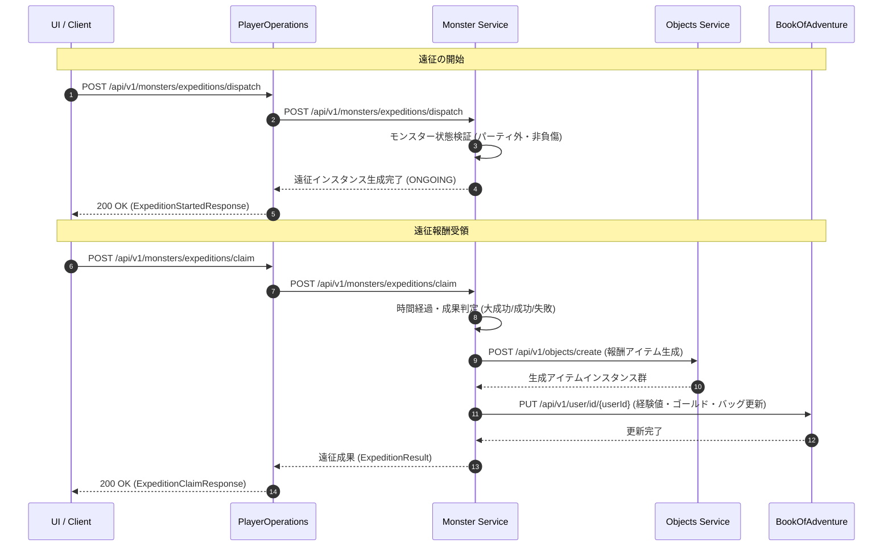

# モンスター遠征システム仕様

本ドキュメントは、**rogueb**における新規提案機能である**モンスター遠征システム（Monster Expedition System）**の詳細なメカニズム、遠征エリア、成功判定ロジック、データモデル、API仕様、およびエラーハンドリングについて定義します。

---

## 1. 概要とコンセプト

### 1.1 背景と目的
プレイヤーは探索や繁殖、捕獲を通じて多数のモンスターを保有します。しかし、アクティブパーティ（最大3体）やダンジョン防衛に配置されていない待機中のモンスターは、倉庫や手持ちの枠に留まるのみとなっています。
モンスター遠征システムは、これら待機中のモンスター（サブメンバー）に「フロンティア（未拓域）」への調査・自動遠征を指示し、実時間経過に伴い各種資材（ゴールド、増築用資材、特性の石、退化の砂時計、未識別アイテム等）の獲得およびモンスター自身の経験値・忠誠度の上昇を得られるシステムです。

### 1.2 主な特徴
- **待機モンスターの有効活用**: アクティブパーティ編入中以外のモンスターを1〜3体編成して遠征隊を結成します。
- **多様な遠征先**: 必要なリソース（建築素材、消費アイテム、希少装備等）に応じた遠征エリアを選択可能。
- **ステータス・特性・親愛状態の連動**: モンスターのレベル、[忠誠度](./Monster-Loyalty-System.md)、[親愛状態](./Monster-Affection-System.md)、および[個体特性](./Monster-Trait-System.md)（採掘、薬草学、宝探し等）が遠征成功率や大成功確率に直接影響します。
- **リスクとリターン**: 失敗時には報酬が減少するだけでなく、モンスターが「負傷」状態となり、一定時間の休養または治癒用アイテムの使用が必要になります。

---

## 2. 遠征メカニズムとエリア

### 2.1 遠征の基本ルール
1. **編成条件**:
   - 1チームにつき **1〜3体** のモンスターを編成。
   - 対象モンスターはアクティブパーティ外かつダンジョン防衛非配置であること。
   - 「負傷（`INJURED`）」状態のモンスターは遠征に参加不可。
2. **同時遠征枠**:
   - 初期状態で **最大2チーム** まで同時に遠征可能。
   - プレイヤーレベルや[倉庫システム](./Storage-System.md)の拡張段階に応じて最大4チームまで解放。
3. **所要時間**:
   - エリアに応じて **15分（ショート）**、**1時間（ミドル）**、**4時間（ロング）**、**8時間（ディープ）** の実時間コースが存在。
   - 遠征途中で「早期帰還（Recall）」を実行可能（ただし報酬・経験値は半減し、大成功率は0%となる）。

### 2.2 遠征エリア一覧

| エリアID | エリア名称 | 推奨レベル | 所要時間 | 主な獲得アイテム・素材 | 特徴 |
| :--- | :--- | :--- | :--- | :--- | :--- |
| `mine_ancient` | **古代の採掘場** | Lv 5+ | 1時間 | ゴールド, 増築用資材 (`expansion_material`), 特性の石 (`trait_stone`) | 鉱石や建築資材に特化したエリア。パワー・耐久重視。 |
| `forest_miasma` | **瘴気の森** | Lv 10+ | 2時間 | 薬草系消耗品, 罠の種 (`trap_flame` 等), 退化の砂時計 (`degeneration_hourglass`) | 自然系・毒耐性が有効。罠の資材や特殊触媒を獲得可能。 |
| `ruins_sunken` | **沈没した遺跡** | Lv 15+ | 4時間 | 未識別巻物/指輪, エンチャントの巻物 (`enchant_scroll`), 抽出の水晶球 (`extraction_orb`) | 魔法・知性重視。希少な未識別アイテムやエンチャント素材を獲得。 |
| `ridge_dragon` | **竜の背骨** | Lv 25+ | 8時間 | ティア3+装備品, 高額ゴールド, 誓いの首輪 (`collar_of_pledge`), 特性結晶 (`trait_crystal`) | 高難易度エリア。大量の経験値と最上級素材を獲得可能。 |

---

## 3. 成功率および報酬計算ロジック

### 3.1 成果判定（大成功・成功・失敗）
遠征完了時、以下の3段階で成果が判定されます。

- **大成功 (Great Success)**: 報酬量 1.5倍〜2.0倍、限定レアアイテム確定ドロップ、経験値 1.5倍、忠誠度 +5。
- **成功 (Success)**: 規定の標準報酬および経験値を獲得、忠誠度 +2。
- **失敗 (Failure)**: 報酬量 0.3倍、経験値 0.5倍、20%の確率でモンスター1体が「負傷（`INJURED`）」状態になる。

### 3.2 計算式と補正

1. **基本成功率 ($S_{\text{base}}$)**:
   $$\text{平均パーティレベル} \div \text{推奨レベル} \times 70\%$$
   （最大 85% まで）

2. **忠誠度・親愛補正 ($C_{\text{loyalty}}$)**:
   - パーティ平均忠誠度 $\ge 150$: $+10\%$
   - 親愛状態（Loyalty 255）のモンスターが1体以上存在: $+15\%$ （かつ負傷発生率を $0\%$ に固定）

3. **個体特性補正 ($C_{\text{trait}}$)**:
   - エリア適正特性（例：採掘特化、宝探し、夜行性等）を保持: 特性1つにつき $+5\%$ （最大 $+15\%$）

4. **最終成功率 ($S_{\text{final}}$)**:
   $$S_{\text{final}} = \min(95\%, S_{\text{base}} + C_{\text{loyalty}} + C_{\text{trait}})$$

5. **大成功確率 ($P_{\text{great}}$)**:
   $$P_{\text{great}} = (S_{\text{final}} - 50\%) \times 0.4 + \text{親愛ボーナス}(10\%)$$

---

## 4. データモデルとMongoDBスキーマ

### 4.1 `expeditionInstanceDomain` コレクション構造
- **説明:** 実行中および完了未受取の遠征チームデータを保持するコレクション。
- **フィールド構造:**

```json
{
  "_id": "exp_inst_98765",
  "userId": "user_12345",
  "areaId": "mine_ancient",
  "slotIndex": 0,
  "monsterInstanceIds": [
    "monster_inst_001",
    "monster_inst_002"
  ],
  "startTime": "2026-03-31T10:00:00Z",
  "endTime": "2026-03-31T11:00:00Z",
  "status": "ONGOING",
  "calculatedSuccessRate": 0.85,
  "calculatedGreatRate": 0.24,
  "_class": "net.hero.rogueb.monster.domain.ExpeditionInstanceDomain"
}
```

### 4.2 インデックス推奨事項
- `{"userId": 1, "status": 1}`: プレイヤーの進行中・完了遠征一覧の照会用。
- `{"endTime": 1, "status": 1}`: バックグラウンドでの遠征完了判定・通知処理用。

---

## 5. モジュール間連携フロー

### シーケンス図: 遠征派遣および結果受領



---

## 6. API仕様

### 6.1 遠征エリア一覧取得 (`GET /api/v1/monsters/expeditions/areas`)

#### レスポンス (Response: 200 OK)
```json
{
  "areas": [
    {
      "areaId": "mine_ancient",
      "name": "古代の採掘場",
      "recommendedLevel": 5,
      "durationMinutes": 60,
      "description": "建築資材や鉱石が豊富な古代の採掘跡。",
      "possibleRewards": [
        "gold",
        "expansion_material",
        "trait_stone"
      ]
    },
    {
      "areaId": "forest_miasma",
      "name": "瘴気の森",
      "recommendedLevel": 10,
      "durationMinutes": 120,
      "description": "危険な毒胞子が漂う森。特殊な調合素材を獲得可能。",
      "possibleRewards": [
        "trap_flame",
        "trap_frost",
        "degeneration_hourglass"
      ]
    }
  ]
}
```

---

### 6.2 遠征派遣実行 (`POST /api/v1/monsters/expeditions/dispatch`)

#### リクエスト (Request)
```json
{
  "userId": "user_12345",
  "areaId": "mine_ancient",
  "slotIndex": 0,
  "monsterInstanceIds": [
    "monster_inst_001",
    "monster_inst_002"
  ]
}
```

#### レスポンス (Response: 200 OK)
```json
{
  "expeditionId": "exp_inst_98765",
  "userId": "user_12345",
  "areaId": "mine_ancient",
  "slotIndex": 0,
  "monsterInstanceIds": [
    "monster_inst_001",
    "monster_inst_002"
  ],
  "startTime": "2026-03-31T10:00:00Z",
  "endTime": "2026-03-31T11:00:00Z",
  "successRate": 0.85,
  "greatSuccessRate": 0.24,
  "status": "ONGOING"
}
```

---

### 6.3 遠征報酬受領・精算 (`POST /api/v1/monsters/expeditions/claim`)

#### リクエスト (Request)
```json
{
  "userId": "user_12345",
  "expeditionId": "exp_inst_98765"
}
```

#### レスポンス (Response: 200 OK)
```json
{
  "expeditionId": "exp_inst_98765",
  "resultType": "GREAT_SUCCESS",
  "earnedGold": 1500,
  "earnedExpPerMonster": 350,
  "loyaltyGained": 5,
  "rewardItems": [
    {
      "instanceId": "item_inst_501",
      "typeId": "expansion_material",
      "name": "増築用資材"
    },
    {
      "instanceId": "item_inst_502",
      "typeId": "trait_stone",
      "name": "特性の石"
    }
  ],
  "injuredMonsterIds": [],
  "completedAt": "2026-03-31T11:00:00Z"
}
```

---

## 7. エラーハンドリング仕様

| エラーコード | HTTPステータス | 原因・条件 | エラーメッセージ例 |
| :--- | :--- | :--- | :--- |
| `MONSTER_NOT_FOUND` | `404 Not Found` | 指定されたモンスターインスタンスが存在しない。 | 指定されたモンスターが見つかりません。 |
| `MONSTER_IN_ACTIVE_PARTY` | `400 Bad Request` | モンスターがアクティブパーティ（手持ち戦闘枠）に編成されている。 | 戦闘パーティ中のモンスターは遠征に派遣できません。 |
| `MONSTER_ALREADY_ON_EXPEDITION` | `400 Bad Request` | モンスターが既に別の遠征に参加している。 | 対象モンスターは既に別の遠征へ派遣されています。 |
| `MONSTER_INJURED` | `422 Unprocessable Entity` | モンスターが負傷状態であり遠征不能。 | 負傷中のモンスターは遠征に参加できません。休養が必要です。 |
| `INVALID_AREA_ID` | `400 Bad Request` | 存在しない遠征エリアIDが指定された。 | 指定された遠征エリアが存在しません。 |
| `EXPEDITION_NOT_COMPLETED` | `400 Bad Request` | 所要時間が未満で報酬受領を実行しようとした（早期帰還フラグなし）。 | 遠征がまだ完了していません。 |
| `EXPEDITION_SLOT_FULL` | `400 Bad Request` | 同時遠征可能チーム数の上限を超過して派遣しようとした。 | 同時遠征枠の上限に達しています。 |
| `INVENTORY_FULL` | `400 Bad Request` | 報酬アイテム受領時にバッグおよび倉庫に空き枠がない。 | インベントリが満杯のため報酬を受け取れません。 |

---

## 8. 関連ドキュメント

- **[モンスター ドメインモデル](./domain_models/Monster.md)**
- **[モンスター MongoDBデータ構造](./domain_models/Monster-MongoDB.md)**
- **[モンスター忠誠度システム仕様](./Monster-Loyalty-System.md)**
- **[モンスター親愛システム仕様](./Monster-Affection-System.md)**
- **[モンスター特性システム仕様](./Monster-Trait-System.md)**
- **[倉庫システム仕様](./Storage-System.md)**
- **[経済システム仕様](./domain_models/Economic-System.md)**
- **[Objectsモジュール ドメインモデル](./domain_models/Objects.md)**
