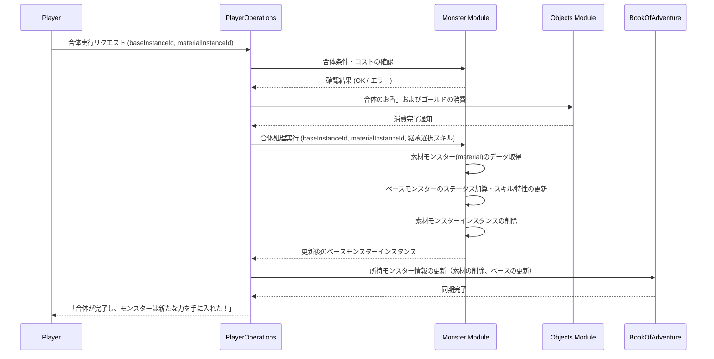

# モンスター合体システム (Monster Fusion System)

## 1. 概要
本ドキュメントは、プレイヤーが所持する 2 体のモンスターを掛け合わせ、新たな能力を持った強力な個体を生成する「合体」システムの仕様を定義します。合体システムは、不要になったモンスターや重複したモンスターを消費してメインモンスターを永続的に強化する、中〜長期的な育成エンドコンテンツとして機能します。

[モンスター繁殖システム](./Monster-Breeding-System.md)が「卵を生成し歩数によって孵化させる」世代交代型のシステムであるのに対し、本システムは「ベースモンスターに素材モンスターを吸収させて直接かつ即座に強化・変化させる」直接強化型のシステムです。

## 2. 合体の実行条件とコスト
合体は拠点または特定の施設（合体研究所など）において実行可能です。

### 2.1 実行条件
- **レベル制限**: ベースモンスター、素材モンスターの双方が **レベル 15 以上** である必要があります。
- **対象外モンスター**: ボスモンスター（Tier 5、例: `ancient_dragon`）および、特定のストーリーイベント用モンスター（例: `town_guardian`）は、ベースまたは素材のいずれとしても合体に利用することはできません。

### 2.2 コスト
合体の実行には以下のコストを消費します。
- **ゴールド**: `(ベースのティア + 素材のティア) * 1,000` Gold。
- **触媒アイテム**: 合体の触媒となる「合体のお香 (`fusion_incense`)」を 1 つ消費します。このアイテムは主に高難易度ダンジョンのクリア報酬やショップで購入可能です。

## 3. 合体の種類

合体には、ベースとなる種族をそのまま強化する「継承合体」と、特定の組み合わせによって新しい種族へ進化させる「特殊合体」の 2 種類が存在します。

### 3.1 継承合体 (Inheritance Fusion)
ベースモンスターの種族（`monsterId`）を維持したまま、素材モンスターのステータスやスキル、特性の一部を吸収して個体を強化します。

- **用途**: お気に入りの低ティアモンスターを、高ティアモンスターを素材にすることで実用的なレベルまで強化する場合や、特定のスキルを別の系統のモンスターに移植する場合に使用します。

### 3.2 特殊合体（合体進化） (Special Fusion)
特定の種族同士を掛け合わせることで、通常の進化ルートを経由することなく、即座に上位または特殊な種族（例: `dragon_slime` や `griffin`）を誕生させます。

#### 特殊合体テーブルの例
| ベース (種族 ID) | 素材 (種族 ID) | 誕生種族 (種族 ID) | 備考 |
| :--- | :--- | :--- | :--- |
| `slime` | `dragon` | `dragon_slime` | ドラゴン属性を持つスライム。レベルは 1 にリセット。 |
| `wolf` | `eagle` | `griffin` | 飛行特性を持つ強力な魔獣。レベルは 1 にリセット。 |
| `zombie` | `skeleton` | `lich` | 強力な不死の魔導師。レベルは 1 にリセット。 |
| `fire_spirit` | `water_spirit` | `mist_spirit` | 霧を操る精霊。レベルは 1 にリセット。 |

- **メリット**: 進化石などの特殊な進化触媒アイテムを必要とせず、両親のレベルのみで高ティアモンスターを獲得可能です。

## 4. ステータスと能力の継承ルール

### 4.1 ステータスの継承 (Stat Inheritance)
合体後、ベースモンスター（特殊合体の場合は誕生したモンスター）の `inheritedStatus` に対し、素材モンスターの強さに応じた永続ボーナスが加算されます。

#### 計算式:
`新InheritedStatus[stat] = 旧InheritedStatus[stat] + (素材の基本値[stat] + 素材の継承値[stat]) * 0.05 * 忠誠度補正`

- **忠誠度補正 (Loyalty Modifier)**:
  素材モンスターのプレイヤーに対する忠誠度が高いほど、ステータス継承率が上昇します。
  `忠誠度補正 = 1.0 + (素材のLoyalty / 255) * 0.5`
  - 素材モンスターの忠誠度が最大の **255** である場合、補正は **1.5 倍** となり、素材の最終ステータス（レベル1換算値）の最大 **7.5%** がボーナスとしてベースモンスターに加算されます。
- **制限**: 継承ボーナスによる加算値は、各ステータス項目ごとに最大 **+99** までとします。

### 4.2 スキルの引き継ぎ (Skill Inheritance)
- **移植枠**: 素材モンスターが現在習得しているスキル（`skillIds`）の中から、最大 **2 つ** を選択してベースモンスターに引き継ぐことができます。
- **枠数制限の適用**: ベースモンスターが保持できるスキルは最大 **4 つ** までです。継承するスキルを含めて合計が 4 つを超える場合、プレイヤーは手動で不要なスキルを選択し、削除（上書き）する必要があります。

### 4.3 特性の引き継ぎ (Trait Inheritance)
素材モンスターが「突然変異」や「過去の合体」等によって獲得した個体固有の特性（種族標準の特性以外）を、一定確率で引き継ぐことができます。

- **基本継承確率**: 30%
- **忠誠度ボーナス**: 素材モンスターの忠誠度に応じて、継承確率が最大 **60%** まで上昇します。
  `継承確率(%) = 30 + (素材のLoyalty / 255) * 30`
- **制限**: 同一の特性を重複して持つことはできません（[モンスター特性システム](./Monster-Trait-System.md#21-特性の累積と優先順位-trait-stacking--priority)に準拠）。

## 5. 忠誠度への影響

合体は命を掛け合わせた高度な儀式であり、誕生した、あるいは生き残った個体の忠誠度は、掛け合わせる 2 体の絆を強く反映します。

- **合体後の忠誠度計算**:
  `合体後のLoyalty = min(255, (ベースのLoyalty * 0.8) + (素材のLoyalty * 0.2))`
  - ※特殊合体の場合は、ベースを親 A、素材を親 B として同様に計算します。
  - 素材となったモンスターを失う喪失感を考慮しつつも、長年連れ添った仲間の絆（Loyalty）がベースに引き継がれる形となります。
- **最終忠誠度更新日時の更新**: `lastLoyaltyUpdate` は合体実行時のタイムスタンプに更新されます。

## 6. モジュール間連携

## 7. 今後の拡張
- **合体禁忌度 (Fusion Strain)**: 短期間に同一モンスターを何度も合体させるとステータスに一時的なデバフがかかるシステム。
- **属性変化合体**: 特定の属性オーブや高属性値モンスターを合体させることで、ベースモンスターの「属性 (`attribute`)」自体を変化させる仕組み。
