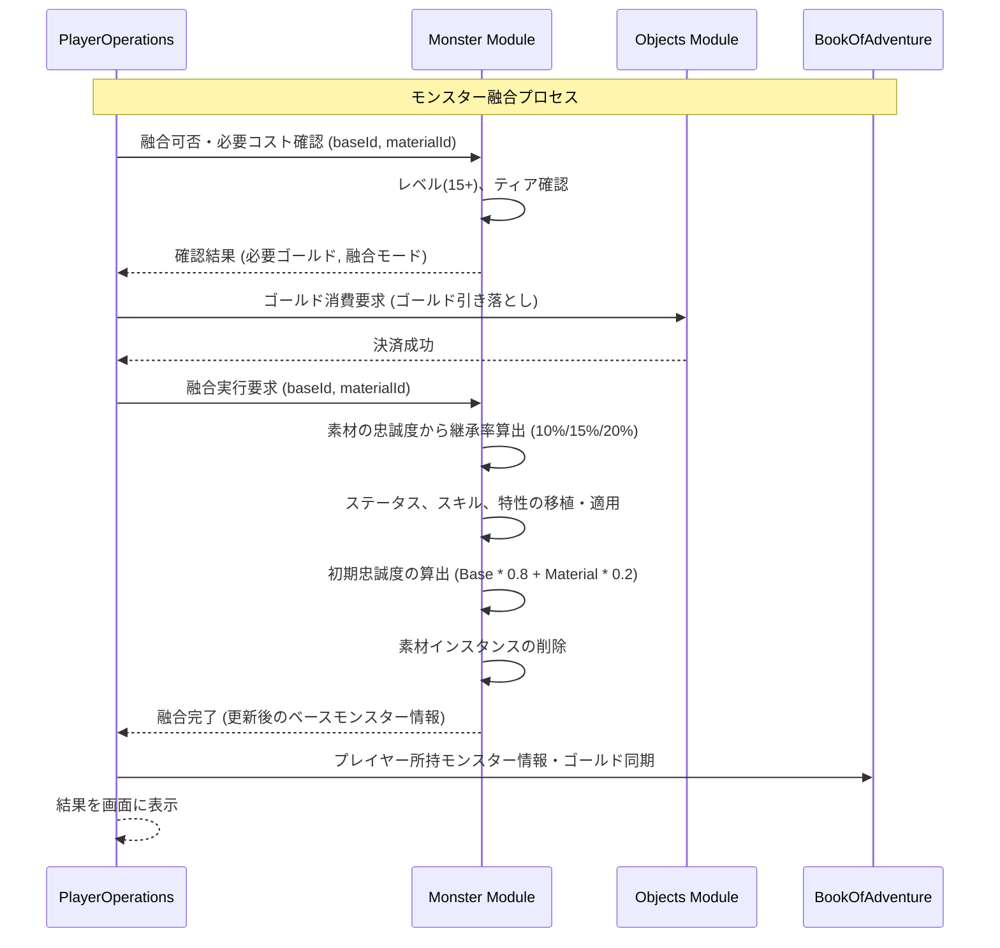

# モンスター融合システム (Monster Fusion System)

## 1. 概要
本ドキュメントは、2体の十分に成長したモンスター個体を合体・融合させることで、能力を強化した新たな個体を生み出したり、特殊な新種族へと変化（進化）させたりする「モンスター融合システム」の仕様を定義します。本システムは、プレイヤーが育成したお気に入りのモンスターをさらに深化させるためのエンドコンテンツ・および成長サイクルの重要要素です。

## 2. 融合の実行条件
モンスターの融合を行うには、ベースとなるモンスターと、素材となるモンスターが特定の条件を満たしている必要があります。

### 2.1 レベル制限
- **ベース個体（Base）**: レベル **15** 以上であること。
- **素材個体（Material）**: レベル **15** 以上であること。

### 2.2 コスト計算
合体の実行にはゴールドが必要であり、ベースおよび素材のティアに基づいて算出されます。
- **計算式**:
  `必要ゴールド = (ベース個体のティア + 素材個体のティア) * 1000` Gold

- **例**:
  - ティア2 のベースと ティア3 の素材を合体する場合：
    `(2 + 3) * 1000 = 5000` Gold

### 2.3 個体への影響
- **ベース個体（Base）**: 消失せず、合体後の能力向上や進化を適用された状態で存続します。
- **素材個体（Material）**: 合体完了時に**完全に消失（消費）**します。

## 3. 合体の種類と挙動
合体には大きく分けて「系統継承合体」と「特殊進化合体」の2つのモードが存在します。

### 3.1 系統継承合体 (System/Inheritance Fusion)
ベースモンスターの種族をそのまま維持しつつ、素材モンスターの強力なステータス、スキル、および特性をベース個体に継承・移植するモードです。

- **挙動**:
  - ベースモンスターの種族（`monsterId`）は変更されません。
  - 素材モンスターから能力値のボーナス（後述）を継承します。
  - 素材モンスターのスキルや特性を任意に継承（移植）できます。

### 3.2 特殊進化合体 (Special/Fusion Evolution)
特定の種族同士の組み合わせによってのみ発生し、ベースモンスターが全く別のユニークな新種族へと直接変化・覚醒（進化）するモードです。

- **挙動**:
  - ベースモンスターの種族（`monsterId`）が、定義された進化後の種族へと更新されます。
  - 通常の進化と同様にレベルがリセットされるか、引き継がれるかは進化先種族の定義に依存します。
  - 系統継承合体と同様に、素材モンスターからのステータス補正、スキル、特性の継承も同時に行われます。

## 4. 継承ロジックと忠誠度の影響
合体時の能力・特性の継承率は、**素材モンスターの「忠誠度」**によって強力に補正されます。素材との絆が深ければ深いほど、より多くの力と意志がベース個体へと受け継がれます。

### 4.1 ステータス継承率
素材モンスターのステータスの内、ベースモンスターへボーナス（`inheritedStatus`）として加算される割合は、素材モンスターの忠誠度（0 〜 255）によって以下のように変動します。

| 素材モンスターの忠誠度 | 継承補正率 | 備考 |
| :--- | :---: | :--- |
| **0 〜 100** | **10%** | 最低限の力の移行。 |
| **101 〜 200** | **15%** | 信頼関係による効率的な能力継承。 |
| **201 〜 255** | **20%** | 固い絆によって、素材の持つポテンシャルを最大限に引き出す。 |

- **算出式**:
  `加算される継承ステータス[stat] = 素材モンスターの最終ステータス[stat] * 継承補正率`
  - 対象ステータス: `hp, mp, atk, def, magicAtk, magicDef, dex, mnd`

### 4.2 特性の継承
素材モンスターが所持している固有・パッシブ特性（種族特性以外）をベースモンスターが継承できる確率も、素材の忠誠度に基づいて決定されます。

- **継承判定式**:
  `特性継承確率 = (素材モンスターの忠誠度 / 5) %`
  - 例: 忠誠度 250 の場合、`250 / 5 = 50%` の高確率で特性を引き継ぐことが可能です。
  - 忠誠度 50 の場合、`50 / 5 = 10%` の確率に留まります。

### 4.3 合体後の初期忠誠度
合体後のベースモンスターの初期忠誠度（`loyalty`）は、合体前の2体の忠誠度をベースに以下の割合でブレンド・再計算されます。素材モンスターを消費することに対する影響も含めて算出されます。

- **計算式**:
  `合体後の忠誠度 = Baseの忠誠度 * 0.8 + Materialの忠誠度 * 0.2`
  - 小数点以下は四捨五入。値の範囲は 0 〜 255。

## 5. 特殊進化合体テーブル (Special Fusion Evolution Table)
特殊進化合体における、主要な組み合わせと進化先種族の一覧です。

| ベース (種族 ID) | 素材 (種族 ID) | 進化先 (種族 ID) | 概要・備考 |
| :--- | :--- | :--- | :--- |
| `slime` | `metal_spirit` | `metal_slime` | メタル属性を纏った極めて頑丈なスライム。 |
| `orc` | `demon` | `high_demon` | 悪魔の血を受け継ぎ、巨大な力と魔力を得た上位魔族。 |
| `wolf` | `wind_spirit` | `gale_wolf` | 風を切り裂いて走る、俊敏性に特化した神獣の末裔。 |
| `dragon` | `fire_spirit` | `ancient_dragon` | 根源の炎を取り込み、神格へと近づいた古代竜。 |

## 6. データ構造と永続化
合体処理、および継承パラメータは `MonsterInstanceDomain` および `MonsterDomain` において以下のプロパティを参照して実行されます。

- **合体用の API パラメータ**:
  - `baseInstanceId`: ベース個体の UUID。
  - `materialInstanceId`: 素材個体の UUID。
  - `fusionType`: `SYSTEM` (系統継承) または `SPECIAL` (特殊進化)。

- **スキーマ拡張への考慮**:
  - 融合履歴や累計融合回数を記録する `fusionCount` フィールドを `MonsterInstanceDomain` に将来的に格納することを推奨。

## 7. モジュール間連携

