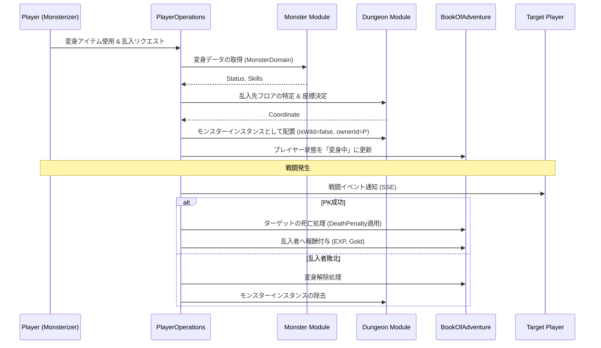

# モンスター化・PKシステム (Monsterization & PK System)

## 1. 概要
本ドキュメントは、プレイヤーがモンスターとしてダンジョンに介入し、他のプレイヤーと戦闘を行う「モンスター化」および「PK (Player Kill)」システムの仕様を定義します。このシステムにより、非対称な対人戦と、管理者によるダンジョン運営の戦略性が強化されます。

## 2. モンスター化 (Monsterization)
プレイヤーは特定の条件下で、一時的に自身の姿をモンスターに変え、その能力を行使することができます。

### 2.1 変身の条件
- **専用アイテムの使用**: 「魔物の魂」等の特殊な消費アイテムを使用することで変身します。
- **場所の制限**: 原則として、他者の「マイ・ダンジョン」内、または特定の「乱入可能エリア」でのみ実行可能です。
- **レベル制限**: プレイヤーのレベルが 10 以上である必要があります。

### 2.2 変身中のステータス
- **見た目**: 選択したモンスター種族（`MonsterDomain`）の外見になります。
- **ステータス**: 基本的に変身したモンスター種族の `baseStatus` に、プレイヤー自身のレベルに応じた補正が加わります。
- **スキル**: プレイヤー自身のスキルは使用不可となり、そのモンスター種族が持つ固有スキル（`skillTable` に定義されたもの）のみが使用可能となります。
- **インベントリ**: 変身中はアイテムの使用・拾得が制限される場合があります。

## 3. PK (Player Kill) メカニズム
モンスター化したプレイヤーは、ダンジョン内を探索している他のプレイヤーを攻撃できます。

### 3.1 乱入 (Intrusion)
- プレイヤーは「乱入」コマンドを使用し、現在攻略中の他プレイヤーがいるフロアへ、特定のモンスターとして配置されます。
- 配置場所は、対象プレイヤーの視界外からランダムに選ばれます。

### 3.2 戦闘ルール
- 戦闘計算式は通常の [戦闘システム](./Combat-System.md) に準拠します。
- モンスター側（乱入者）は、AI モンスターと同様にプレイヤー側からの攻撃対象となります。
- 他の AI モンスターは、モンスター化したプレイヤーを「味方」と認識し、共闘します。

## 4. 報酬とペナルティ

### 4.1 モンスター側（乱入者）のメリット
- **経験値の獲得**: プレイヤーを撃破した場合、そのプレイヤーのレベルに応じた大量の経験値を獲得します。
- **戦利品の獲得**: 対象プレイヤーが死亡した際の「デスペナルティ」によって没収されたアイテムやゴールドの一部、または全額（管理者の設定による）を獲得できます。

### 4.2 モンスター側の敗北（解除条件）
- **HP 0 到達**: モンスター形態の HP が 0 になると変身が強制解除され、元のプレイヤーの姿で拠点（またはダンジョン入り口）へ戻されます。
- **時間経過**: アイテムの効果時間が終了すると自動的に解除されます。
- **解除時のペナルティ**: モンスター形態で死亡しても、プレイヤー自身の経験値やアイテムは失われませんが、変身に使用したアイテムは消費されます。

## 5. モジュール間連携

## 6. 管理者の介入
ダンジョンの管理者は、自身の「マイ・ダンジョン」を攻略中のプレイヤーに対し、自らモンスターとなって立ちはだかることができます。

- **管理者特典**: 管理者が自ら乱入する場合、変身アイテムのコストが免除される、あるいはより強力なモンスターを選択できる等のボーナスがあります。
- **直接操作**: 通常の AI モンスターに代わり、管理者の意思でトラップへの誘導や連携攻撃を行うことが可能です。

## 7. 今後の拡張
- **指名手配システム**: 頻繁に PK を行うプレイヤーに賞金がかけられ、他のプレイヤーや強力な NPC 衛兵に狙われる仕組み。
- **進化系モンスター**: 特定のプレイヤーを倒し続けることで、変身できるモンスターがより強力な種族へ進化する機能。
