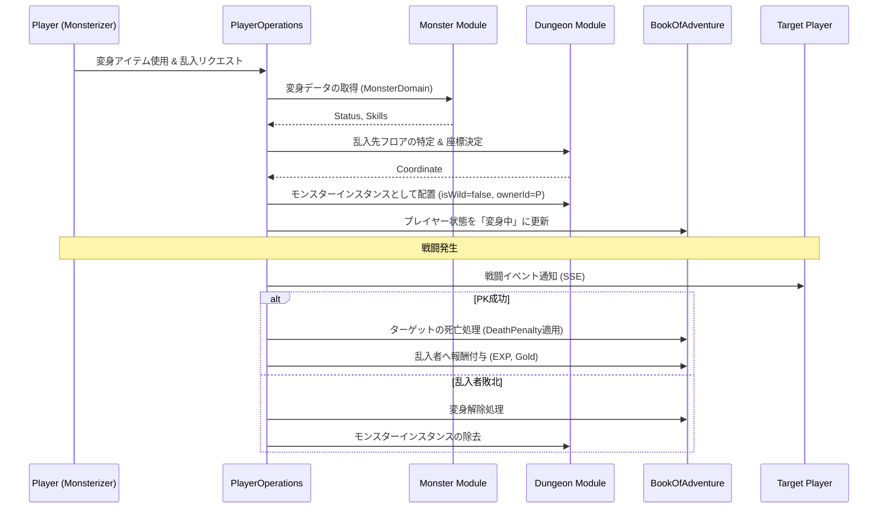

# モンスター化・PKシステム (Monsterization & PK System)

## 1. 概要
本ドキュメントは、プレイヤーがモンスターとしてダンジョンに介入し、他のプレイヤーと戦闘を行う「モンスター化」および「PK (Player Kill)」システムの仕様を定義します。このシステムにより、非対称な対人戦と、管理者によるダンジョン運営の戦略性が強化されます。

## 2. モンスター化 (Monsterization)
プレイヤーは特定の条件下で、一時的に自身の姿をモンスターに変え、その能力を行使することができます。

### 2.1 変身の条件
- **専用アイテムの使用**: 「モンスターソウルジェム」等の特殊な消費アイテムを使用することで変身します。
- **場所の制限**: 原則として、他者の「マイ・ダンジョン」内、または特定の「乱入可能エリア」でのみ実行可能です。
- **レベル制限**: プレイヤーのレベルが 10 以上である必要があります。

### 2.2 変身中のステータス
- **対象モンスターの選定**: プレイヤーが所持しているモンスター（`PlayerMonsterDomain` に登録された `MonsterInstanceDomain`）の中から、変身する個体を選択します。
- **見た目・名前**: 選択したモンスター種族（`MonsterDomain`）の外見になり、名前にはその個体のニックネーム（`metadata` 内）が反映されます。
- **ステータス**: 変身したモンスター種族の `baseStatus` および、その個体が持つ `inheritedStatus`（継承補正）をベースに、プレイヤー自身のレベル（Lv）に応じて以下の式で算出されます。
  `変身中のステータス = (baseStatus + 継承補正) * (1 + (Lv - 1) * 0.1) * EliteCorrection`
  - この算出式は、通常のモンスターやプレイヤーの成長曲線と一致し、繁殖によって強化された個体の能力が変身時にも反映されます。
- **スキル**: プレイヤー自身のスキルは使用不可となり、そのモンスター種族が持つ固有スキル（`skillTable` に定義されたもの）のみが使用可能となります。
- **インベントリ**: 変身中はアイテムの使用・拾得が制限される場合があります。

## 3. PK (Player Kill) メカニズム
モンスター化したプレイヤーは、ダンジョン内を探索している他のプレイヤーを攻撃できます。

### 3.1 乱入 (Intrusion)
- **乱入リクエスト**: プレイヤーは「乱入」コマンドを使用し、現在攻略中の他プレイヤーがいるフロアへ、特定のモンスターとして配置されます。
- **ティア制限**: 乱入先のダンジョンのランクに応じて、変身可能なモンスターのティアに上限が設定されます。ダンジョンランクが要求するティアを超えるモンスターでの乱入はできません。詳細は [ダンジョンランクシステム](./Dungeon-Rank-System.md) を参照。
- **ターゲット選択**: 乱入可能なプレイヤー（「乱入可能エリア」に滞在中のプレイヤー）のリストから、対象を選択します。リストは、プレイヤーのレベルや現在地（階層）に基づいてフィルタリング可能です。
- **コスト**: 乱入には「モンスターソウルジェム」等の変身アイテムに加え、以下の計算式に基づいた「乱入コスト（ゴールド）」が必要となります。
  `乱入コスト = (対象プレイヤーのレベル * 100) + (変身モンスターのティア * 500)`
- **配置場所**: 配置場所は、対象プレイヤーの視界外からランダムに選ばれます。これにより、不意打ちのような形での介入が可能になります。

### 3.2 戦闘ルール
- 戦闘計算式は通常の [戦闘システム](./Combat-System.md) に準拠します。
- モンスター側（乱入者）は、AI モンスターと同様にプレイヤー側からの攻撃対象となります。
- 他の AI モンスターは、モンスター化したプレイヤーを「味方」と認識し、共闘します。

## 4. 報酬とペナルティ

### 4.1 モンスター側（乱入者）のメリット
- **経験値の獲得**: プレイヤーを撃破した場合、そのプレイヤーのレベルに応じた大量の経験値を獲得します。
    - **獲得経験値の算出**: `EXP = (対象プレイヤーのレベル * 100) * (現在の連続撃破数 * 0.5 + 1)`
- **戦利品の獲得**: 対象プレイヤーが死亡した際の「デスペナルティ」によって没収されたアイテムやゴールドの一部、または全額（管理者の設定による）を獲得できます。

### 4.2 モンスター側の敗北（解除条件）
- **HP 0 到達**: モンスター形態の HP が 0 になると変身が強制解除され、元のプレイヤーの姿で拠点（またはダンジョン入り口）へ戻されます。
- **時間経過**: 変身から **500 subStep** 経過すると自動的に解除されます。
- **解除時のペナルティ**: モンスター形態で死亡しても、プレイヤー自身の経験値やアイテムは失われませんが、変身に使用したアイテムは消費されます。

## 5. モジュール間連携


```mermaid
sequenceDiagram
    participant P as Player (Monsterizer)
    participant PO as PlayerOperations
    participant M as Monster Module
    participant D as Dungeon Module
    participant BA as BookOfAdventure
    participant T as Target Player

    P->>PO: 変身アイテム使用 & 乱入リクエスト
    PO->>M: 変身データの取得 (MonsterDomain)
    M-->>PO: Status, Skills
    PO->>D: 乱入先フロアの特定 & 座標決定
    D-->>PO: Coordinate
    PO->>D: モンスターインスタンスとして配置 (isWild=false, ownerId=P)
    PO->>BA: プレイヤー状態を「変身中」に更新

    Note over P, T: 戦闘発生
    PO->>T: 戦闘イベント通知 (SSE)

    alt PK成功
        PO->>BA: ターゲットの死亡処理 (DeathPenalty適用)
        PO->>BA: 乱入者へ報酬付与 (EXP, Gold)
    else 乱入者敗北
        PO->>BA: 変身解除処理
        PO->>D: モンスターインスタンスの除去
    end
```

## 6. 管理者の介入
ダンジョンの管理者は、自身の「マイ・ダンジョン」を攻略中のプレイヤーに対し、自らモンスターとなって立ちはだかることができます。

- **管理者特典**: 管理者が自ら乱入する場合、変身アイテムのコストが免除される、あるいはより強力なモンスターを選択できる等のボーナスがあります。
- **直接操作**: 通常の AI モンスターに代わり、管理者の意思でトラップへの誘導や連携攻撃を行うことが可能です。

## 7. 指名手配システム (Wanted System)
頻繁に PK を行うプレイヤーは「指名手配犯」としてマークされ、ゲーム内でのリスクが増大します。

### 7.1 手配の条件と賞金
- **発生条件**: 短期間に一定回数以上の PK を実行、または特定の累計撃破数に達したプレイヤーが自動的に手配されます。
- **賞金計算**: 賞金（Bounty）は以下の計算式で算出され、撃破したプレイヤーや管理者に支払われます。
  `賞金 = (累計撃破数 * 1,000) + (現在の連続撃破数 * 500)`
- **手配ランク**: 賞金額に応じて以下の手配ランクが設定され、ランクが高いほど後述の追跡が激しくなります。

| ランク | ランク指数 | 必要賞金額 (Bounty) | 備考 |
| :--- | :---: | :---: | :--- |
| **C** | 1 | 1,000 〜 | 注意が必要な新米 PK 犯。 |
| **B** | 2 | 10,000 〜 | 各地で被害が報告されている熟練 PK 犯。 |
| **A** | 3 | 50,000 〜 | 広域指名手配。マップ上に位置が露呈する。 |
| **S** | 4 | 200,000 〜 | 伝説的な極悪人。衛兵や賞金稼ぎの追跡が極めて激しくなる。 |

### 7.2 手配犯への制約と追跡
- **町のお触れ書き**: 拠点の掲示板に、手配犯の名前と現在の賞金額が貼り出されます。
- **NPC 衛兵（Town Guardian）の攻撃**:
    - 拠点（町）などの安全エリア（Non-combat zone）に滞在している際、強力な NPC 衛兵から先制攻撃を受けるようになります。
    - 衛兵は通常のモンスターよりも高い命中率と、移動を封じる「捕縛」スキルを使用します。
    - 衛兵のレベルは **Lv 99** または **プレイヤーレベル + 20** に固定され、圧倒的な実力差で手配犯を制圧します。
- **賞金稼ぎ（NPC Bounty Hunter）**:
    - ダンジョン探索中、**100 歩（subStep）ごと**に以下の確率で「賞金稼ぎ」を目的とした高レベルの NPC モンスターがプレイヤーの周辺（視界外）にスポーンします。
        - ランク C: 1% / ランク B: 2% / ランク A: 3% / ランク S: 5%
    - 賞金稼ぎは、手配犯のレベルに **(ランク指数 * 5)** のレベル補正を加えたステータス（例：ランク S なら +20）を持ち、視界外からでも手配犯を追跡し、優先的に攻撃を仕掛けてきます。
- **位置の露呈**: 手配ランクが A 以上のプレイヤーは、同一ダンジョン内の他プレイヤーのマップ上に大まかな位置（エリア単位）が強調表示されます。

### 7.3 賞金の分配と手配の解除
- **賞金の支払い**: 手配犯を撃破したプレイヤー（または管理者）は、累積された賞金全額を獲得します。
- **分配ロジック**:
    - パーティや共闘で撃破した場合、**与えたダメージ量の比率**に応じて賞金が分配されます。
    - プレイヤーの所有するモンスターが与えたダメージは、そのプレイヤー（飼い主）の貢献度として合算されます。
    - ただし、とどめを刺したプレイヤー（Finishing Blow）には、ボーナスとして**賞金総額の 20%** が優先的に割り当てられ、残りの 80% がダメージ比率で分配されます。
    - **NPC による撃破**:
        - 野生のモンスターや賞金稼ぎ（Bounty Hunter）によって撃破された場合、賞金は誰にも支払われずリセットされます。
        - 管理者が所有するダンジョン（マイ・ダンジョン）内で、そのダンジョンの衛兵、配置モンスター、または**設置されたトラップ**によって撃破された場合は、賞金総額の **50%** が「没収金」としてダンジョン管理者に支払われ、残りの 50% は消滅（リセット）します。
- **撃破による解除**: 他のプレイヤーや NPC に撃破され、デスペナルティを受けることで手配が解除されます。
- **贖罪**: 拠点の特定の NPC（教会等）に多額のゴールドを支払うことで、手配を解除することが可能です。
    - **贖罪コスト**: `現在の賞金額 * 1.5` ゴールドを支払うことで、累積撃破数および賞金がリセットされます。

### 7.4 追跡 NPC の詳細仕様
指名手配犯を追跡する NPC の具体的なステータスと挙動を定義します。

#### 7.4.1 拠点衛兵 (Town Guardian)
- **出現場所**: 拠点（町）、セーフエリア。
- **ステータス**:
    - **レベル**: **Lv 99** または **プレイヤーレベル + 20** の高い方を適用。
    - **攻撃力・防御力**: 同レベルの標準的なモンスターの 1.5 倍。
- **AI 挙動**:
    - 視界内に手配犯を検知次第、即座に敵対状態となります。
    - **優先行動**: 射程内にターゲットがいる場合、まず「捕縛」スキルを使用して移動を封じます。
    - **出口封鎖**: ターゲットがエリア出口（ポータルやゲート）に近づいた場合、攻撃よりも出口を塞ぐ移動を優先します。
- **ドロップ**: なし（衛兵を倒すことによる報酬稼ぎを防止）。

#### 7.4.2 賞金稼ぎ (NPC Bounty Hunter)
- **出現場所**: 一般ダンジョン（手配ランクに応じて出現率変動）。
- **ステータス補正**:
    - レベル = `ターゲットのレベル + (ランク指数 * 5)`。
    - ランク A 以上は、プレイヤーの現在ステータス（バフ込み）を 10% 上回る補正がかかります。
- **ランク別特性**:

| ランク | 出現時の二つ名 | 特殊能力 | 主なドロップアイテム |
| :--- | :--- | :--- | :--- |
| **C** | 新米の〜 | 特になし | 回復薬、少額のゴールド |
| **B** | 熟練の〜 | 毒・麻痺耐性 | 強化素材、中額のゴールド |
| **A** | 凄腕の〜 | 特性「不可視看破 (`SEE_INVISIBILITY`)」「追跡 (`TRACKING`)」を保持。 | 高品質な装備、高額のゴールド |
| **S** | 伝説の〜 | 1.1倍のステータス。特性「不可視看破 (`SEE_INVISIBILITY`)」「追跡 (`TRACKING`)」「自己再生 II (`REGENERATION_II`)」「全状態異常無効 (`STATUS_IMMUNITY`)」を保持。 | 希少なアーティファクト、賞金稼ぎの証 |

- **希少ドロップの流通制限**: 「賞金稼ぎの証」等の希少アイテムには世界全体の存在上限 (`maxLimit`) が設定されています。上限に達している場合は、[経済システムで定義される共通代替ルール](./domain_models/Economic-System.md#52-上限到達時の共通振る舞い-global-fallback-standard) に基づき、標準価格の 30% 分のゴールドへ置換されます。
- **AI 挙動**:
    - **追跡アルゴリズム**: ランク A 以上は特性「追跡 (`TRACKING`)」により、プレイヤーが視界外にいても常に最短距離で追跡します（「におい」や「魔力探知」の演出）。
    - **連携**: 同一フロアに複数の賞金稼ぎがいる場合、ターゲットを包囲するように動きます。

## 8. API仕様 (API Specification)
モンスター化・乱入・指名手配・贖罪処理で用いられる主要な Restful API エンドポイントのデータ構造（JSON）を定義します。

### 8.1 モンスター変身リクエスト (`POST /api/v1/pk/transform`)
所持モンスターと変身アイテムを選択し、一時的にモンスター形態に変身します。

#### リクエスト Payload 例
```json
{
  "playerId": "usr_998231",
  "itemInstanceId": "item_soul_gem_001",
  "monsterInstanceId": "mon_inst_88712"
}
```

#### レスポンス Payload 例（成功時: 200 OK）
```json
{
  "success": true,
  "transformedMonster": {
    "monsterInstanceId": "mon_inst_88712",
    "typeId": "high_demon",
    "nickname": "ヘルブレイズ",
    "level": 15,
    "calculatedStatus": {
      "hp": 240,
      "maxHp": 240,
      "atk": 85,
      "def": 62,
      "matk": 90,
      "mdef": 70,
      "dex": 55
    },
    "availableSkillIds": [
      "skill_dark_breath",
      "skill_grand_crush"
    ]
  },
  "transformationDurationSubSteps": 500,
  "message": "ハイデーモンへの変身が完了しました。"
}
```

### 8.2 乱入リクエスト (`POST /api/v1/pk/intrude`)
変身形態のまま他プレイヤーの攻略中フロアへ乱入します。

#### リクエスト Payload 例
```json
{
  "playerId": "usr_998231",
  "targetDungeonId": "dungeon_abyss_01",
  "targetFloor": 5,
  "targetPlayerId": "usr_104822",
  "monsterInstanceId": "mon_inst_88712",
  "itemInstanceId": "item_soul_gem_001"
}
```

#### レスポンス Payload 例（成功時: 200 OK）
```json
{
  "success": true,
  "intrusionId": "intrude_772189",
  "targetFloor": 5,
  "spawnCoordinate": {
    "x": 12,
    "y": 8
  },
  "requiredGoldCost": 2500,
  "message": "ターゲットプレイヤーの視界外へ乱入しました。"
}
```

### 8.3 指名手配リスト照会 (`GET /api/v1/pk/wanted-list`)
現在指名手配されているプレイヤーの一覧を取得します。

#### リクエストパラメータ例
`GET /api/v1/pk/wanted-list?rank=A&page=1&limit=10`

#### レスポンス Payload 例（成功時: 200 OK）
```json
{
  "total": 3,
  "wantedPlayers": [
    {
      "playerId": "usr_998231",
      "playerName": "ShadowSlayer",
      "bounty": 65000,
      "rank": "A",
      "currentKillStreak": 8,
      "totalPkCount": 42,
      "lastKnownLocation": {
        "dungeonId": "dungeon_abyss_01",
        "dungeonName": "深淵の魔宮",
        "floor": 5
      }
    }
  ]
}
```

### 8.4 贖罪リクエスト (`POST /api/v1/pk/atonement`)
拠点の教会等でゴールドを支払い、指名手配状態および撃破数をリセットします。

#### リクエスト Payload 例
```json
{
  "playerId": "usr_998231",
  "paymentGold": 97500
}
```

#### レスポンス Payload 例（成功時: 200 OK）
```json
{
  "success": true,
  "paidGold": 97500,
  "remainingGold": 125000,
  "clearedBounty": 65000,
  "message": "贖罪が完了し、指名手配が解除されました。"
}
```

## 9. エラーハンドリング (Error Handling)
モンスター化およびPK処理において発生し得る業務エラーコード、発生条件、および対応する HTTP ステータスコードのマッピングを以下に示します。

| エラーコード | HTTPステータス | 発生条件・詳細 |
| :--- | :---: | :--- |
| `PLAYER_NOT_FOUND` | 404 Not Found | 指定されたプレイヤーが存在しない場合。 |
| `INSUFFICIENT_LEVEL` | 400 Bad Request | 変身・乱入に必要なプレイヤーレベル（Lv 10以上）を満たしていない場合。 |
| `ITEM_NOT_FOUND` | 404 Not Found | 指定された変身アイテムが存在しない場合。 |
| `ITEM_NOT_IN_INVENTORY` | 400 Bad Request | 変身アイテムがプレイヤーのインベントリ内に存在しない場合。 |
| `INVALID_ITEM_TYPE` | 400 Bad Request | 指定されたアイテムが変身用アイテム（モンスターソウルジェム等）でない場合。 |
| `MONSTER_NOT_FOUND` | 404 Not Found | 変身対象として指定されたモンスターが存在しない場合。 |
| `MONSTER_NOT_OWNED` | 403 Forbidden | 指定されたモンスターがプレイヤー自身の所有個体でない場合。 |
| `AREA_NOT_INTRUDABLE` | 400 Bad Request | 対象ダンジョンまたはエリアで乱入が許可されていない（`isIntrusionEnabled = false`）場合。 |
| `INSUFFICIENT_GOLD` | 400 Bad Request | 乱入コストまたは贖罪に必要なゴールドが不足している場合。 |
| `TIER_LIMIT_EXCEEDED` | 400 Bad Request | ダンジョンランクの上限を超えるティアのモンスターで乱入しようとした場合。 |
| `TARGET_PLAYER_NOT_FOUND` | 404 Not Found | 乱入対象のプレイヤーが存在しないか、すでにダンジョンを離脱している場合。 |
| `TARGET_NOT_INTRUDABLE` | 400 Bad Request | 乱入対象プレイヤーが乱入可能エリアに滞在していない場合。 |
| `NOT_WANTED` | 400 Bad Request | 指名手配されていないプレイヤーが贖罪を行おうとした場合。 |

#### エラーレスポンス Payload 例（ゴールド不足時: 400 Bad Request）
```json
{
  "errorCode": "INSUFFICIENT_GOLD",
  "message": "乱入に必要なゴールドが不足しています。",
  "details": {
    "requiredGold": 2500,
    "currentGold": 1200
  },
  "timestamp": "2026-03-31T12:00:00Z"
}
```

## 10. 今後の拡張 (Future Extensions)
- **進化系モンスター**: 特定のプレイヤーを倒し続けることで、変身できるモンスターがより強力な種族へ進化する機能。
