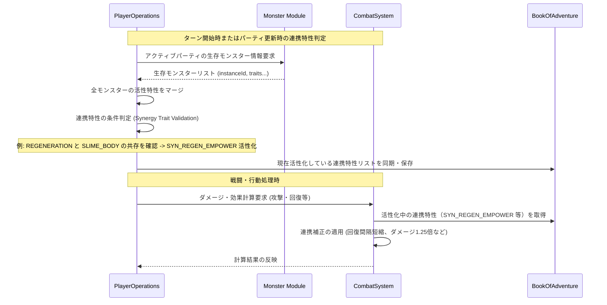

# モンスター連携特性システム (Monster Synergy Trait System)

## 1. 概要
本ドキュメントは、プレイヤーのアクティブパーティ（手持ち編成）に、特定の組み合わせの特性を持つモンスターを同時に編入している場合に発動するシナジー効果「連携特性（Synergy Trait）」の仕様を定義します。これは[モンスター特性システム](./Monster-Trait-System.md)の上位概念として位置づけられ、モンスター単体の強さだけでなく、パーティ全体のシナジーを意識した戦術的・戦略的な編成の楽しさを提供するシステムです。

## 2. 連携特性の基本仕様

連携特性は、アクティブパーティに含まれる全てのモンスターの「総活性特性（種族特性＋個体特性）」をチェックし、特定の特性の組み合わせ（ペアまたはトリオ等）が揃っている場合に自動的に適用されるバフまたは特殊なパッシブ効果です。

### 2.1 発動の基本ルール
- **編成内の活性チェック**:
  - 発動対象はプレイヤーのアクティブパーティ（通常最大3〜4体）に現在編入されており、かつ「生存している」モンスターに限定されます。戦闘不能状態（HP 0）のモンスターが保有する特性は、活性チェックの対象外となります。
- **重複の扱い**:
  - パーティ内で同一の連携特性が複数成立する組み合わせ（例：異なる2組のモンスターが同じ連携特性の条件を満たしている場合）があっても、**その効果は重複適用（スタック）されず、1回分のみ**が有効となります。
  - 同一モンスターが複数の異なる連携特性のトリガーになることは可能です（例：モンスターAが連携特性XとYの双方の構成員となる場合）。
- **戦闘中・非戦闘時のリアルタイム更新**:
  - モンスターの死亡、復活、パーティの入れ替え等により編成内の活性特性の組み合わせが変化した場合、連携特性の状態は即時に（または次のターンの開始時に）再計算されて適用・解除されます。

---

## 3. 主要連携特性リスト (Synergy Traits List)

システムで定義される標準的な連携特性の組み合わせ、発動条件、および効果の一覧です。

| 連携特性 ID | 連携名称 | 必須特性の組み合わせ | 効果概要 | 戦術的な位置づけ |
| :--- | :--- | :--- | :--- | :--- |
| `SYN_REGEN_EMPOWER` | 共鳴再生 | `REGENERATION` (または `REGENERATION_II`) + `SLIME_BODY` | パーティ全員の自然回復量を 1.5 倍にし、回復タイミングを `subStep % 10 == 0` から `subStep % 8 == 0` に短縮する。 | 持久戦・低コストダンジョンの探索に適した生存特化シナジー。 |
| `SYN_BLAZE_WAVE` | 熱波の共鳴 | `FIRE_IMMUNITY` + `FLIGHT` | 敵に与えるすべての火属性ダメージが 1.25 倍になる。さらに、攻撃時に 15% の確率で対象を「火傷（Flame）」状態（3ターン）にする。 | 火属性特化の高速殲滅パーティ構築に有効。 |
| `SYN_DEATH_PLEDGE` | 冥界の契約 | `UNDEAD_SOUL` + `BRACE` (または `BRACE_II`) | アンデッド系の味方が戦闘不能（HP 0）になった際、20% の確率で即座に最大 HP の 10% で復活する（1戦闘につき各個体1回まで）。 | ゾンビアタックや粘り強い防衛線の構築に適した特殊復活シナジー。 |
| `SYN_SHADOW_HUNT` | 影の追跡者 | `TRACKING` + `SEE_INVISIBILITY` | プレイヤーまたは対象エネミーに対するすべての攻撃の命中率が +15% され、クリティカル率が +10% される。 | 回避率の高い敵や「不可視」状態の敵に対する確実な対抗手段。 |
| `SYN_STORM_RUSH` | 風神の加護 | `FLIGHT` + `AGGRESSIVE` (または `AGGRESSIVE_II`) | パーティ内のすべての飛行特性持ちモンスターの行動間隔（WaitTime）を恒常的に 10% 短縮（行動速度の向上）する。 | 先手を取るヒット＆アウェイ戦術に特化した加速シナジー。 |
| `SYN_GREED_SPIRIT` | 黄金の導き | `SCAVENGER` + `MIASMA_RESISTANCE` | プレイヤーがダンジョン内で獲得するゴールドがさらに 15% 上昇し、アイテムのドロップ確率が微増する。 | 周回・金策・素材集めを目的とした経済優先シナジー。 |

---

## 4. モジュール間連携とデータフロー

連携特性の判定および効果の適用は、戦闘ロジックやステータス計算の司令塔である `PlayerOperations` が、`Monster` モジュールからパーティ情報を、`CombatSystem` から現在の戦闘状態を取得して行います。



---

## 5. APIリクエスト・フローとデータ表現

### 5.1 APIリクエスト仕様
プレイヤーの現在のパーティにおける活性化中の連携特性一覧を取得するためのエンドポイントです。

- **Endpoint**: `GET /api/v1/players/{userId}/synergy-traits`
- **Response Body (JSON)**:
```json
{
  "userId": "player_uuid_12345",
  "activeSynergies": [
    {
      "synergyId": "SYN_REGEN_EMPOWER",
      "name": "共鳴再生",
      "description": "パーティ全員の自然回復量を 1.5 倍にし、回復タイミングを subStep 8 回ごとに短縮します。",
      "triggerMonsterIds": ["slime_instance_001", "mist_spirit_instance_002"]
    }
  ]
}
```

### 5.2 エラーハンドリング (Error Handling)
連携特性の算出時に発生する可能性のある例外的な状態を適切に処理します。

| エラーコード | 発生条件 | レスポンス HTTP ステータス | 戻り値のメッセージ例 |
| :--- | :--- | :---: | :--- |
| `PLAYER_NOT_FOUND` | 指定された `userId` のプレイヤーが存在しない。 | 404 Not Found | プレイヤー情報が見つかりません。 |
| `NO_ACTIVE_PARTY` | プレイヤーがアクティブパーティに1体もモンスターを編入していない。 | 400 Bad Request | アクティブパーティにモンスターが編成されていません。 |

---

## 6. 制限事項とゲームバランス

- **最大アクティブ連携数**:
  - ゲームバランスの崩壊を防ぐため、1つのパーティで同時に活性化できる連携特性の数は**最大 3 つ**までと制限されます。4つ以上の組み合わせが同時に成立した場合、発動優先度（IDの定義順など）が高い上位3つの連携特性のみが活性化されます。
- **状態異常による無効化**:
  - パーティ内の連携対象となるモンスターが、特定の行動不能系状態異常（「睡眠」「麻痺」等）にかかっている間、そのモンスターが提供する特性は連携の判定において一時的に「非活性」として扱われる場合があります（絆の途絶）。
- **進化的・融合的要素との連携**:
  - プレイヤーは、[モンスター融合システム](./Monster-Fusion-System.md)や[モンスター特性強化システム](./Monster-Trait-Enhancement-System.md)を利用して、本来特定の種族しか持たない特性（例：`SLIME_BODY`）を個体特性として他種族に継承させることで、自由度の高い連携特性パーティをビルドすることが可能になります。
