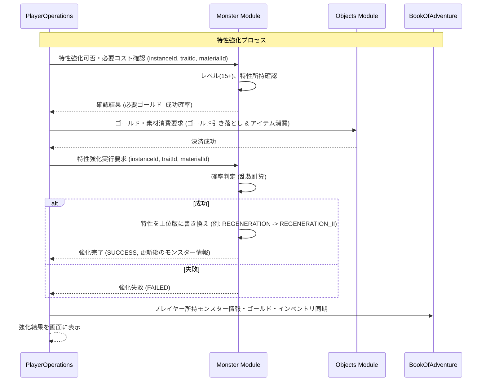

# モンスター特性強化システム (Monster Trait Enhancement System)

## 1. 概要
本ドキュメントは、モンスターが保持する個体特性（パッシブ能力）を強化するための「モンスター特性強化システム」の仕様を定義します。本システムは、プレイヤーが育成したモンスターの個体特性を上位の能力へと引き上げ、戦闘における優位性を高めるための中核的な育成要素です。

## 2. 特性強化の基本仕様
特性の強化（例：自己再生 I → II）を行うには、対象のモンスター個体および消費素材が特定の条件を満たしている必要があります。

- **対象となる特性の制限**:
  - 強化可能なのは、個体固有の特性（個体特性：`MonsterInstanceDomain.traits`）のみです。
  - 種族固有の標準特性（`MonsterDomain.traits`）は、種族ごとに固定されているため直接強化することはできません。詳細は [モンスター特性システム](./Monster-Trait-System.md) を参照してください。
- **レベル制限**:
  - 対象のモンスター個体（`MonsterInstance`）のレベルが **15** 以上である必要があります。
- **強化回数の上限**:
  - 各個体特性は、最大で **レベル II**（または最上位形態）まで強化可能です。すでに最上位に達している特性をさらに強化することはできません。

## 3. 強化アイテムと必要コスト
特性強化には、触媒となる専用のアイテムとゴールドが必要となります。

### 3.1 強化用触媒アイテム
特性を強化するための触媒として、以下の2種類のアイテムが使用されます。これらは `Objects` モジュールで管理される `Thing` の一種（`MATERIAL` カテゴリ）です。

- **特性の石 (`trait_stone`)**:
  - 標準的な強化用アイテム。標準的な確率で特性を強化できます。
- **特性の結晶 (`trait_crystal`)**:
  - 非常に希少な強化用アイテム。極めて高い確率（または確実）で特性を強化できます。

### 3.2 必要ゴールド計算式
特性強化の実行にはゴールドが必要であり、対象モンスターのティア（Tier）に基づいて算出されます。
- **計算式**:
  `必要ゴールド = 対象モンスターのティア * 2000` Gold

- **例**:
  - ティア1 のモンスター（例：スライム）の特性を強化する場合：
    `1 * 2000 = 2000` Gold
  - ティア3 のモンスター（例：ゲイルウルフ）の特性を強化する場合：
    `3 * 2000 = 6000` Gold

## 4. 強化可能特性テーブル
システムで強化可能な特性の組み合わせ、成功確率、および強化後の効果一覧です。

| 強化前特性 ID | 強化後特性 ID | 名称 (強化後) | 触媒アイテム | 成功確率 | 効果概要 (強化後) |
| :--- | :--- | :---: | :---: | :---: | :--- |
| `REGENERATION` | `REGENERATION_II` | 自己再生 II | `trait_stone` / `trait_crystal` | 70% / 100% | `subStep % 10 == 0` のタイミングで、最大 HP の 5% を回復する。 |
| `AGGRESSIVE` | `AGGRESSIVE_II` | 闘争本能 II | `trait_stone` / `trait_crystal` | 60% / 100% | 自身の HP が 40% 以下の時、物理攻撃力および魔法攻撃力が 1.3 倍になる。 |
| `BRACE` | `BRACE_II` | 食いしばり II | `trait_stone` / `trait_crystal` | 50% / 95% | HP 2 以上の時に致死ダメージを受けても、20% の確率で HP 1 で耐える。 |
| `SCAVENGER` | `SCAVENGER_II` | スカベンジャー II | `trait_stone` / `trait_crystal` | 70% / 100% | プレイヤーを撃破した際、追加で獲得ゴールドが 40% 上昇する。 |
| `MIASMA_RESISTANCE` | `MIASMA_IMMUNITY` | 瘴気無効 | `trait_stone` / `trait_crystal` | 60% / 100% | 瘴気によるダメージを完全に無効化し、かつ瘴気エリアでの自然回復力を 1.5 倍にする。 |

### 4.1 強化失敗時のペナルティ
- 強化に失敗した場合、消費したゴールドおよび触媒アイテム（`trait_stone` 等）は**消失**します。
- ただし、対象のモンスター個体や、現在所持している特性自体が消失・劣化することはありません。

## 5. API / 処理フロー仕様
特性強化は `PlayerOperations` モジュールが窓口となり、`Monster` モジュールおよび `Objects` モジュールと連携して処理されます。

### 5.1 エンドポイント仕様
- **パス**: `/api/v1/monsters/enhance-trait`
- **メソッド**: `POST`
- **リクエストボディ (JSON)**:
  ```json
  {
    "instanceId": "3fa85f64-5717-4562-b3fc-2c963f66afa6",
    "traitId": "REGENERATION",
    "materialId": "trait_stone"
  }
  ```
- **レスポンスボディ (JSON) - 成功時**:
  ```json
  {
    "success": true,
    "result": "SUCCESS",
    "monsterInstance": {
      "instanceId": "3fa85f64-5717-4562-b3fc-2c963f66afa6",
      "monsterId": "slime",
      "level": 18,
      "traits": ["REGENERATION_II"]
    }
  }
  ```
- **レスポンスボディ (JSON) - 失敗時**:
  ```json
  {
    "success": false,
    "result": "FAILED",
    "message": "強化に失敗しました。"
  }
  ```

### 5.2 エラーコードとハンドリング
処理中に以下のエラーが発生した場合、適切な HTTP ステータスおよびエラーコードを返します。

| エラーコード | 状態コード | 発生条件 |
| :--- | :---: | :--- |
| `MONSTER_NOT_FOUND` | 404 | 指定された `instanceId` のモンスターが存在しない。 |
| `MONSTER_LEVEL_INSUFFICIENT` | 400 | モンスターのレベルが 15 未満。 |
| `TRAIT_NOT_FOUND` | 400 | モンスターが指定された `traitId` を個体特性として所持していない。 |
| `TRAIT_MAX_LEVEL_REACHED` | 400 | 指定された特性がすでに `II`（または最大段階）に達している。 |
| `INSUFFICIENT_GOLD` | 400 | プレイヤーの所持ゴールドが必要ゴールド未満。 |
| `INSUFFICIENT_MATERIALS` | 400 | 必要な触媒アイテム（`trait_stone` 等）をインベントリに所持していない。 |

## 6. モジュール間連携


