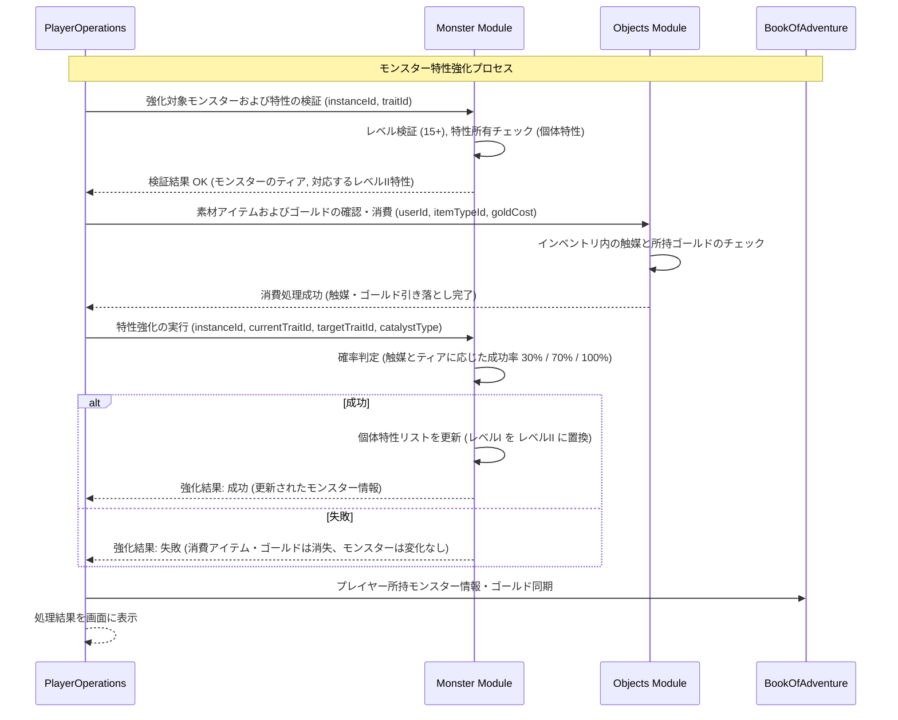

# モンスター特性強化システム (Monster Trait Enhancement System)

## 1. 概要
本ドキュメントは、レベル15以上の十分に成長したモンスター個体の特性（パッシブ能力）を、特定の触媒アイテムを消費してレベルI（標準）からレベルII（上位）へと強化する「モンスター特性強化システム」の仕様を定義します。特性を強化することにより、戦闘時のステータス上昇や耐性の向上など、より強力な効果をパッシブに得ることが可能になります。

## 2. 強化の実行条件とコスト
特性強化を行うには、対象のモンスター個体、習得している個体特性、および必要な消費アイテム（触媒）が以下の条件を満たしている必要があります。

### 2.1 レベル制限
- 特性強化の対象となるモンスター個体（`MonsterInstance`）は、**レベル 15** 以上であること。
- レベル 14 以下の個体は、十分な資質（ポテンシャル）に達していないため、特性強化を実行できません。

### 2.2 対象特性の制限
- 強化できるのは、個体が保有する **個体特性 (Individual Traits)** (`MonsterInstanceDomain.traits`）のみです。
- 種族固有の標準特性である **種族特性 (Species Traits)** (`MonsterDomain.traits`）は、直接強化（上書き）することはできません。

### 2.3 強化に必要な消費アイテムとコスト
特性強化には、ゴールドに加えて、専用の触媒アイテム（素材）である「特性の石（`trait_stone`）」または「特性の結晶（`trait_crystal`）」のいずれかが必要です。

#### 消費素材アイテムの定義
- **特性の石 (`trait_stone`)**
  - **カテゴリ**: `MATERIAL`
  - **価値**: 1500 Gold
  - **説明**: 一般的な特性をレベルIからレベルIIへ強化するために使用される基本触媒。主にティア 1〜2 のモンスターの特性強化に適しています。
- **特性の結晶 (`trait_crystal`)**
  - **カテゴリ**: `MATERIAL`
  - **価値**: 6000 Gold
  - **説明**: 高度な特性をレベルIからレベルIIへ強化するため、または高位の特性を確実に強化するために使用される強力な触媒。主にティア 3 以上のモンスターの特性強化に適しています。

#### 強化成功率と必要ゴールド
消費するゴールドと成功確率は、モンスターのティア（Tier）および使用する触媒によって異なります。

| モンスターのティア | 使用する触媒 (必要個数) | 必要ゴールド | 成功確率 | 失敗時のペナルティ |
| :--- | :--- | :---: | :---: | :--- |
| **Tier 1 〜 2** | `trait_stone` (1個) | 1,000 Gold | **70%** | ゴールドと触媒を消費、特性は維持（失敗ペナルティなし）。 |
| **Tier 1 〜 2** | `trait_crystal` (1個) | 3,000 Gold | **100%** | なし（確実に成功）。 |
| **Tier 3 以上** | `trait_stone` (1個) | 3,000 Gold | **30%** | ゴールドと触媒を消費、特性は維持。 |
| **Tier 3 以上** | `trait_crystal` (1個) | 5,000 Gold | **100%** | なし（確実に成功）。 |

- **失敗時の挙動 (Failure Recovery)**:
  - 強化に失敗した場合、消費されたゴールドと触媒アイテムは失われます。
  - ただし、対象モンスター個体や既存の特性（レベルI）自体が消失・弱体化するなどのペナルティは一切発生しません（安全設計）。

## 3. 特性強化対応表 (Trait Enhancement Mapping)
標準で定義されているレベルI特性と、強化によって習得できる対応するレベルII特性の一覧です。

| レベルI 特性 ID | 強化後（レベルII） 特性 ID | レベルI 効果概要 | レベルII 効果概要 | 備考 |
| :--- | :--- | :--- | :--- | :--- |
| `REGENERATION` | `REGENERATION_II` | `subStep % 10 == 0` のタイミングで最大 HP の 3% を回復。 | `subStep % 10 == 0` のタイミングで最大 HP の 5% を回復。 | 自己再生能力の強化。 |
| `BRACE` | `BRACE_II` | HP 2 以上の時に致死ダメージを受けても、10% の確率で HP 1 で耐える。 | HP 2 以上の時に致死ダメージを受けても、**25%** の確率で HP 1 で耐える。 | 踏みとどまる確率の大幅な向上。 |
| `AGGRESSIVE` | `AGGRESSIVE_II` | 自身の HP が 30% 以下の時、物理・魔法攻撃力が 1.2 倍。 | 自身の HP が **40%** 以下の時、物理・魔法攻撃力が **1.4 倍**。 | 制限条件の緩和と補正の大幅強化。 |
| `SCAVENGER` | `SCAVENGER_II` | プレイヤーを撃破した際、追加で獲得ゴールドが 20% 上昇。 | プレイヤーを撃破した際、追加で獲得ゴールドが **40%** 上昇。 | 経済的恩恵の強化。 |

※ 重複に関する注意：
[モンスター特性システム](./Monster-Trait-System.md) の規定により、同一系統の特性（例：`REGENERATION` と `REGENERATION_II`）を個体特性と種族特性の両方で保持している場合、**より強力なレベルII効果のみ**が適用されます（累積はしません）。

## 4. モジュール間連携とシーケンス

特性強化の実行フローは、`PlayerOperations` が司令塔となり、`Objects` モジュール（ゴールド・素材管理）、`Monster` モジュール（個体特性更新）、および `BookOfAdventure`（プレイヤー・モンスター同期）と連携して行われます。



## 5. APIリクエスト・フローとエラーハンドリング

### 5.1 APIリクエスト仕様
特性強化を実行するためのエンドポイントおよびリクエストボディの構造です。

- **Endpoint**: `POST /api/v1/monsters/traits/enhance`
- **Request Body (JSON)**:
```json
{
  "userId": "player_uuid_12345",
  "monsterInstanceId": "monster_uuid_67890",
  "currentTraitId": "REGENERATION",
  "catalystItemId": "trait_stone"
}
```

- **Response Body (JSON - 成功時)**:
```json
{
  "success": true,
  "result": "SUCCESS",
  "message": "特性の強化に成功しました！「自己再生」が「自己再生 II」に進化しました。",
  "monster": {
    "instanceId": "monster_uuid_67890",
    "monsterId": "slime",
    "level": 15,
    "traits": ["REGENERATION_II"],
    "loyalty": 210
  }
}
```

- **Response Body (JSON - 異常時)**:
```json
{
  "success": false,
  "result": "ERROR",
  "errorCode": "INSUFFICIENT_LEVEL",
  "message": "特性強化を実行するには、モンスターのレベルが15以上である必要があります。"
}
```

### 5.2 エラーハンドリング (Error Handling)
処理の過程で異常が検出された場合、システムは適切なエラーレスポンスを返却します。

| エラーコード | 発生条件 | レスポンス HTTP ステータス | 戻り値のメッセージ例 |
| :--- | :--- | :---: | :--- |
| `MONSTER_NOT_FOUND` | 指定された `monsterInstanceId` のモンスターが存在しない。 | 404 Not Found | 指定されたモンスターが見つかりません。 |
| `INSUFFICIENT_LEVEL` | モンスターのレベルが 15 未満。 | 400 Bad Request | 特性強化を実行するには、モンスターのレベルが15以上である必要があります。 |
| `TRAIT_NOT_FOUND` | モンスターが指定された `currentTraitId` の個体特性を所持していない。 | 400 Bad Request | 指定された特性をこの個体は所持していません。 |
| `CANNOT_ENHANCE_SPECIES_TRAIT` | 指定された特性が種族固有の特性（`MonsterDomain.traits`）である。 | 400 Bad Request | 種族特性は直接強化できません。個体特性のみが対象です。 |
| `INVALID_CATALYST` | 指定された触媒アイテム ID が `trait_stone` または `trait_crystal` 以外。 | 400 Bad Request | 無効な触媒アイテムが指定されています。 |
| `INSUFFICIENT_CATALYST` | プレイヤーのインベントリに指定された触媒アイテムが存在しない。 | 400 Bad Request | 特性強化に必要な触媒アイテムが不足しています。 |
| `INSUFFICIENT_GOLD` | 特性強化に必要なゴールドが不足している。 | 400 Bad Request | 所持ゴールドが不足しています。 |
