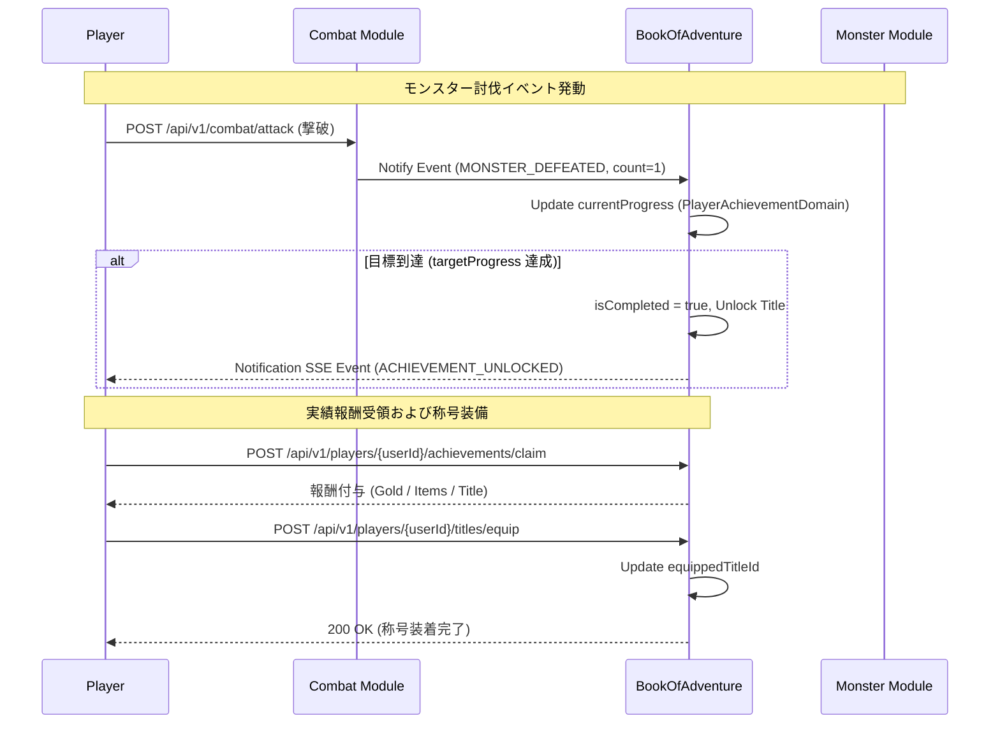

# プレイヤー称号・実績システム仕様

## 1. 概要
本ドキュメントは、**プレイヤー称号・実績システム（Player Title & Achievement System）**の仕様を定義します。
本システムは、ダンジョン探索、モンスター育成・繁殖・遠征、戦闘・PK、経済活動、および世界間移動など、ゲーム内のあらゆる活動において特定の到達目標（実績）を達成したプレイヤーに対して、記念となる「称号（Title）」や報酬（ゴールド、限定消費アイテム、パッシブ効果ボーナス等）を付与する仕組みです。

プレイヤーは獲得した称号の中から1つを「アクティブ称号」として装着（装備）することができ、他のプレイヤーへ自身の偉業を提示できるほか、微量なステータス補正や探索補助ボーナスを獲得できます。

---

## 2. 実績カテゴリと達成条件

実績はゲームプレイの軸に応じて以下の5つの領域（カテゴリ）に分類されます。各実績は単一の目標値（1回達成）または段階的な到達目標（Tier 1 〜 Tier 3）を持ちます。

### 2.1 実績カテゴリ一覧

| カテゴリ | 識別コード | 対象アクション・記録指標 | 代表的な実績例 |
| :--- | :--- | :--- | :--- |
| **ダンジョン探索** | `EXPLORATION` | 到達階層、ダンジョン踏破数、罠作動・解除回数、環境異変遭遇数 | 「深層の踏破者」「罠見破りの達人」 |
| **モンスターマスター** | `MONSTER_MASTER` | 図鑑マスター数、親愛達成数、繁殖・孵化回数、遠征大成功回数 | 「万物探求者」「伝説のブリーダー」「フロンティア開拓王」 |
| **戦闘・PK** | `COMBAT_LEGEND` | モンスター累計撃破数、PK連続撃破数、賞金首討伐数、ボスソロ撃破 | 「無双の剣士」「賞金稼ぎ」「異形の屠殺者」 |
| **経済・取引** | `ECONOMIC_TYCOON` | 累計獲得ゴールド、ショップ売上高、未識別アイテム鑑定数、倉庫最大拡張 | 「富豪」「伝説の鑑定士」「大商人」 |
| **世界連携** | `WORLD_TRAVELER` | ワールド間移動回数、異世界アイテム持ち込み数、トラストポリシー利用 | 「次元の旅人」「境界を越えし者」 |

### 2.2 実績のトラッキングメカニズム
- **リアルタイム更新**: 各モジュール（Dungeon, Combat, Monster, Economic, World）でトリガーされたイベントは、`BookOfAdventure` モジュール内の実績集計サービスへ非同期メッセージまたは直接呼び出しで通知されます。
- **進捗の永続化**: プレイヤーの進捗値（`currentProgress`）および達成フラグ（`isCompleted`）、報酬受領フラグ（`isClaimed`）は `PlayerAchievementDomain` 内で管理されます。

---

## 3. 称号メカニズムとパッシブ効果

実績を達成することで対応する「称号（Title）」が解禁されます。

### 3.1 称号の装備と表示
- **アクティブ称号 (Active Title)**: プレイヤーは解禁済みの称号の中から最大1つをアクティブ称号として設定できます。
- **ネームプレート表示**: アクティブ称号はプレイヤー名の上部または前後にバッジ・肩書きとして表示されます（例: `[万物探求者] 英雄アリス`）。

### 3.2 称号パッシブボーナス (Title Passive Effects)
装着したアクティブ称号に応じ、プレイヤーに僅かなパッシブボーナスが付与されます。ゲームバランスを崩さないよう、効果量は最大 2% 〜 5% 程度に抑制されます。

#### 主要な称号と効果パラメータ

| 称号 ID | 称号名称 | 解禁実績条件 | パッシブ効果内容 |
| :--- | :--- | :--- | :--- |
| `title_abyssal_explorer` | 深層の踏破者 | ダンジョン30階層以上へ到達 | 最大HP +10、罠ダメージ -10% |
| `title_monster_master` | 万物探求者 | モンスター図鑑コンプリート率 100% | 全手持ちモンスターの忠誠度減少速度 -50%、捕獲成功率 +2.0% |
| `title_legendary_breeder` | 伝説のブリーダー | モンスター繁殖・孵化 50 回達成 | 孵化必要歩数 -15% |
| `title_wealth_tycoon` | 大商人 | 累計売上 1,000,000 Gold 達成 | ショップ買取価格 +5% |
| `title_bounty_hunter` | 賞金稼ぎ | 賞金首（PKプレイヤー）10人討伐 | PKプレイヤーに対する攻撃力 +5% |
| `title_dimension_walker` | 次元の旅人 | 3つ以上の異世界へ移動 | 異世界持ち込みアイテムの価格減衰率 -10% |

---

## 4. ドメインモデルおよびデータ構造

### 4.1 `PlayerAchievementDomain` (ドメインエンティティ)
`BookOfAdventure` モジュール内でプレイヤーの実績進捗を管理するオブジェクトです。

- **`id`** (String): 一意な識別子 (例: `ach_usr_12345_exp_floor_30`)
- **`userId`** (String): ユーザー ID
- **`achievementId`** (String): 実績定義 ID (例: `ach_floor_30`)
- **`category`** (String): カテゴリ (`EXPLORATION`, `MONSTER_MASTER` 等)
- **`currentProgress`** (Long): 現在の累積数値
- **`targetProgress`** (Long): 目標達成数値
- **`isCompleted`** (Boolean): 達成フラグ
- **`isClaimed`** (Boolean): 報酬受領フラグ
- **`completedAt`** (Date): 達成日時

### 4.2 `PlayerTitleDomain` (ドメインエンティティ)
プレイヤーが所有する称号およびアクティブ設定状態を管理するオブジェクトです。

- **`id`** (String): 一意な識別子
- **`userId`** (String): ユーザー ID
- **`unlockedTitleIds`** (List<String>): 解禁済み称号 ID リスト
- **`equippedTitleId`** (String): 現在装着中の称号 ID (未装着時は null)
- **`updatedAt`** (Date): 最終更新日時

---

## 5. モジュール間連携イベントフロー

以下のシーケンス図は、プレイヤーのアクション（モンスター討伐等）から実績達成および称号解禁までのメッセージフローを示します。



---

## 6. API仕様

### 6.1 実績一覧照会 (`GET /api/v1/players/{userId}/achievements`)
指定したプレイヤーの実績進捗および達成・受領状況を取得します。

#### レスポンス JSON スキーマ (200 OK)
```json
{
  "userId": "user_12345",
  "achievements": [
    {
      "achievementId": "ach_floor_30",
      "title": "深層への進出",
      "description": "ダンジョン地下30階層に到達する",
      "category": "EXPLORATION",
      "currentProgress": 30,
      "targetProgress": 30,
      "isCompleted": true,
      "isClaimed": false,
      "unlockedTitleId": "title_abyssal_explorer",
      "reward": {
        "gold": 20000,
        "items": [
          {
            "typeId": "expansion_material",
            "count": 2
          }
        ]
      }
    }
  ]
}
```

---

### 6.2 称号一覧照会 (`GET /api/v1/players/{userId}/titles`)
プレイヤーが所持している解禁済み称号および現在装着中のアクティブ称号を取得します。

#### レスポンス JSON スキーマ (200 OK)
```json
{
  "userId": "user_12345",
  "equippedTitleId": "title_abyssal_explorer",
  "unlockedTitles": [
    {
      "titleId": "title_abyssal_explorer",
      "name": "深層の踏破者",
      "description": "ダンジョン最深部を踏破した猛者に贈られる称号。",
      "effectDescription": "最大HP +10、罠ダメージ -10%"
    },
    {
      "titleId": "title_monster_master",
      "name": "万物探求者",
      "description": "あらゆるモンスターの生態を解き明かした称号。",
      "effectDescription": "忠誠度減少速度 -50%、捕獲成功率 +2.0%"
    }
  ]
}
```

---

### 6.3 称号着脱処理 (`POST /api/v1/players/{userId}/titles/equip`)
所持している称号をアクティブ称号として装着、または解除します。

#### リクエスト JSON スキーマ (装着時)
```json
{
  "titleId": "title_monster_master"
}
```

#### リクエスト JSON スキーマ (解除時)
```json
{
  "titleId": null
}
```

#### レスポンス JSON スキーマ (200 OK)
```json
{
  "userId": "user_12345",
  "equippedTitleId": "title_monster_master",
  "message": "称号「万物探求者」を装着しました。"
}
```

---

### 6.4 実績報酬受領 (`POST /api/v1/players/{userId}/achievements/claim`)
達成済みの実績（`isCompleted = true`）の報酬を受け取ります。

#### リクエスト JSON スキーマ
```json
{
  "achievementId": "ach_floor_30"
}
```

#### レスポンス JSON スキーマ (200 OK)
```json
{
  "userId": "user_12345",
  "achievementId": "ach_floor_30",
  "rewardClaimed": {
    "goldAdded": 20000,
    "itemsAdded": [
      {
        "typeId": "expansion_material",
        "count": 2
      }
    ],
    "unlockedTitleId": "title_abyssal_explorer"
  },
  "message": "実績報酬を受け取りました！称号「深層の踏破者」が解禁されました。"
}
```

---

## 7. エラーハンドリング仕様

実績・称号システムの処理実行時に問題が発生した場合のエラーコードマッピングです。

### 7.1 エラーコード一覧

| エラーコード | HTTPステータス | 発生条件・説明 |
| :--- | :---: | :--- |
| `PLAYER_NOT_FOUND` | `404 Not Found` | 指定された `userId` のプレイヤーが存在しない場合。 |
| `ACHIEVEMENT_NOT_FOUND` | `404 Not Found` | 指定された `achievementId` が存在しない場合。 |
| `ACHIEVEMENT_NOT_COMPLETED` | `400 Bad Request` | 進捗が目標値に達しておらず、報酬受領条件を満たしていない場合。 |
| `REWARD_ALREADY_CLAIMED` | `409 Conflict` | 対象実績の報酬がすでに受領済みである場合。 |
| `TITLE_NOT_FOUND` | `404 Not Found` | 指定された `titleId` が存在しない場合。 |
| `TITLE_NOT_UNLOCKED` | `403 Forbidden` | 未解禁の称号を装着しようとした場合。 |
| `TITLE_ALREADY_EQUIPPED` | `400 Bad Request` | すでに装着中の称号を再度装着指定した場合。 |
