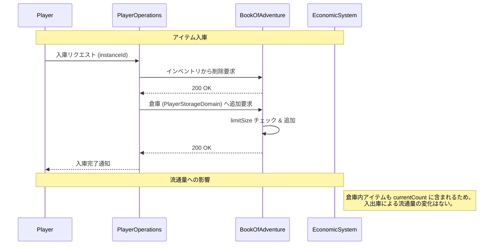

# 倉庫システム (Storage System)

## 1. 概要
本ドキュメントは、プレイヤーが所持品（インベントリ）とは別にアイテムを安全に保管するための「倉庫（Storage）」システムの仕様を定義します。倉庫システムは、インベントリの制限を補完し、貴重なアイテムや将来使用する資材を長期的に管理するための基盤となります。

## 2. 主要なドメインモデル

### `PlayerStorageDomain`
- **説明:** プレイヤー個別の倉庫の状態を管理します。
- **主要なプロパティ:**
    - `id`: 倉庫の一意な識別子。
    - `playerId`: この倉庫を所有するプレイヤーの ID。
    - `objectIdList`: 倉庫に保管されているアイテムのインスタンス ID リスト。
    - `limitSize`: 倉庫に保管可能なアイテムの最大数（初期値: 50）。

## 3. 機能仕様

### 3.1 アイテムの出し入れ
プレイヤーは拠点の特定の施設（倉庫番、金庫等）を通じて、インベントリと倉庫の間でアイテムを移動させることができます。

- **入庫 (Deposit)**:
    - インベントリ内のアイテムを選択し、倉庫へ移動します。
    - 倉庫の `objectIdList` のサイズが `limitSize` に達している場合は入庫できません。
- **出庫 (Withdraw)**:
    - 倉庫内のアイテムを選択し、インベントリへ移動します。
    - インベントリ（`Bag`）の `limitSize` に達している場合は出庫できません。

### 3.2 倉庫の拡張 (Expansion)
特定の条件を満たすことで、倉庫の `limitSize` を拡張することが可能です。

- **拡張方法**:
    - 特定のアイテム（例: 「増築用資材」）の消費。
    - 一定額のゴールドの支払い。
- **拡張幅**: 一回の拡張につき +10 枠など。上限（例: 最大 200 枠）が設定される場合があります。

### 3.3 共有倉庫 (Shared Storage)
将来的な拡張として、同一アカウント内の複数キャラクターや、ギルド単位で共有可能な倉庫の導入を検討します。

## 4. 経済システムとの連携
倉庫に保管されているアイテムは、[経済システム ドメインモデル](./domain_models/Economic-System.md) における「流通量 (`currentCount`)」のカウント対象に含まれます。

- **流通カウント**: アイテムが倉庫に入っている状態でも、世界（サーバー）内に存在するものとして集計されます。
- **消失時の処理**: 倉庫内のアイテムが（何らかの理由で）消失した場合、経済システムに通知され、流通カウントが減算されます。

## 5. モジュール間連携

## 6. 今後の拡張
- **カテゴリー別整理**: アイテムの種類（武器、薬等）による自動ソート機能。
- **倉庫内検索**: アイテム名や属性によるフィルタリング機能。
- **期限付き倉庫**: 特定のイベント期間中のみ使用可能な一時的な保管場所。
