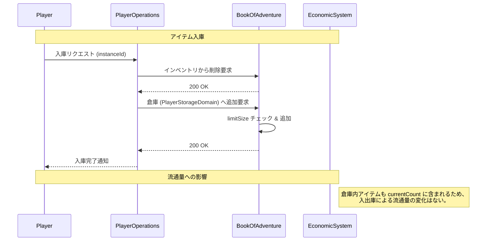

# 倉庫システム (Storage System)

## 1. 概要
本ドキュメントは、プレイヤーが所持品（インベントリ）とは別にアイテムを安全に保管するための「倉庫（Storage）」システムの仕様を定義します。倉庫システムは、インベントリの制限を補完し、貴重なアイテムや将来使用する資材を長期的に管理するための基盤となります。

## 2. 主要なドメインモデル

### `PlayerStorageDomain`
- **説明:** プレイヤー個別の倉庫の状態を管理します。
- **主要なプロパティ:**
    - `id`: 倉庫の一意な識別子。
    - `playerId`: この倉庫を所有するプレイヤーの ID。
    - `objectIdList`: 倉庫に保管されているアイテムのインスタンス ID リスト。
    - `limitSize`: 倉庫に保管可能なアイテムの最大数（初期値: 50）。

## 3. 機能仕様

### 3.1 アイテムの出し入れ
プレイヤーは拠点の特定の施設（倉庫番、金庫等）を通じて、インベントリと倉庫の間でアイテムを移動させることができます。

- **入庫 (Deposit)**:
    - インベントリ内のアイテムを選択し、倉庫へ移動します。
    - 倉庫の `objectIdList` のサイズが `limitSize` に達している場合は入庫できません。
- **出庫 (Withdraw)**:
    - 倉庫内のアイテムを選択し、インベントリへ移動します。
    - インベントリ（`Bag`）の `limitSize` に達している場合は出庫できません。

### 3.2 倉庫の拡張 (Expansion)
特定の条件（ゴールドおよび特定アイテムの消費）を満たすことで、倉庫の `limitSize` を拡張することが可能です。

- **拡張基本ルール**:
    - 初期容量（`limitSize`）は **50** 枠です。
    - 最大容量は **200** 枠です。
    - 拡張は最大 **5回** まで行え、1回の拡張につき `limitSize` が **30** 枠増加します。
    - 拡張処理は、拠点（ロビー）の倉庫NPCまたは管理画面から実行できます。

#### 3.2.1 拡張コストおよび段階テーブル
拡張の各段階におけるコストと必要アイテムは以下の通りです。

| 拡張段階 | 拡張後の容量 (limitSize) | 必要ゴールド | 必要アイテム |
| :--- | :---: | :--- | :--- |
| **初期状態** | 50 枠 | - | - |
| **1段階目** | 80 枠 | 5,000 Gold | `expansion_material`（増築用資材） × 1 |
| **2段階目** | 110 枠 | 15,000 Gold | `expansion_material`（増築用資材） × 2 |
| **3段階目** | 140 枠 | 30,000 Gold | `expansion_material`（増築用資材） × 3 |
| **4段階目** | 170 枠 | 50,000 Gold | `expansion_material`（増築用資材） × 4 |
| **5段階目** | 200 枠 | 100,000 Gold | `expansion_material`（増築用資材） × 5 |

#### 3.2.2 API仕様とエラーハンドリング
倉庫の拡張処理は以下のAPIエンドポイントを介して行われます。

- **エンドポイント**: `POST /api/v1/storage/expand`
- **リクエストパラメータ**:
    - `playerId` (String): 拡張を実行するプレイヤーのID。
- **処理フロー**:
    1. プレイヤーの現在の `PlayerStorageDomain` を取得し、現在の `limitSize` から次の拡張段階を判定します（既に 200 枠に達している場合はエラー）。
    2. 対象の拡張段階に必要な「ゴールド」および「増築用資材 (`expansion_material`)」をプレイヤーのインベントリ/所持金から確認します。
    3. 不足している場合はエラーを返します。
    4. 条件を満たしている場合、ゴールドの減算、アイテムの消費（Objectsモジュールとの連携）をアトミック、あるいは補償トランザクションを伴う結果整合性処理にて実行します。
    5. `PlayerStorageDomain` の `limitSize` を `+30` 更新して保存します。
- **想定されるエラーコード**:
    - `STORAGE_ALREADY_MAX_LIMIT` (400): 既に最大枠（200枠）まで拡張済み。
    - `INSUFFICIENT_GOLD` (400): 拡張に必要なゴールドが不足している。
    - `INSUFFICIENT_EXPANSION_MATERIAL` (400): 必要な `expansion_material` が不足している。

### 3.3 共有倉庫 (Shared Storage)
将来的な拡張として、同一アカウント内の複数キャラクターや、ギルド単位で共有可能な倉庫の導入を検討します。

## 4. 経済システムとの連携
倉庫に保管されているアイテムは、[経済システム ドメインモデル](./domain_models/Economic-System.md) における「流通量 (`currentCount`)」のカウント対象に含まれます。

- **流通カウント**: アイテムが倉庫に入っている状態でも、世界（サーバー）内に存在するものとして集計されます。
- **消失時の処理**: 倉庫内のアイテムが（何らかの理由で）消失した場合、経済システムに通知され、流通カウントが減算されます。

## 5. モジュール間連携

```mermaid
sequenceDiagram
    participant P as Player
    participant PO as PlayerOperations
    participant BA as BookOfAdventure
    participant ECO as EconomicSystem

    Note over P, ECO: アイテム入庫
    P->>PO: 入庫リクエスト (instanceId)
    PO->>BA: インベントリから削除要求
    BA-->>PO: 200 OK
    PO->>BA: 倉庫 (PlayerStorageDomain) へ追加要求
    BA->>BA: limitSize チェック & 追加
    BA-->>PO: 200 OK
    PO-->>P: 入庫完了通知

    Note over P, ECO: 流通量への影響
    Note right of ECO: 倉庫内アイテムも currentCount に含まれるため、<br/>入出庫による流通量の変化はない。
```

## 6. 今後の拡張
- **カテゴリー別整理**: アイテムの種類（武器、薬等）による自動ソート機能。
- **倉庫内検索**: アイテム名や属性によるフィルタリング機能。
- **期限付き倉庫**: 特定のイベント期間中のみ使用可能な一時的な保管場所。
