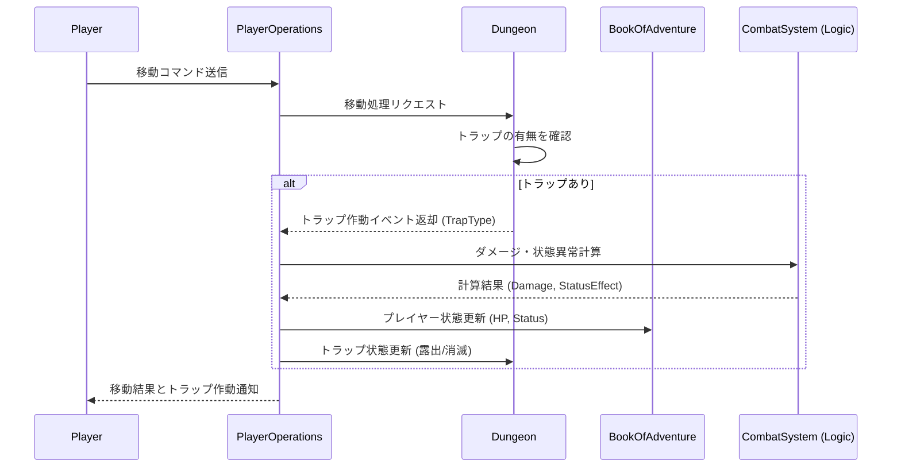

# トラップシステム (Trap System)

## 1. 概要
本ドキュメントは、ダンジョン内に設置される「トラップ（罠）」の仕様を定義します。トラップはプレイヤーやモンスターの行動を阻害し、ダメージや状態異常を与える要素として機能します。

## 2. トラップの状態
トラップは、以下のいずれかの視認状態を持ちます。

### 2.1 隠蔽状態 (Hidden)
- 通常時、プレイヤーからは見えない状態です。
- マップ上には床タイルとして表示されます。
- プレイヤーがトラップを踏む、あるいは特定の手段（罠探しの巻物、素振りなど）で発見されるまでこの状態を維持します。

### 2.2 露出状態 (Revealed)
- トラップが発見された、あるいは一度作動した後の状態です。
- マップ上に専用の文字（例: `^`）で表示されます。
- 一度露出したトラップは、基本的に永続的に視認可能な状態となります。

## 3. トラップの種類と効果
主要なトラップのバリエーションと、作動時の効果を以下に定義します。

| 名称 | 作動時の効果 | 露出状態への遷移 |
| :--- | :--- | :--- |
| **落とし穴** | 下の階層へ強制的に移動し、ダメージを受ける。 | 作動後に消滅 |
| **毒矢の罠** | 正面から矢が飛び出し、ダメージと「毒」状態を与える。 | 作動後に露出 |
| **地雷** | 周囲 8 マスのエンティティに大ダメージを与える。 | 作動後に消滅 |
| **睡眠ガス** | 周囲にガスを噴射し、「睡眠」状態を与える。 | 作動後に露出 |
| **装備外しの罠** | 装備している武器・防具を強制的に解除する。 | 作動後に露出 |
| **空腹の罠** | スタミナ（満腹度）を一気に減少させる。 | 作動後に露出 |
| **召喚の罠** | 周囲に複数のモンスターをランダムに召喚する。 | 作動後に露出 |

## 4. 作動と回避のルール

### 4.1 作動条件
- エンティティ（プレイヤーまたはモンスター）がトラップのあるタイルに足を踏み入れた瞬間に判定が行われます。
- 浮遊状態（飛行能力など）を持つエンティティは、一部のトラップ（落とし穴、地雷など）を無効化できます。

### 4.2 回避判定
- 一部のトラップは、プレイヤーの「器用さ (Dexterity)」に基づき、一定確率で不発（作動しない）となる場合があります。
`不発確率(%) = (器用さ / 2)`（最大 20%）

## 5. 管理者による配置 (My Dungeon モード)
管理者は自身のダンジョンにおいて、戦略的にトラップを配置できます。

- **配置コスト**: 強力なトラップほど、配置に必要な資材やコストが高くなります。
- **連鎖設置**: 地雷を隣接させて配置し、連鎖爆発を狙うなどの設計が可能です。
- **視認設定**: 管理者自身の画面では、すべてのトラップが常に露出状態で表示されます。

## 6. モジュール間連携

トラップ作動時の基本的なデータフローを以下に示します。

## 7. 今後の拡張
- **味方トラップ**: プレイヤーが設置し、モンスターを嵌めるためのトラップ。
- **属性トラップ**: 火炎、氷結、電撃などの属性ダメージを持つトラップ。
- **偽の階段**: 降りようとするとトラップとして作動する階段。
