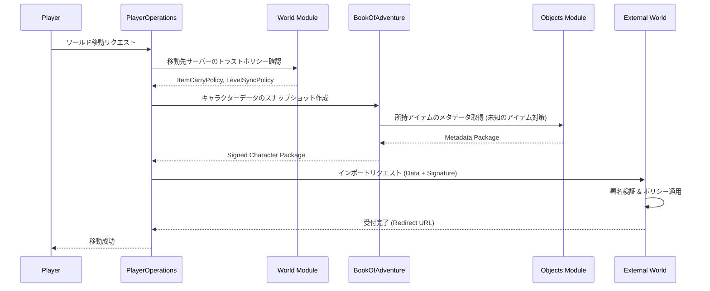

# 世界間連携システム (World Interoperability System)

## 1. 概要
本ドキュメントは、複数の独立したサーバー（ワールド）間でプレイヤーキャラクターやアイテムを移動・同期させる「世界間連携」および「トラストネットワーク」の仕様を定義します。これにより、プレイヤーは自身が育てたキャラクターを連れて、他の管理者が運営する世界を自由に冒険することが可能になります。

## 2. トラストネットワーク (Trust Network)
異なるサーバーの管理者同士が、相互に「信頼関係」を構築する仕組みです。

### 2.1 信頼レベルの設定
管理者は、接続する外部サーバーごとに以下のポリシーを個別に設定し、自サーバーへの影響度をコントロールできます。

#### 2.1.1 アイテム持ち込みポリシー (`ItemCarryPolicy`)
| 名称 | 詳細 |
| :--- | :--- |
| **双方向可能** | 互いのサーバー間で自由にアイテムを持ち込み・持ち出しができる。 |
| **片方向のみ** | 自サーバーへの持ち込みのみ許可、または自サーバーからの持ち出しのみ許可する。 |
| **移動不可** | キャラクターの移動は許可するが、アイテムの持ち込みは一切禁止する（インベントリが一時的に空の状態で開始）。 |

#### 2.1.2 レベル同期ポリシー (`LevelSyncPolicy`)
| 名称 | 詳細 |
| :--- | :--- |
| **レベル共有** | 信頼するサーバー間ですべての経験値・レベルを完全に同期する。 |
| **レベル引き継ぐ** | 移動時点のレベルをコピーして開始する。移動後の成長は各サーバーで独立する。 |
| **新たに1から始める** | 名前や外見のみ引き継ぎ、レベル 1 から開始する。 |

## 3. クロスワールド・マイグレーション (Cross-World Migration)
キャラクターを別の世界へ転送するプロセスです。

### 3.1 転送されるデータ (Snapshot)
マイグレーション実行時、以下のデータがスナップショットとしてパッケージ化されます。
- **基本情報**: 名前、外見、累積経験値、レベル。
- **ステータス**: HP/MP、基本ステータスマップ（`atk`, `def` 等）。
- **所持品**: `Bag` 内のアイテムインスタンスおよび `PlayerMonsterDomain` に紐づくモンスターインスタンス。
- **知識**: `PlayerKnowledgeDomain` に基づくアイテム識別状況。

### 3.2 同期プロセス
1. **エクスポート**: 出発元サーバーでキャラクターデータをシリアライズし、署名を付与します。
2. **インポート**: 移動先サーバーで署名を検証し、自身のトラストポリシーに従ってデータをフィルタリング・反映します。

## 4. 未知のアイテムの持ち込み (Unknown Item Protocol)
移動先サーバーに定義されていないアイテム（外部サーバー独自のカスタムアイテム等）を持ち込んだ際の挙動を定義します。

### 4.1 データ継承 (Data Inheritance)
移動先サーバーに該当する `typeId` が存在しない場合、以下のメタデータ一式をキャラクターデータと共に転送し、移動先サーバーで一時的な `Thing` として扱います。
- **基本情報**: `name` (名称), `description` (説明), `display` (表示文字), `type` (カテゴリ: `TypeEnum`)
- **ビジュアル情報**: スプライト画像データまたはアセット参照 ID。
- **パラメータ**: 攻撃力、防御力、属性、ティア、標準価格などの基本数値。
- **特殊効果**: 標準化されたエフェクト ID とそのパラメータ（例: `HEAL_HP: 50`, `ADD_STATUS: POISON`）。

### 4.2 動作保証 (Behavioral Guarantees)
- **カテゴリベースの振る舞い**: `TypeEnum` (WEAPON, POTION 等) に基づき、移動先サーバーの標準ロジックで動作します。
- **スクリプト制限**: 独自の複雑なスクリプトを持つアイテムは、セキュリティ上の理由から、移動先サーバーでは標準的な効果に置換されるか、使用不可となる場合があります。

## 5. 不正防止とセキュリティ

### 5.1 署名検証 (Signature Verification)
- 転送されるキャラクターデータには、出発元サーバーの秘密鍵によるデジタル署名が付与されます。
- 移動先サーバーは、あらかじめ交換された公開鍵を用いてデータの改ざんがないことを確認します。

### 5.2 信頼レベルに応じた制限
- 信頼度が低いサーバーからの移動者に対しては、持ち込めるアイテムのティア制限や、ステータスの上限補正（スケーリング）を適用できます。
- 異常な数値（例: レベル 1 で攻撃力 9999 等）を持つデータは、インポート時に自動的に拒絶または修正されます。

## 6. モジュール間連携

## 7. 今後の拡張
- **アイテムの逆輸入**: 外部ワールドで獲得したアイテムを、元のワールドへ持ち帰る際の同期ロジック。
- **クロスワールド・ランキング**: 複数のワールドをまたいだプレイヤーランキングシステム。
- **ギルド間抗争**: ワールドの壁を超えた、大規模な組織間バトル。
