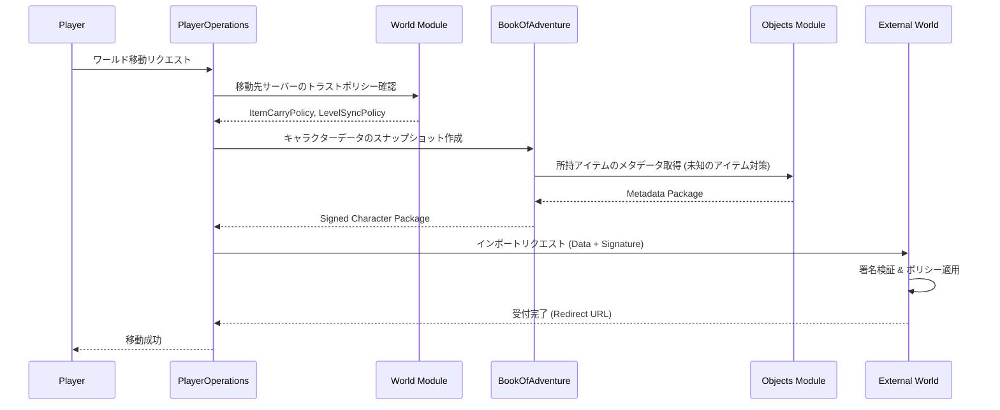

# 世界間連携システム (World Interoperability System)

## 1. 概要
本ドキュメントは、複数の独立したサーバー（ワールド）間でプレイヤーキャラクターやアイテムを移動・同期させる「世界間連携」および「トラストネットワーク」の仕様を定義します。これにより、プレイヤーは自身が育てたキャラクターを連れて、他の管理者が運営する世界を自由に冒険することが可能になります。

## 2. トラストネットワーク (Trust Network)
異なるサーバーの管理者同士が、相互に「信頼関係」を構築する仕組みです。

### 2.1 信頼レベルの設定
管理者は、接続する外部サーバーごとに以下のポリシーを個別に設定し、自サーバーへの影響度をコントロールできます。

#### 2.1.1 アイテム持ち込みポリシー (`ItemCarryPolicy`)
| 名称 | 詳細 |
| :--- | :--- |
| **双方向可能** | 互いのサーバー間で自由にアイテムを持ち込み・持ち出しができる。 |
| **片方向のみ** | 自サーバーへの持ち込みのみ許可、または自サーバーからの持ち出しのみ許可する。 |
| **移動不可** | キャラクターの移動は許可するが、アイテムの持ち込みは一切禁止する（インベントリが一時的に空の状態で開始）。 |

#### 2.1.2 レベル同期ポリシー (`LevelSyncPolicy`)
| 名称 | 詳細 |
| :--- | :--- |
| **レベル共有** | 信頼するサーバー間ですべての経験値・レベルを完全に同期する。 |
| **レベル引き継ぐ** | 移動時点のレベルをコピーして開始する。移動後の成長は各サーバーで独立する。 |
| **新たに1から始める** | 名前や外見のみ引き継ぎ、レベル 1 から開始する。 |

## 3. クロスワールド・マイグレーション (Cross-World Migration)
キャラクターを別の世界へ転送するプロセスです。

### 3.1 転送されるデータ (Snapshot)
マイグレーション実行時、以下のデータがスナップショットとしてパッケージ化されます。
- **基本情報**: 名前、外見、累積経験値、レベル。
- **ステータス**: HP/MP、基本ステータスマップ（`atk`, `def` 等）。
- **所持品**: `Bag` 内のアイテムインスタンスおよび `PlayerMonsterDomain` に紐づくモンスターインスタンス。
- **知識**: `PlayerKnowledgeDomain` に基づくアイテム識別状況。

### 3.2 同期プロセス
1. **エクスポート**: 出発元サーバーでキャラクターデータをシリアライズし、署名を付与します。
2. **インポート**: 移動先サーバーで署名を検証し、自身のトラストポリシーに従ってデータをフィルタリング・反映します。

## 4. 未知のアイテムの持ち込み (Unknown Item Protocol)
移動先サーバーに定義されていないアイテム（外部サーバー独自のカスタムアイテム等）を持ち込んだ際の挙動を定義します。

### 4.1 データ継承 (Data Inheritance)
移動先サーバーに該当する `typeId` が存在しない場合、以下のメタデータ一式をキャラクターデータと共に転送し、移動先サーバーで一時的な `Thing` として扱います。

- **基本情報**: `name` (名称), `description` (説明), `display` (表示文字), `type` (カテゴリ: `TypeEnum`)
- **ビジュアル情報**:
    - `meta_visual_asset_id`: アセット参照 ID。
    - `meta_sprite_data`: Base64 エンコードされたスプライト画像データ（任意）。
- **パラメータ**: 攻撃力 (`atk`)、防御力 (`def`)、属性 (`attribute`)、ティア (`tier`)、標準価格 (`standardPrice`)。
- **特殊効果 (`meta_effects`)**:
    - 標準化されたエフェクト ID。詳細は後述の「標準化エフェクトリスト」を参照してください。
    - パラメータマップ (例: `{"amount": 50}`, `{"status": "POISON", "chance": 0.5}`)。

### 4.2 標準化エフェクトリスト (Standardized Effect List)
未知のアイテムの効果を移動先サーバーで再現するための、共通エフェクト ID の定義です。

| エフェクト ID | 概要 | 必須パラメータ | 備考 |
| :--- | :--- | :--- | :--- |
| `HEAL_HP` | HP を回復する | `amount` (固定値) または `ratio` (割合 0.0-1.0) | ポーション、食料等 |
| `HEAL_MP` | MP を回復する | `amount` または `ratio` | ポーション等 |
| `HEAL_STAMINA` | スタミナを回復する | `amount` または `ratio` | 食料、薬等 |
| `ADD_STATUS` | 状態異常を付与する | `status` (種類), `chance` (確率 0.0-1.0), `turns` (持続) | 武器、巻物、杖等 |
| `REMOVE_STATUS` | 状態異常を解除する | `status` (種類) | 薬草、巻物等 |
| `STAT_BOOST` | ステータスを永続/一時強化 | `stat` (種類), `value` (加算値) | 装備品（パッシブ）、薬等。`stat` は `atk`, `def`, `magicAtk`, `magicDef`, `dex`, `mnd` のいずれか。 |
| `TELEPORT` | 別の座標へワープする | なし（ランダム） または `range` (範囲) | 巻物、杖、トラップ等 |
| `EXPLOSION` | 周囲に爆発ダメージ | `damage` (固定値) または `ratio` (割合) | 巻物、杖等 |
| `REVEAL_MAP` | マップの視界を広げる | `type` (`FLOOR`, `TRAP`, `MONSTER`) | 巻物等 |
| `IDENTIFY` | アイテムを識別する | なし | 巻物等 |
| `REMOVE_CURSE` | 呪いを解除する | なし | 巻物等 |
| `DEAL_DAMAGE` | 対象に直接ダメージ | `damage` または `ratio` | 杖、巻物等 |
| `HOLY_DAMAGE` | 聖なるダメージを与える | `value` (ダメージ量) | 聖なる武器等 |

### 4.3 動作保証 (Behavioral Guarantees)
- **カテゴリベースの振る舞い**: `TypeEnum` (WEAPON, POTION 等) に基づき、移動先サーバーの標準ロジックで動作します。
- **スクリプト制限**: 独自の複雑なスクリプトを持つアイテムは、セキュリティ上の理由から、移動先サーバーでは標準的な効果に置換されるか、使用不可となる場合があります。

## 5. 技術プロトコルとデータ構造

### 5.1 署名・暗号化アルゴリズム
サーバー間の信頼性とデータの完全性を確保するため、以下のアルゴリズムを標準として採用します。

- **デジタル署名**: **Ed25519 (EdDSA)**。高速かつ高セキュリティな公開鍵署名。
- **ハッシュ関数**: **SHA-256**。署名前のメッセージダイジェスト生成に使用。
- **シリアライズ形式**: **JSON** (UTF-8 形式)。

#### 5.1.1 正規化プロセス (Canonicalization)
データの完全性を保証するため、署名の生成および検証の前に、以下のルールに基づいた JSON の正規化（JCS: RFC 8785 準拠）を行います。
- **キーのソート**: オブジェクトのキーは Unicode 符号点順に昇順でソートされます。
- **空白の除去**: キーと値の間のコロン（:）やカンマ（,）の前後にある不要な空白や改行はすべて除去されます。
- **数値形式の統一**: 小数点以下の冗長なゼロの削除など、数値表現を標準化します。

### 5.2 キャラクター移行パッケージ (Character Migration Package)
マイグレーション時に転送される JSON データの基本構造です。

```json
{
  "version": "1.0",
  "timestamp": "2023-10-27T10:00:00Z",
  "originWorldId": "world-alpha-01",
  "playerData": {
    "id": "user-123",
    "name": "Hero",
    "level": 20,
    "exp": 15000,
    "status": { "atk": 50, "def": 40, ... }
  },
  "inventory": [
    {
      "instanceId": "item-999",
      "typeId": "ex-sword-01",
      "isUnknown": true,
      "inheritanceData": {
        "name": "Excalibur",
        "type": "WEAPON",
        "params": { "atk": 100 },
        "effects": [{ "id": "HOLY_DAMAGE", "value": 20 }]
      }
    }
  ],
  "monsters": [...],
  "signature": "base64-encoded-eddsa-signature"
}
```

## 6. 不正防止とセキュリティ

### 6.1 署名検証 (Signature Verification)
- 転送されるキャラクターデータには、出発元サーバーの秘密鍵によるデジタル署名が付与されます。
- 移動先サーバーは、あらかじめ交換された公開鍵を用いてデータの改ざんがないことを確認します。

### 6.2 エラーハンドリングとロールバック
マイグレーションはサービス間をまたぐため、一貫性を保つための以下の処理を実装します。

- **トランザクショナルな移動**:
    1. 出発元サーバーでキャラクターを「転送中（ロック状態）」にする。
    2. 移動先サーバーでのインポート完了を確認。
    3. 出発元サーバーでデータを削除（またはアーカイブ）。
    - **原子性の保証**: マイグレーションは原子的に行われなければなりません。インポートに失敗した場合、必ずロールバック処理を行うか、管理者向けの**手動リカバリツール**を使用して不整合を解消する必要があります。
- **タイムアウト処理**: 一定時間（例: 5分）以内にインポート完了通知がない場合、出発元サーバーのロックを自動解除し、移動をキャンセルします。
- **整合性チェック**: インポート直後に、持ち込まれたアイテムの総数やステータスが署名時のデータと一致するか再検証します。

#### 6.2.1 エラーコード一覧 (Migration Error Codes)
マイグレーション失敗時に使用される標準エラーコードを定義します。

| エラーコード | 概要 | 推奨される対応 |
| :--- | :--- | :--- |
| `ERR_MIGRATION_AUTH_FAILED` | デジタル署名の検証に失敗した。 | 公開鍵の不一致やデータの改ざんを確認。 |
| `ERR_MIGRATION_VERSION_MISMATCH` | データフォーマットのバージョンが未対応。 | システムのアップデートまたは互換モードの確認。 |
| `ERR_MIGRATION_POLICY_VIOLATION` | 転送先サーバーのトラストポリシーに抵触した。 | 持ち込み不可アイテムの除外や制限の確認。 |
| `ERR_MIGRATION_DATA_CORRUPT` | データのデシリアライズに失敗、または構造が不正。 | ネットワーク不良やエクスポート処理の不具合。 |
| `ERR_MIGRATION_TIMEOUT` | インポートプロセスがタイムアウトした。 | 再試行、または出発元でのロック解除。 |

### 6.3 信頼レベルに応じた制限
- 信頼度が低いサーバーからの移動者に対しては、持ち込めるアイテムのティア制限や、ステータスの上限補正（スケーリング）を適用できます。
- 異常な数値（例: レベル 1 で攻撃力 9999 等）を持つデータは、インポート時に自動的に拒絶または修正されます。

## 7. モジュール間連携



## 8. 今後の拡張
- **アイテムの逆輸入**: 外部ワールドで獲得したアイテムを、元のワールドへ持ち帰る際の同期ロジック。
- **クロスワールド・ランキング**: 複数のワールドをまたいだプレイヤーランキングシステム。
- **ギルド間抗争**: ワールドの壁を超えた、大規模な組織間バトル。
